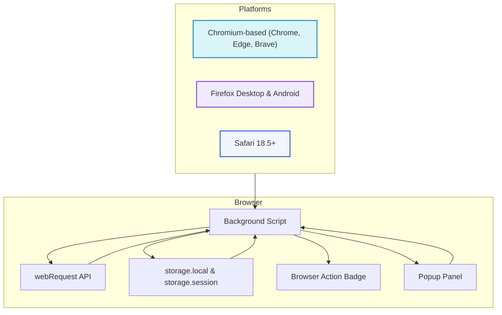

# Browser Support & Integration

Understand which browsers are supported by uBO Scope, how the extension integrates with different browser platforms, and the critical role of the webRequest API in providing real-time network activity insights.

---

## Overview

uBO Scope is designed as a browser extension compatible across major web browsers, including Chromium-based browsers (such as Google Chrome and Microsoft Edge), Firefox, and Safari. Each supported platform offers unique integration points, but all rely fundamentally on the browser's `webRequest` API to monitor network requests.

This page details compatibility considerations, platform packaging differences, and how uBO Scope leverages browser features to deliver consistent and insightful reporting on third-party network connections.

## Why Browser Support Matters

Networking behaviors, security models, and extension APIs vary subtly across browsers. uBO Scope’s goal is to work seamlessly across platforms by adapting to each browser's constraints while maintaining its core function—to transparently reveal all network connections initiated by webpages.

By supporting the three main browser platforms, uBO Scope provides broad availability to users regardless of their environment, helping privacy-conscious users, filter list maintainers, and developers gain accurate insights.

## Supported Browser Platforms

### Chromium-Based Browsers

- **Browsers:** Google Chrome, Microsoft Edge, Brave, and other Chromium derivatives
- **Manifest & Background:** Uses a service worker as its background script (`service_worker` in `manifest.json`). Supports Manifest Version 3.
- **Permissions:** Requires `webRequest`, `storage`, and `activeTab` permissions to monitor and store relevant data.
- **Host Permissions:** Monitors HTTP, HTTPS, and WebSocket (wss/ws) URLs within specified host permissions to capture all network requests.

### Firefox

- **Browser:** Firefox Desktop and Firefox for Android
- **Manifest & Background:** Employs a module-based background script defined in `manifest.json`, compatible with Firefox WebExtension standards.
- **Permissions:** Requests `webRequest`, `storage`, and `activeTab` permissions.
- **Host Permissions:** Includes HTTP, HTTPS, and WebSocket URL schemes.
- **Browser Specific Settings:** Defines a minimum Firefox version to ensure API support and stability.

### Safari

- **Browser:** Safari 18.5 and above
- **Manifest & Background:** Integrates extension background scripts via module-type scripts specified in `manifest.json`.
- **Permissions:** Requires access to `webRequest`, `storage`, and `activeTab` permissions.
- **Host Permissions:** Covers HTTP and HTTPS schemes (WebSocket support is not specified).
- **Limitations:** Current Safari support is tied to newer versions supporting Manifest Version 3 and its APIs.

## Integration with webRequest API

The core technology behind uBO Scope’s network monitoring capabilities is the `webRequest` API available in all supported browsers. This API enables the extension to listen to all network requests made by webpages, including:

- Requests allowed by the content blockers or browser
- Requests blocked or failed
- Redirected requests

By listening to these events, uBO Scope maintains an accurate and up-to-date record of third-party domain connections established during browsing sessions.

### Browser API Usage Highlights

- Listeners for `onBeforeRedirect`, `onErrorOccurred`, and `onResponseStarted` track each network request's state changes.
- The extension aggregates data at the per-tab level, updating badge counts and popup panel details dynamically.
- `webRequest` combined with storage APIs (`storage.local` and `storage.session`) ensures persistence and smooth user experience.

## Packaging and Build

The extension packaging process adapts to platform-specific manifest files and resource layouts using the provided `tools/make-package.sh` script.

### Packaging Workflow

- Run the script with the platform name argument (e.g., `chromium`, `firefox`, `safari`).
- The script creates a build folder specific to the platform.
- Copies assets such as images, CSS, JavaScript, HTML, and the platform-specific `manifest.json` into the build folder.
- Optionally sets the version string in `manifest.json` when provided.

This modular packaging supports producing browser-ready extension files with correct configuration tailored to each environment.

## Practical Considerations

- **Browser Version:** Ensure you use supported browser versions (Chromium 122+, Firefox 128+, Safari 18.5+).
- **Permission Safety:** The extension requests minimal permissions strictly necessary to perform its function.
- **WebSocket Monitoring:** WebSocket (wss://, ws://) monitoring is available on Chromium and Firefox but currently not on Safari.
- **Extension Lifecycle:** Background scripts differ — service workers in Chromium, module-based scripts in Firefox and Safari — but behavior remains consistent.

## Troubleshooting Integration Issues

If uBO Scope does not appear to report connections correctly:

- Verify the browser version meets the minimum required.
- Check that the extension has been granted the necessary permissions.
- Confirm the browser supports `webRequest` events and that no browser-specific restrictions block the extension.
- On Chromium browsers, ensure Manifest V3 is fully supported.

Consult the [Troubleshooting Common Issues](https://docs.example.com/getting-started/first-use-and-validation/troubleshooting-common-issues) documentation for detailed guidance.

---

## References

- [uBO Scope on GitHub](https://github.com/gorhill/uBO-Scope)
- Platform-specific manifests in the `platform/` directory:
  - [Chromium manifest](platform/chromium/manifest.json)
  - [Firefox manifest](platform/firefox/manifest.json)
  - [Safari manifest](platform/safari/manifest.json)
- [Build Script](tools/make-package.sh) for packaging per platform

---

## Summary Diagram of Browser Integration and Data Flow

---

## Next Steps

Proceed to the [System Architecture & Data Flow](https://docs.example.com/overview/architecture-feature-overview/system-architecture-flow) documentation to understand the detailed inner workings of the extension. For user guidance on interpreting data, the [Interpreting the Popup Panel](https://docs.example.com/guides/getting-started/understanding-popup) page is recommended.

---

_Last updated with version 1.0.1 manifests and source code from main branch._

