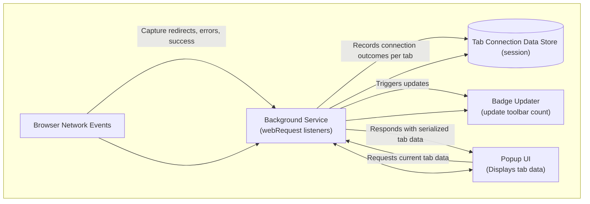

# System Architecture Overview

Understand how uBO Scope’s core components work together to deliver real-time insights into your browser’s remote server connections. This overview clarifies the flow of data, how network events are monitored, and how results are presented, empowering you to leverage uBO Scope effectively.

## How uBO Scope Works

At its core, uBO Scope is a browser extension composed of several tightly integrated parts:

- **Background Service** (background.js): Continuously listens to all network requests your browser makes using the `webRequest` API. It gathers, classifies, and updates connection data.
- **Popup UI** (popup.html and popup.js): A user interface triggered from the extension icon that shows detailed connection counts and breakdowns for the currently active tab.
- **Tab Data Management**: Maintains per-tab connection statistics that track allowed, blocked, and stealth-blocked remote server domains and hostnames.
- **Badge Updater**: Updates the extension’s toolbar icon badge with a live count of distinct third-party remote servers connected.

### What Happens When You Browse

1. As you navigate or browse web pages, the background service intercepts network events:
   - Requests starting (success), failures (errors), and redirects.
2. These events are queued and processed periodically to update tab-specific connection details.
3. Tab connection data is stored in session storage allowing persistence during the browsing session.
4. The extension badge updates to reflect the number of distinct third-party domains with allowed connections in the active tab, giving an immediate privacy exposure metric.
5. When you open the popup UI, it queries the current tab’s data and renders a detailed breakdown — organized by connection outcome (allowed, stealth blocked, blocked).

This approach guarantees accuracy and up-to-date reporting, capturing network activity regardless of which content blocker or blocking method is in effect.

## Component Responsibilities

| Component           | Role and Responsibilities                                         |
|---------------------|------------------------------------------------------------------|
| **Background Service** | Listens to `webRequest` API events, logs, analyzes, and updates tab domain connection details.| 
| **Popup UI**         | Presents tab-specific statistics in an easy-to-understand format with domain lists and counts. |
| **Session Storage**  | Persists tab connection details between page navigations and extension use. |
| **Badge Updater**    | Displays a live count of distinct third-party allowed domains on the toolbar icon. |

## Architecture Diagram

## Key Concepts and Data Flow

- The **background service** listens for three types of network events:
  - **onBeforeRedirect**: handles redirects updating stealth-blocked connections.
  - **onErrorOccurred**: logs blocked or failed connections.
  - **onResponseStarted**: logs successful connections.

- For each network event, the background service extracts the tab identifier and the URL hostname, then determines the connection outcome (allowed, stealth, blocked).

- Each tab maintains a structured object that tracks:
  - The main hostname and domain loaded.
  - Separate maps of connected domains and hostnames categorized by outcome.

- The **badge** on the extension icon displays the number of distinct allowed third-party domains for the current tab, giving an at-a-glance privacy exposure indication.

- When opening the popup, the UI requests the current tab’s connection data. The UI then renders a detailed list of connected domains grouped by outcome with details on connection counts.

## Practical Example

Consider you navigate to a website. The background service:

- Detects the main frame navigation request and resets previous tab data.
- Tracks each subsequent network request:
  - A connection that completes is logged under "allowed".
  - Requests that fail or are blocked by another content blocker are logged as "blocked".
  - Redirects or stealth-block attempts are logged accordingly.

Your extension icon badge updates live, displaying the count of unique allowed third-party domains the page connects to.

Opening the popup reveals not only that count but also the identity and frequency of such connections, letting you grasp your true privacy exposure precisely.

## Tips & Best Practices

- The badge reflects distinct domains connected in the current tab only.
- The background service batches network events every second to optimize performance without losing real-time relevance.
- If you switch tabs or close a tab, the extension resets and cleans the stored data to ensure accuracy.
- The component that extracts domains uses the Public Suffix List to correctly identify registered domains across TLDs.

## Troubleshooting

- **Badge count not updating?**
  - Ensure your browser supports the `webRequest` API properly.
  - Verify the extension has the needed permissions.

- **Popup shows "NO DATA" or is empty?**
  - You may have opened the popup immediately on a new tab with no network activity.
  - Wait for some browsing activity or reload the page.

- **Network requests outside `webRequest` API scope won’t be shown.**
  - Some browser internal or system-level connections are not reported.

## Getting Started with System Architecture

To start exploring how uBO Scope tracks your browsing connections:

1. Open any website.
2. Watch the extension’s badge number grow or shrink as connections happen.
3. Click the extension icon to open the popup and see detailed connection statistics for that tab.
4. Navigate to other tabs and repeat to observe tab-specific tracking.

For deeper understanding of terminology and to learn next steps, see [What is uBO Scope?](../product-intro-core-concepts/what-is-ubo-scope) and the [Primary Use Cases & Target Audience](../product-intro-core-concepts/primary-use-cases-audience) pages.

---

<Check>
By grasping uBO Scope’s system architecture, you gain clear insight into how this extension delivers precise, trustworthy real-time privacy exposure metrics.
</Check>

---

<Source url="https://github.com/gorhill/uBO-Scope" branch="main" paths={[{"path": "js/background.js", "range": "1-195"}]} />
