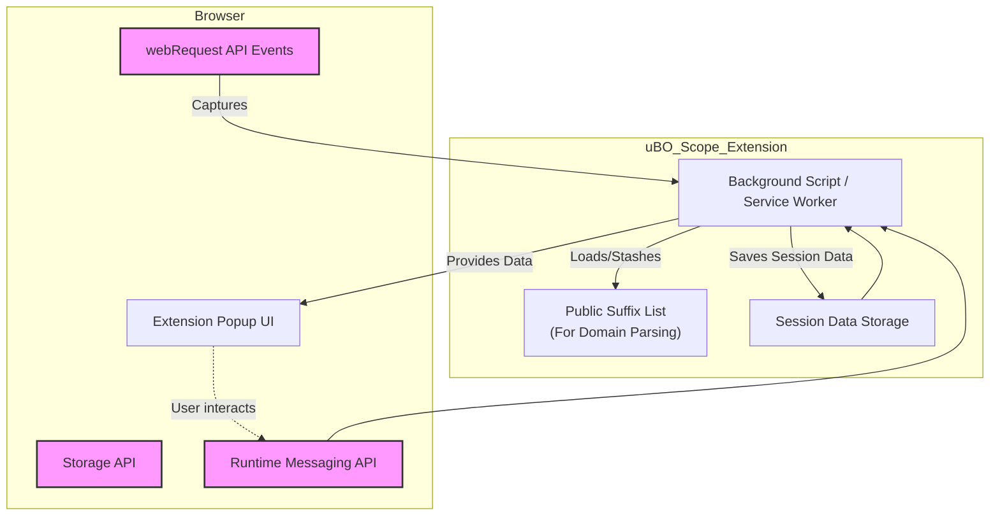

# Browser Integration & Dependencies

## Seamless Compatibility Across Major Browsers

uBO Scope is designed to provide consistent and reliable monitoring of remote server connections regardless of the browser you use. Whether on Chrome, Firefox, or Safari, uBO Scope leverages browser-specific APIs efficiently to deliver accurate insights into network activity while respecting platform differences.

## Why Browser Integration Matters

Every browser has unique ways of exposing network events and permissions to extensions. uBO Scope depends heavily on these underlying browser capabilities to:

- Capture detailed network request events
- Display accurate badge counts reflecting third-party connections
- Serve the same user interface with equal fidelity across platforms

By adapting to the specifics of each browser, uBO Scope ensures users across environments get the same level of detail and performance.

---

## Supported Browsers and Installation Sources

- **Chromium-based browsers** (such as Chrome, Edge, Brave) — install uBO Scope via the [Chrome Web Store](https://chromewebstore.google.com/detail/ubo-scope/bbdpgcaljkaaigfcomhidmneffjjjfgp).
- **Mozilla Firefox** — install via the [Firefox Add-ons](https://addons.mozilla.org/firefox/addon/ubo-scope/).
- **Apple Safari** (version 18.5 and later) — available in the Safari Extensions Gallery or via the Safari app store.

Each browser version has a dedicated manifest file that declares the specific permissions and settings required for optimal operation.

## Core Browser APIs Utilized by uBO Scope

### `webRequest` API

The cornerstone of uBO Scope's monitoring capabilities is the browser's `webRequest` API. This API allows the extension to listen to network request lifecycle events such as:

- **onBeforeRedirect**: Tracks when a request redirects to another URL
- **onErrorOccurred**: Captures failed network requests
- **onResponseStarted**: Detects successful requests and their initial responses

This comprehensive listening is essential for categorizing requests into **allowed**, **blocked**, and **stealth-blocked** outcomes.

### Storage and Runtime APIs

- **Storage**: uBO Scope persists session data, including network request records and the public suffix list, using browser storage (`local` and `session` storage).
- **Runtime messaging**: Internally coordinates communication between the background script and the popup UI to update displayed data live.

By abstracting these APIs behind a unified interface, the extension maintains smooth operation and data integrity.

## Manifest Configuration Details

Each browser platform uses a tailored `manifest.json` configuration to register the extension.

### Manifest Highlights

- **Permissions**
  - `webRequest` and `activeTab` are essential for monitoring and interacting with active web pages.
  - `storage` enables saving session data and the public suffix list.
- **Host permissions**
  - Defined to allow monitoring of HTTP, HTTPS, WS, and WSS requests across all hosts.
  - On Chromium and Firefox, both HTTP/S and WS/S are included. Safari has a slightly simpler list due to platform constraints.
- **Background scripts**
  - Chromium and Firefox use a module-based service worker or background script.
  - Safari uses a background script module with Safari-specific minimum requirements.
- **Popup interface**
  - Consistently declares `popup.html` as the default user interface triggered from the extension icon.

### Example Snippet from Chromium Manifest
```json
{
  "permissions": ["activeTab", "storage", "webRequest"],
  "host_permissions": ["https://*/*", "http://*/*", "wss://*/*", "ws://*/*"],
  "background": {
    "service_worker": "/js/background.js",
    "type": "module"
  },
  "default_popup": "popup.html"
}
```

The Firefox and Safari manifests follow similar patterns but adjust `browser_specific_settings` accordingly.

## Handling of Public Suffixes

Determining the correct domain associated with a hostname is pivotal to reporting distinct third-party servers accurately. uBO Scope incorporates the **public suffix list (PSL)** to parse hostnames into registrable domains correctly, accounting for complex cases like `sub.example.co.uk`.

- The PSL is loaded and cached in extension storage.
- The domain extraction logic uses this list to avoid counting subdomains incorrectly as separate domains.
- This ensures badge counts reflect meaningful distinct domains rather than inflated or incorrect values.

## Maintaining Consistency and Accuracy

uBO Scope abstracts browser differences, so users benefit from:

- **Uniform badge counts** indicating distinct allowed third-party domains
- **Accurate capture of all HTTP, HTTPS, WebSocket connections** within browser network monitoring scope
- **Reliable popup UI display of allowed, blocked, and stealth-blocked domains**

### Practical Scenario
A user browsing on Firefox and another on Chrome will see identical results for the same webpage network behavior. Both see the exact third-party domain counts and connection outcomes, enabling confident privacy auditing and troubleshooting.

## Best Practices and Common Pitfalls

- Ensure your browser is updated to a version supporting Manifest V3 and the necessary APIs.
- Permissions must be granted at installation; otherwise, uBO Scope cannot report network events.
- Some browser-specific limits on `webRequest` APIs might prevent capturing certain network requests (e.g., requests made outside the browser's visible context).
- The extension does not and cannot report network requests made outside browser APIs (`webRequest`), such as those by other applications.

## Summary
By leveraging browser-native APIs and carefully configured manifests tailored to each platform, uBO Scope guarantees consistent, accurate visibility into webpage remote server connections. Its use of the public suffix list ensures meaningful domain aggregation, and cross-browser support places powerful network insight tools within reach of all users.

---

## Additional Resources
- [Understanding the Popup Interface](/guides/core-usage/understanding-the-popup): How data from the browser is presented.
- [Feature Overview](/overview/architecture-features-integration/feature-overview): Explore core features that rely on browser integration.
- [System Architecture and Data Flow](/overview/architecture-features-integration/system-architecture): Deep dive into how uBO Scope coordinates its browser components.


---

## Technical Overview Diagram

