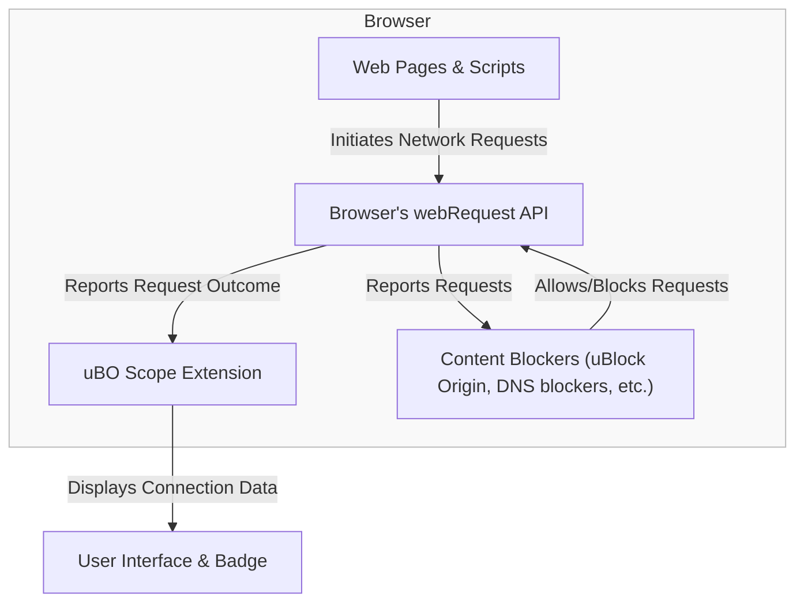

# Integration and Compatibility

Explore how uBO Scope seamlessly works alongside various content blockers and across major browser platforms. Understand its reliance on browser capabilities, its compatibility nuances with Chromium, Firefox, and Safari, and the inherent constraints tied to the webRequest API.

---

## How uBO Scope Works Alongside Content Blockers

uBO Scope is designed to provide transparent reporting on every remote server your browser attempts to connect with, regardless of any content blockers your browser uses. This means it can monitor and report network requests processed by other extensions or DNS-based blocking methods without interference.

- **Independent Monitoring:** The extension uses the browser's `webRequest` API to listen for network requests initiated by webpages. Because `webRequest` reports these requests at a low level, uBO Scope can observe requests that are allowed, blocked, or stealth-blocked by content blockers.

- **Common Ground With Content Blockers:** Whether you use uBlock Origin, other extension-based blockers, or DNS-level blockers, uBO Scope tracks and classifies all third-party connections your browser makes or attempts.

- **Unified Reporting:** This independence allows uBO Scope to provide a clear picture of actual network connections, complementing your content blocker rather than competing with it.

<Tip>
Because uBO Scope relies on the browser’s `webRequest` API, it accurately reflects blocking outcomes from nearly all content blockers that operate within the browser or modify network requests in ways visible to the API.
</Tip>

## Compatibility Across Browsers

uBO Scope supports the three major browsers with distinct considerations for each platform’s API capabilities and restrictions.

### Chromium (Google Chrome, Microsoft Edge, and others)

- **Manifest Version:** Uses Manifest V3, requiring a service worker background script for extension logic.
- **Permissions:** Requires `webRequest`, `activeTab`, and `storage` permissions.
- **Host Permissions:** Covers all HTTP(S) and WebSocket URLs to monitor relevant network traffic.
- **Behavior:** Fully supports observing network request events such as redirects, successes, and errors through `webRequest` listeners.

### Firefox

- **Manifest Version:** Also uses Manifest V3 with a module-type background script.
- **Browser Specific Settings:** Requires strict minimum Firefox version 128.0.
- **Permissions & Host Permissions:** Similar to Chromium, with support for monitoring both HTTP(S) and WebSocket requests.
- **Additional Notes:** Firefox's `webRequest` API is compatible with uBO Scope's requirements, ensuring detailed reporting.

### Safari

- **Manifest Version:** Manifest V3 compatible, but with some limitations inherent to the Safari web extensions environment.
- **Strict Minimum Version:** Requires Safari 18.5 or later to fully support the necessary APIs.
- **Permissions & Host Permissions:** Limited to HTTP and HTTPS, without explicit WebSocket host permissions listed.
- **Considerations:** Safari's `webRequest` API support is comparatively more limited, which may affect certain network events’ reporting fidelity.

<Warning>
Due to the architectural differences and API limitations in Safari, some WebSocket request monitoring and certain background service worker behaviors may be restricted or behave differently.
</Warning>

## Reliance on webRequest API

uBO Scope fundamentally depends on the browser's `webRequest` API to observe network traffic.

- The extension listens for three key `webRequest` events:
  - `onBeforeRedirect` to track redirects,
  - `onErrorOccurred` to capture failed or blocked requests,
  - `onResponseStarted` for successful connections.

- These event listeners capture and classify network requests into allowed, blocked, or stealth-blocked categories.

- For environments or platforms where parts of network activity occur outside the reach of `webRequest` (for example, some native app traffic, VPNs, or newer browser networking APIs), uBO Scope will not be able to observe those connections.

<Check>
Ensure your browser supports the `webRequest` API fully and that uBO Scope has the required permissions to track network requests effectively.
</Check>

## Limitations and Known Constraints

- **Network Requests Outside `webRequest`:** Network requests that bypass the browser's `webRequest` API (e.g., some WebSocket connections on certain platforms, or native browser features) cannot be monitored.

- **Stealth-Blocking Classification:** Certain content blockers use stealth techniques that hide blocking actions from scripts on webpages. uBO Scope reflects these with the "stealth-blocked" category but cannot influence these decisions.

- **Manifest and Browser API Updates:** As browsers evolve, API capabilities or permission models may change. uBO Scope requires ongoing browser support of `webRequest` APIs to function as intended.

- **Platform-Specific Behavior:** Although designed for cross-browser compatibility, slight differences in API implementations may cause variations in reporting.

## Summary Diagram of uBO Scope in the Ecosystem

This flow shows that uBO Scope acts as an independent observer using the browser's webRequest API, alongside other content blockers, to provide a detailed view of network request outcomes.

## Practical Tips for Users

- When installing uBO Scope, verify permissions are granted for network request monitoring.
- Use uBO Scope along with your existing content blocker to gain insights beyond simple blocking counts.
- On platforms like Safari, be aware of potential gaps in WebSocket traffic reporting.
- Remember that uBO Scope shows what connections are being attempted or blocked — interpreting these results aids better privacy and security decisions.

---

For a deeper understanding of uBO Scope's functionality and core concepts, consult the associated documentation pages.

---

<Source url="https://github.com/gorhill/uBO-Scope" paths={[{"path": "platform/chromium/manifest.json", "range": "1-50"},{"path": "platform/firefox/manifest.json", "range": "1-50"},{"path": "platform/safari/manifest.json", "range": "1-50"},{"path": "js/background.js", "range": "1-200"}]} />

