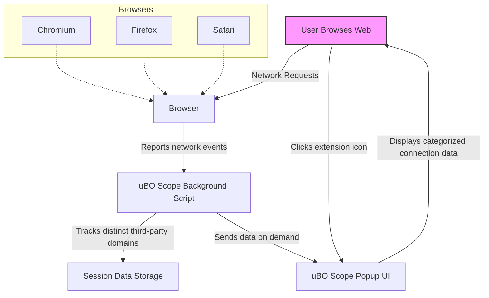

# Feature Overview & Quick Start Guide

## Unlock Clear Visibility into Webpage Network Connections

uBO Scope empowers you with a straightforward extension that reveals every distinct third-party server connection webpages attempt or establish during your browsing sessions. With cross-browser support and an intuitive popup interface, you gain instant insight into the remote servers your browser interacts with — enhancing your understanding of privacy impacts and the effectiveness of content blockers.

### Key Benefits at a Glance

- **Distinct Third-Party Connection Reporting:** Monitor the exact number of different third-party servers your browser communicates with, helping you identify unwanted or unexpected connections.
- **Cross-Browser Compatibility:** Seamlessly install and use uBO Scope across Chromium-based browsers, Firefox, and Safari, ensuring consistent privacy transparency.
- **Instant Popup Insights:** Click the toolbar icon to open a clear, categorized popup that breaks down allowed, blocked, and stealth-blocked server connections per active tab.

### Who Should Use This?

Ideal for privacy-focused users, content blocker auditors, and filter list maintainers, uBO Scope provides actionable data to improve your browsing security and evaluate filtering tools effectively.

---

## What is uBO Scope?

At its core, uBO Scope is a lightweight browser extension that tracks and displays the network connections initiated by webpages, with a focus on third-party servers. Rather than merely counting blocked requests, it highlights distinct third-party domains contacted, offering an objective perspective on hidden web traffic.

### Why uBO Scope Matters

Webpages frequently connect to multiple external servers — not all are visible or easily traceable. uBO Scope reveals these connections in real time, even when other content blockers intercept or mask them, providing transparency into your browsing footprint.

### Unique Capabilities

- Operates independently of content blockers, reporting connections regardless of blocking method.
- Distinguishes between successfully allowed, blocked, and stealth-blocked requests.
- Offers a minimal and responsive popup interface focused on clarity and actionable insights.

---

## Core Features & Capabilities

### 1. Distinct Third-Party Server Count

Instead of showing raw block counts, uBO Scope tracks the number of unique third-party domains contacted. This metric offers a more meaningful indicator of your exposure to external services.

### 2. Categorized Connection Outcomes

The popup categorizes servers into three groups:

- **Allowed:** Connections that completed successfully.
- **Blocked:** Known-blocked requests that failed.
- **Stealth-Blocked:** Requests intercepted quietly without obvious errors.

This separation helps users understand exactly how content blockers and network conditions influence server connections.

### 3. Cross-Browser Support

uBO Scope supports all major browsers with a unified experience:

- **Chromium-based browsers** (e.g., Chrome, Edge) — install via Chrome Web Store.
- **Mozilla Firefox** — install via Firefox Add-ons.
- **Safari** — requires Safari 18.5+, install via the Safari Extensions Gallery.

All platforms provide the same consistent insights through the native browser popup UI.

### 4. Instant Popup Access

The extension icon provides a one-click popup showing:

- The total distinct third-party domains connected on the current tab.
- Domains grouped by connection outcome with counts of requests.

Example popup view includes headers for allowed, stealth-blocked, and blocked domains for clear differentiation.

---

## Quick Start Guide

Get uBO Scope installed and uncover hidden webpage connections quickly.

### Step 1: Install uBO Scope in Your Browser

Choose your browser and follow the installation steps below:

| Browser          | Installation Link |
|------------------|-------------------|
| Chromium-based    | [Chrome Web Store](https://chromewebstore.google.com/detail/ubo-scope/bbdpgcaljkaaigfcomhidmneffjjjfgp) |
| Mozilla Firefox  | [Firefox Add-ons](https://addons.mozilla.org/firefox/addon/ubo-scope/) |
| Safari 18.5+     | Available via Safari Extensions Gallery |

### Step 2: Pin the Extension Icon

After installation, pin the uBO Scope extension to your browser toolbar for quick access.

### Step 3: Start Browsing & Monitor Connections

Visit any webpage and click the uBO Scope icon:

- View the total count of distinct third-party domains contacted.
- Explore connections categorized by allowed, stealth-blocked, and blocked.
- Use this information to audit webpage behavior or verify content blockers.

### Tips for Effective Use

- Lower third-party counts generally mean fewer external server connections, enhancing privacy.
- Use stealth-blocked information to detect quietly blocked connections that might bypass traditional indicators.
- Combine uBO Scope insights with content blocker audits for best results.

---

## Additional Resources

- For detailed installation instructions and supported browsers, visit [Integration & Browser Compatibility](/overview/architecture-features-quickstart/integration-browser-support).
- To understand how to interpret popup information, see the [Understanding the Popup: A User Interface Tour](/guides/getting-started/tour-popup).
- Explore daily workflows and use cases in [Monitoring Remote Connections on Any Webpage](/guides/workflows-usage/monitoring-requests) and [Interpreting Badge Numbers and Domain Lists](/guides/workflows-usage/interpreting-badge).

---

## Troubleshooting & Best Practices

<AccordionGroup title="Common Setup and Usage FAQs">
<Accordion title="Why don't I see any data in the popup after installation?">
Ensure that the page you are viewing has loaded and made network requests. uBO Scope updates its data asynchronously, so refreshing the page and reopening the popup may be necessary.
</Accordion>
<Accordion title="How does cross-browser support affect features?">
While feature parity is strong, minor behavioral differences may exist based on browser-specific APIs. Always use the latest browser version for optimal results.
</Accordion>
<Accordion title="What does ‘stealth-blocked’ mean?">
Stealth-blocked connections are requests that were blocked silently—without generating standard error signals. This helps reveal filtering that tries to avoid detection.
</Accordion>
</AccordionGroup>

---

Experience transparent control over webpage connections with uBO Scope. Install today to step ahead in understanding your browser's unseen network activity.

---

## Summary Diagram



---

## Code Sample — Accessing the Popup

The popup renders connection data by fetching tab-specific information from the background script asynchronously:

```javascript
// Fetch data for the active tab
browser.tabs.query({ active: true, currentWindow: true }).then(([tab]) => {
  sendMessage({ what: 'getTabData', tabId: tab.id }).then(serialized => {
    const data = deserialize(serialized);
    renderPanel(data); // Display domains and counts
  });
});
```

This approach delivers responsive metrics every time you view the extension popup.

---

For complete installation steps, configuration tips, and detailed usage scenarios, explore other documentation pages linked above.


---

*Documentation created with best practices to provide clear, actionable guidance tailored to user needs and real-world workflows.*