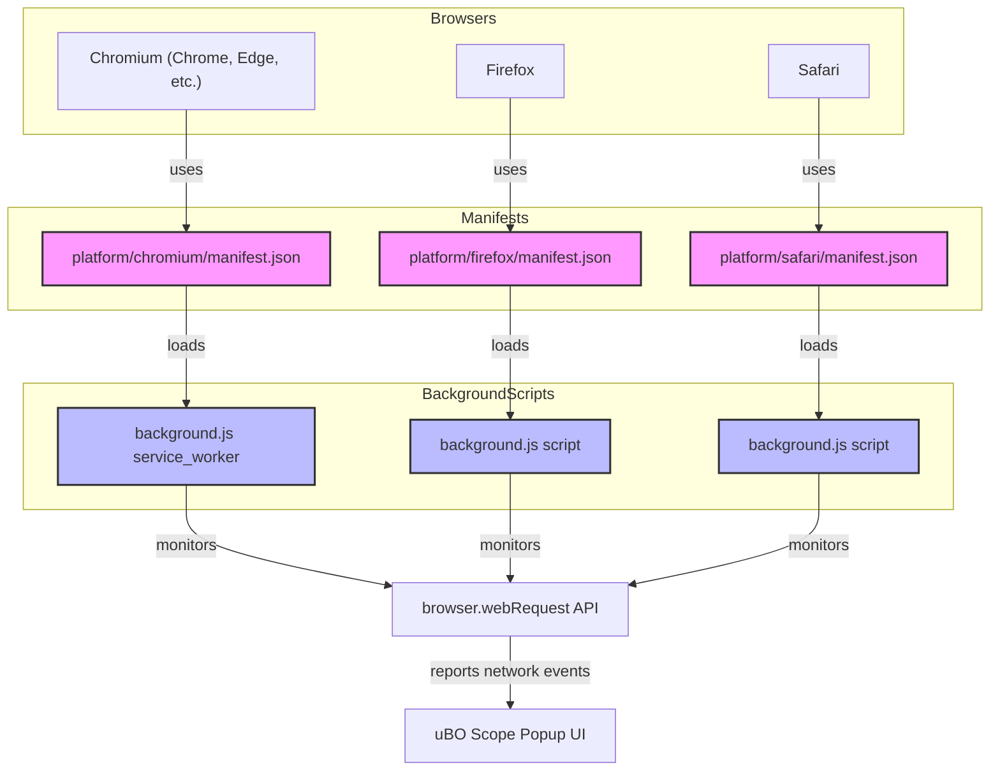

# Integration & Browser Compatibility

## Seamless Integration Across Chromium, Firefox, and Safari

uBO Scope is engineered to provide consistent and reliable network activity observation across the three major browser platforms: Chromium (including Chrome and Edge), Firefox, and Safari. This page explains how uBO Scope adapts its integration for each browser using distinct manifests and background scripts, ensuring accurate monitoring of remote server connections regardless of other content blockers or DNS configurations.

---

## Why Browser Integration Matters

Network request monitoring depends heavily on browser APIs and permission models. Each browser enforces unique extension architectures and security policies that affect how uBO Scope can track and report connection attempts. By tailoring integrations per platform, uBO Scope guarantees these core outcomes:

- **Reliable reporting of all network requests visible through the browser's `webRequest` API.**
- **Operation unobstructed by other content blockers or DNS-level blocking.**
- **Accurate badge counts reflecting distinct third-party connections.**

This ensures you always get transparent insight into network interactions originating from webpages, essential for privacy evaluation and content blocker validation.

---

## How uBO Scope Integrates with Each Browser

### Chromium (Chrome, Edge, and compatible browsers)

- Uses a manifest version 3 (`manifest.json`) specifically tailored for Chromium, declaring `background.service_worker` with a modular JavaScript file.
- Grants broad `host_permissions` to monitor HTTP, HTTPS, WS, and WSS network schemes.
- Leverages the `webRequest` API for capturing network events such as redirects, errors, and successful responses.
- Background service worker (`background.js`) performs the core tracking, while UI elements (popup) display aggregated data.

### Firefox

- Uses a manifest compatible with Firefox's WebExtension API, including gecko-specific settings for strict minimum Firefox version support.
- Background script runs as a module (`background.js`), mirroring Chromium's architecture for consistency.
- Supports extended permissions covering WebSocket protocols and broad URL matching for comprehensive monitoring.
- Employs Firefox’s `webRequest` API analogously to Chromium, ensuring feature parity.

### Safari

- Uses a manifest adhering to Safari's WebExtension manifest schema with `background.scripts` instead of service workers, reflecting Safari's extension model.
- Enforces Safari-specific version constraints to guarantee compatibility with features used by uBO Scope.
- Includes a narrowed `host_permissions` scope (HTTP and HTTPS only), respecting Safari’s current API limitations.
- Implements similar `webRequest` listeners in the background script, securing all observable network activity within Safari's ecosystem.

---

## Ensuring Reliable Network Observation Despite Other Content Blockers or DNS Settings

uBO Scope monitors network requests through the browser’s native `webRequest` API, which captures network activity as the browser processes it, **independent of any content blocker extensions you may have installed or external DNS-based blocking**. This design ensures:

- Visibility into requests even when other content blockers intervene, except those requests filtered out before the browser networking stack.
- Detection of stealth-blocked requests that might otherwise appear invisible to webpages or diagnostic tools.
- Accurate reporting based on actual network events (redirects, errors, successful responses).

> **Note:** Some network requests initiated outside the browser's `webRequest` API scope (for example, OS-level or application-level traffic) are inherently beyond uBO Scope's reach.

---

## Key Technical Permissions and APIs

Across all supported browsers, uBO Scope requires the following to function properly:

- **`activeTab` Permission:** Allowing dynamic interaction with the current tab.
- **`storage` Permission:** Saving session data such as observed connections across browser sessions.
- **`webRequest` Permission:** Monitoring network activity in real-time.
- **`host_permissions`** scoped to all HTTP, HTTPS, and WebSocket URLs to observe all relevant network requests.

These permissions enable the core capability: **to reveal each unique third-party remote server a webpage communicates with, regardless of other blockers or DNS interference.**

---

## Practical User Impact

- **Cross-Browser Consistency:** Whether you use Chrome, Firefox, or Safari, you benefit from the same fundamental insights into your browsing activity with uBO Scope.
- **Transparent Connection Visibility:** No hidden requests go unnoticed due to extension or DNS conflicts.
- **Reliability:** The extension is kept up-to-date with browser-specific manifest and API changes to maintain flawless operation.

---

## Summary

| Browser    | Manifest Highlights                                   | Network Monitoring Coverage                       |
|------------|------------------------------------------------------|--------------------------------------------------|
| Chromium   | Manifest v3 service worker; broad URL & WS permissions | HTTP, HTTPS, WS, WSS network requests             |
| Firefox    | Manifest v3 style with Gecko settings; extended URL & WS permissions | Matches Chromium feature support                  |
| Safari     | Manifest v3 with script-based background; HTTP/HTTPS only | HTTP and HTTPS network requests; limited WS due to API limits |

---

## Troubleshooting Integration Issues

If uBO Scope does not monitor connections as expected:

- Verify you have installed the correct version for your browser.
- Ensure permissions are granted, especially `webRequest` and host permissions.
- Confirm you are using a supported browser version (e.g., Chrome ≥122, Firefox ≥128, Safari ≥18.5).
- Remember that network requests hidden outside browser APIs cannot be monitored.

---

## Explore Next

- Visit [System Architecture Overview](/overview/architecture-features-quickstart/system-architecture-overview) to understand how the background processes work across browsers.
- Review [Feature Overview & Quick Start Guide](/overview/architecture-features-quickstart/feature-overview-quickstart) for usage tips and quick installation.
- Check out [Best Practices & Advanced Scenarios](/guides/best-practices/integration-use-cases) to learn how to maximize value across platforms.

---

## Mermaid Diagram: Cross-Browser Integration Overview

---

​
