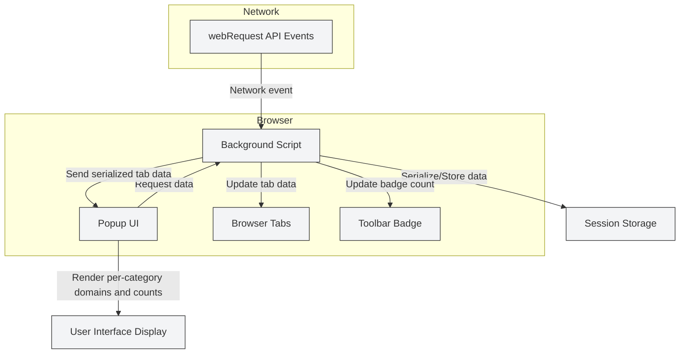

# System Architecture Overview

Explore how uBO Scope functions under the hood to deliver timely, accurate insights about network connections initiated by your browser tabs. This page visually and narratively explains the extension's architecture—highlighting background network event listeners, tab-specific data management, and information flow to the user interface popup.

---

## Understanding the Architecture

uBO Scope operates as a lightweight browser extension that actively listens to network events, capturing details about every remote server connection made by webpages. The extension's core logic runs primarily in a background script, which maintains a real-time map of network activity keyed by browser tab.

This architecture ensures that data is organized per tab, enabling users to easily inspect and understand the behaviors of individual web pages they visit.

### Key Components:

- **Background Script**: Central hub that listens to browser network events via `webRequest` APIs, processes outcomes of network requests, and maintains tab-specific connection details.

- **Tab Data Store**: In-memory and session-persistent storage that holds detailed status about domains contacted, categorized by outcome (allowed, stealth-blocked, blocked) for each tab.

- **Popup UI**: Front-end interface presenting aggregated tab connection data when users click the extension icon. It queries the background script for the current tab’s data and renders it in a clear, interactive format.

### Why This Matters

By isolating network activity per tab and categorizing connections based on their outcome, uBO Scope gives users precise clarity into their web traffic. Whether tracking potentially unblocked third-parties or spotting stealth blocking, this architecture powers reliable, actionable transparency.

---

## Workflow: How Data Flows Through uBO Scope

1. **Network Event Captured:** The background script registers listeners for network request lifecycle events including redirects, errors, and successful responses.

2. **Outcome Recorded:** For each event, the script extracts the tab context, determines the hostname and domain, and records whether the connection was allowed, stealth-blocked (redirects), or blocked (network errors).

3. **Tab Data Updated:** The tab-specific data structure is either created or updated with this information, tallying occurrences per domain and hostname.

4. **Badge Updated:** The extension updates the browser toolbar icon badge to reflect the count of distinct allowed remote domains for the active tab.

5. **UI Requests Data:** When a user opens the popup UI, it sends a message to fetch the current tab’s collected data.

6. **Popup Renders Data:** The UI deserializes the data and displays categorized lists of connections with request counts.

---

## Practical Architecture Insights

- **Session Persistence:** Data is serialized and stored using the browser’s session storage API, allowing state retention across tab reloads and browser restarts.

- **Public Suffix List Usage:** The architecture leverages an embedded public suffix list to accurately extract base domains from hostnames, avoiding misleading domain aggregation.

- **Network Request Filtering:** Event listeners only process network requests matching the extension’s host permissions, ensuring privacy and performance.

- **Asynchronous Processing:** Network requests are queued for batch processing, avoiding UI jank and reducing CPU overhead.

---

## Architectural Diagram

Below is a Mermaid flowchart capturing uBO Scope's core architecture and data flow:

---

## Tips and Best Practices

- While the system handles all network requests reported by the browser, some third-party requests initiated outside the browser's `webRequest` API scope cannot be observed.

- Data accuracy depends on browser support; ensure you use modern browsers with full `webRequest` support for best results.

- The clear tab-oriented architecture helps troubleshoot network-related privacy issues per site without cross-tab confusion.

- Avoid installing conflicting extensions altering network behavior to keep the data consistent.

---

## Troubleshooting Common Issues

<AccordionGroup title="Common System Architecture Troubleshooting">
<Accordion title="Background Script Not Collecting Data">
Check that the extension has appropriate permissions (`webRequest`, `activeTab`) and host access to the sites you visit. Also, verify your browser version meets the minimum requirements for manifest v3 extensions.
</Accordion>
<Accordion title="Popup UI Fails to Load Tab Data">
Ensure the popup sends requests only when a valid active tab is present. If data retrieval fails, the background script might be overloaded or the session data corrupted; reloading the extension or browser can resolve temporary issues.
</Accordion>
<Accordion title="Badge Count Not Updating Correctly">
Remember that the badge reflects the count of distinct allowed third-party domains per tab. Network delays or complex redirect chains can cause short update lags. Also, disabled or conflicting content blockers may influence results.
</Accordion>
</AccordionGroup>

---

## Next Steps

After understanding uBO Scope’s system architecture, explore the following documentation to master effective use:

- [Feature Overview & Quick Start Guide](/overview/architecture-features-quickstart/feature-overview-quickstart) — Learn how to interact with the UI and interpret data.
- [Integration & Browser Compatibility](/overview/architecture-features-quickstart/integration-browser-support) — Understand platform-specific considerations.
- [Monitoring Remote Connections on Any Webpage](/guides/workflows-usage/monitoring-requests) — Practical user workflows.

These will help you translate architectural knowledge into daily productivity and privacy confidence.

---

_Discover how uBO Scope turns complex network activity into clear, actionable insights by understanding its architecture. Dive in and empower your browsing privacy._
