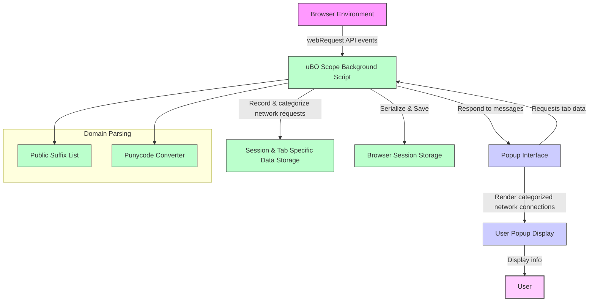

# How uBO Scope Works

Discover the inner workings of uBO Scope—the privacy-focused browser extension that monitors and classifies every web connection your browser attempts or makes. This page provides a clear, approachable explanation of how uBO Scope listens to network requests in real time and presents this data in an easy-to-understand popup interface.

---

## Introduction

uBO Scope acts as a vigilant observer within your browser, tracking all outgoing network requests initiated by webpages. It captures these connection attempts—whether successful, blocked, or stealth-blocked—and categorizes them into meaningful groups. This live monitoring lets you gain unmatched transparency into the remote servers that your browser communicates with, empowering you to make informed decisions about your online privacy.

This page explains the high-level mechanics behind this process, describing the path from how uBO Scope listens for network events within the browser environment to how it compiles and exposes this information in a user-friendly popup. You'll also find a visualization of this data flow to clarify the extension’s architecture.

---

## How uBO Scope Monitors Network Requests

### Listening to Network Traffic

At the heart of uBO Scope's functionality is the use of the browser's `webRequest` API. This API provides hooks at various stages of each network request, letting the extension observe:

- Redirects
- Errors
- Response starts (successful connections)

The extension subscribes to these events for all HTTP, HTTPS, and WebSocket requests, enabling near-complete coverage of remote server interactions initiated by webpages.

### Categorizing Connection Outcomes

Every network request triggers an event that uBO Scope captures and queues for processing. These events are then evaluated in batch to efficiently update the internal records.

Requests are categorized into three distinct outcomes:

- **Allowed (Not Blocked):** Successfully made connections reported through the response start event.
- **Blocked:** Requests that resulted in errors, indicating that the browser or an installed content blocker prevented the connection.
- **Stealth-blocked:** Connections that were redirected or otherwise manipulated in a way that is less transparent.

By maintaining separate domain and hostname counts for each outcome, uBO Scope offers granular insight into which remote servers are contacted and how those requests were handled.

### Tab-Specific Tracking

uBO Scope keeps detailed connection data grouped by browser tab. When a webpage loads in the main frame, data for that tab resets to track only the current page’s connections. This tab-scoped tracking lets you assess network exposure on a per-website basis, offering actionable visibility while browsing.

### Persistent Session Storage

To maintain continuity during a browsing session, uBO Scope serializes its internal tab connection data and the Public Suffix List to session storage. This enables the extension to reload the data efficiently, even if the browser or extension restarts abruptly.

The Public Suffix List, a key component for correctly identifying domain boundaries (e.g., distinguishing `example.co.uk` from `co.uk`), is loaded and parsed once per session.

---

## Presenting Data to You: The Popup Interface

Once the background service worker collects and processes network request data, it shares this information with the popup interface triggered when you click the uBO Scope icon.

The popup organizes and presents the data clearly:

- The **tab’s hostname and domain** are displayed at the top.
- A **summary showing the count of distinct connected domains**.
- Separate sections for each outcome category: **Not Blocked (allowed), Stealth-blocked, and Blocked**, each listing domains and their connection counts.

For clarity and readability, internationalized domain names are transformed from punycode back into Unicode.

---

## Step-by-Step Workflow Example

Imagine you visit a website `example.com`. Here’s what happens under the hood:

1. The tab's details are reset to clear old data.
2. As the main frame starts loading, uBO Scope notes the tab's domain (`example.com`).
3. Every network request initiated by this page fires one of the `webRequest` events.
4. The background script queues each event and processes them every second to update connection counts.
5. These processed results categorize connected third-party domains as allowed, blocked, or stealth-blocked.
6. When you click the extension icon, the popup requests the latest tab data.
7. The popup renders domains and counts under each category, giving you an instant snapshot of network exposure.

---

## Data Flow Diagram

---

## Practical Tips & Best Practices

- **Refreshing Data:** The popup fetches real-time data from the background script, so each time you open it, you get the freshest connection summary.
- **Tab Focused:** Results strictly reflect the active tab, helping you understand network exposure per webpage.
- **Handling Redirects and Errors:** uBO Scope distinguishes subtle differences between redirects (stealth-blocked) and outright errors (blocked), enabling better analysis.
- **Efficient Performance:** Processing network events in short intervals reduces CPU load without sacrificing real-time insights.

---

## Troubleshooting Common Issues

- **No Data Displayed:** Ensure the extension has proper permissions (`webRequest`) in your browser. Verify network requests are passing through the supported protocols (`http`, `https`, `ws`, `wss`).
- **Inconsistent Counts:** Some requests made outside the browser’s `webRequest` API scope may not be tracked—such as those from certain WebAssembly modules or native applications.
- **Tab Cleansing:** Closing tabs removes stored data. If the extension doesn't show expected data, check you are viewing the popup for the intended tab.

---

## Next Steps

To deepen your understanding or start using uBO Scope immediately, explore:

- **[What is uBO Scope?](/overview/introduction-core-concepts/what-is-ubo-scope)** — Core product introduction and purpose.
- **[Understanding the Popup: Domains and Connection Statuses](/guides/network-insights-common-workflows/understanding-popup)** — Learn how to read and interpret the popup data.
- **[Core Use Cases & Target Audience](/overview/introduction-core-concepts/core-use-cases)** — See who benefits most and how.

---

Harness the power of precise, real-time network transparency to take control of your online privacy with uBO Scope.

---