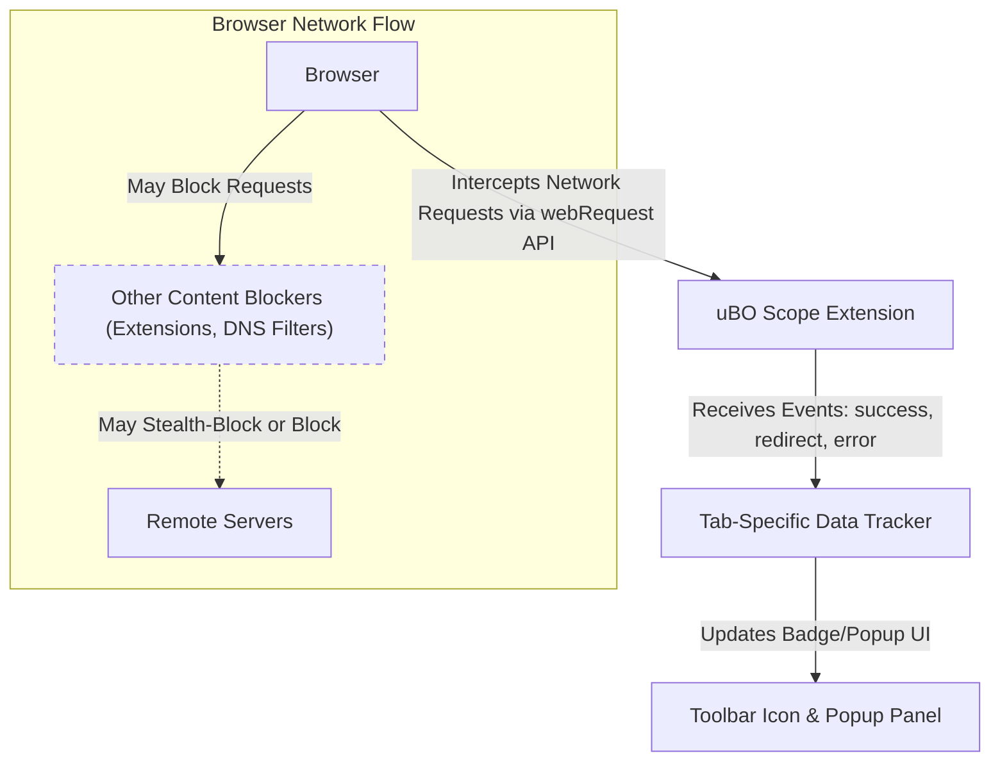

# Integration & Compatibility

Understanding how uBO Scope fits into your browsing environment is essential to get the most from its capabilities. This page details how uBO Scope integrates with browsers, coexists with other content blockers and DNS filters, and provides guidance on installation paths and compatibility considerations for Chrome, Firefox, and Safari browsers.

---

## Seamless Browser Integration

uBO Scope is designed as a lightweight browser extension that works natively within your browser’s extension APIs, using only permissions necessary to monitor network connections. This seamless integration ensures that it operates harmoniously with your existing browsing setup without interfering with normal web activities.

- Supports the `webRequest` API to observe all network requests, ensuring comprehensive visibility into connections made by webpages.
- Utilizes browser `action` APIs for intuitive user interface elements like the toolbar icon badge and popup panel.
- Employs efficient session management to persist data on open tabs and maintain accurate counts across browsing sessions.

### Supported Browsers and Installation

Installation files are provided for Chromium-based browsers, Firefox, and Safari, each adapted to the specific requirements and capabilities of those browsers:

| Browser         | Installation Path       |
|-----------------|------------------------|
| Chromium (Chrome, Edge, etc.) | [`platform/chromium/manifest.json`](https://github.com/gorhill/uBO-Scope/blob/main/platform/chromium/manifest.json) |
| Firefox         | [`platform/firefox/manifest.json`](https://github.com/gorhill/uBO-Scope/blob/main/platform/firefox/manifest.json) |
| Safari          | [`platform/safari/manifest.json`](https://github.com/gorhill/uBO-Scope/blob/main/platform/safari/manifest.json) |

The manifests specify minimum browser versions and required permissions including `activeTab`, `storage`, and `webRequest` which are crucial for the extension’s operation.

---

## Coexistence With Other Content Blockers

A core strength of uBO Scope is its ability to function independently and alongside other content blockers or DNS-based filtering solutions. This means:

- **Non-Interference:** uBO Scope does not block or modify network requests itself. Instead, it passively reports the outcome of requests, whether they are allowed, stealth-blocked, or outright blocked by another extension or DNS filter.
- **Accurate Reporting:** It observes the actual network behavior reported by the browser, even when other blockers or DNS filters intervene, ensuring transparent and truthful data on real connections.
- **Myth Debunking:** By showing distinct third-party server connections rather than raw block counts, it helps users understand the true impact of their content blocker setups.

This ensures that whether you use uBlock Origin, browser built-in privacy features, or DNS filtering, uBO Scope will accurately report connections without interference or conflicts.

---

## Independence From DNS or Web Extension Blockers

uBO Scope operates based on network requests as seen by the browser's `webRequest` API. This has important implications:

- It can identify and report connection attempts regardless of how blocking is performed (extension-based blocking, DNS filtering, or network-level blocking), **as long as the browser signals these events through the `webRequest` API.**
- Any network request that bypasses the browser's `webRequest` interface, such as those made by non-browser processes or encrypted DNS outside the browser's awareness, will not be visible to uBO Scope.

This access to browser-reported network requests enables uBO Scope to function as a trustworthy measurement tool rather than an active blocker.

---

## Practical Examples of Installation

### Installing uBO Scope on Chromium

1. Navigate to the [Chrome Web Store listing](https://chromewebstore.google.com/detail/ubo-scope/bbdpgcaljkaaigfcomhidmneffjjjfgp).
2. Click `Add to Chrome` and confirm.
3. The extension will appear as a toolbar icon with a badge displaying the number of distinct third-party remote servers with connections.

### Installing uBO Scope on Firefox

1. Visit the [Firefox Add-ons page](https://addons.mozilla.org/firefox/addon/ubo-scope/).
2. Click `Add to Firefox` and grant required permissions.
3. Use the extension’s toolbar icon to view real-time network connections.

### Safari Compatibility Notes

- uBO Scope requires Safari 18.5 or later to function properly.
- Due to Safari’s stricter extension environment, only HTTP and HTTPS host permissions are requested (WebSocket permissions are limited).
- You can install from the Safari Extensions Gallery or through manual extension loading for development.

---

## Key Compatibility Considerations

- **Minimum Browser Versions:** uBO Scope requires Chrome 122.0+, Firefox 128.0+, and Safari 18.5+ for full functionality.
- **WebRequest API Availability:** Browsers must support the `webRequest` API with detailed event listening capabilities; without this, uBO Scope cannot monitor connections.
- **Permission Requirements:** The extension requests permissions only necessary to monitor and report network requests — avoiding intrusive or unnecessary access.
- **Host Permissions:** uBO Scope requests broad host permissions (`https://*/*`, `http://*/*`, and WebSocket equivalents) to comprehensively monitor network activity.
- **No Blocking Functionality:** Since uBO Scope is strictly a reporting tool, it does not interfere with or block traffic, mitigating risks of conflicts or browser warnings.

---

## Troubleshooting Installation and Compatibility

<AccordionGroup title="Common Issues and Solutions">
<Accordion title="Extension Not Showing Data or Badge Count">
- Ensure your browser version meets the minimum requirement.
- Confirm that uBO Scope has been granted the necessary permissions during installation.
- Browser settings or other privacy extensions might restrict access to `webRequest` data.
- Try restarting the browser after installation.
</Accordion>
<Accordion title="Conflicts with Other Extensions">
- uBO Scope is designed to be non-intrusive and should coexist with content blockers.
- If issues arise, test by disabling other extensions temporarily.
</Accordion>
<Accordion title="WebSocket Connections Not Reported in Safari">
- Due to Safari’s permission model, WebSocket host permissions may be restricted.
- WebSocket connections may not appear in reporting as a result.
</Accordion>
</AccordionGroup>

---

## Summary Diagram

This diagram outlines uBO Scope’s position in the browser network stack and its interactions with browser APIs and other blockers.

---

## Additional Resources

For detailed configuration and advanced usage, please consult:

- [What is uBO Scope?](https://docs.ubo-scope.org/overview/introduction-core-concepts/what-is-ubo-scope)
- [How uBO Scope Works](https://docs.ubo-scope.org/overview/architecture-features/how-ubo-scope-works)
- [Understanding the Popup: Domains and Connection Statuses](https://docs.ubo-scope.org/guides/network-insights-common-workflows/understanding-popup)
- [Installation Walkthrough](https://docs.ubo-scope.org/guides/getting-started-ubo-scope/installation-walkthrough)

Additionally, consult your browser’s extension documentation for manual installation and permissions management specific to your environment.

---

By comprehending these integration and compatibility guidelines, you can smoothly set up uBO Scope to monitor third-party network connections and enhance your browsing transparency and privacy awareness.