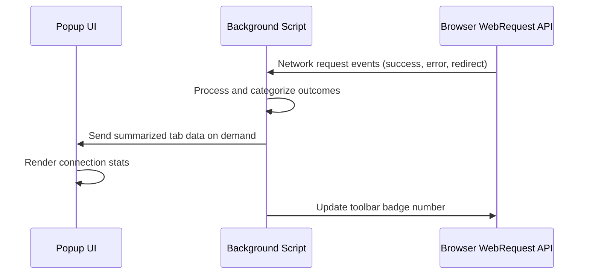

# Integration with Browsers & Other Systems

uBO Scope operates seamlessly alongside browsers and other content blocking or DNS-based network control systems. This page explains how the extension leverages browser APIs to provide independent, accurate insight into all remote server connections generated by your browser, without interfering or relying on any specific blocking technology.

---

## How uBO Scope Leverages Browser APIs

uBO Scope uses the browser's `webRequest` API to monitor all network requests made by webpages. This API exposes detailed information about attempts to connect to remote servers, regardless of whether those requests are blocked or allowed by other extensions, the browser itself, or even external DNS-level blocking.

By listening to network events such as request initiation, redirects, errors, and successful responses, uBO Scope captures a comprehensive picture of all connections attempted from webpages in real-time. This low-level integration ensures that the data reported is authoritative and unaffected by the presence or absence of any particular content blocker.

### Key Benefits of Using `webRequest` API

- **Comprehensive Visibility:** Tracks both blocked and allowed network connections, including stealth or “hidden” blocks done by other components.
- **Independence:** Works regardless of what content blockers or DNS filtering systems are active.
- **Accuracy:** Reports actual third-party servers contacted, not just the number of blocked requests.
- **Compatibility:** Supports modern browsers that provide the `webRequest` API under Manifest Version 3 requirements.

## Compatibility Across Browser Platforms

uBO Scope is designed to run consistently across the major web browsers:

| Browser        | Notes                                            |
|----------------|-------------------------------------------------|
| Chromium-based | Uses service workers to handle background tasks. Supports Chrome 122+ and compatible browsers. |
| Firefox        | Uses module background scripts, compatible with Firefox 128+. |
| Safari         | Complies with Safari Web Extensions using module background scripts, minimum Safari 18.5. |

Each platform’s integration uses the browser’s native extension APIs but maintains a consistent feature set and user experience. The extension’s manifest files specify the necessary host and API permissions to allow full monitoring of network requests.

## Working Alongside Content Blockers and DNS Systems

Many users deploy separate content blockers or DNS-based blockers to limit unwanted network requests. uBO Scope:

- **Does Not Block Requests:** It only measures and reports connection attempts, ensuring that it never interferes with your browsing.
- **Detects Network Outcome Regardless of Blocker:** It records whether requests were blocked, stealth-blocked, or allowed by observing how the browser responds to network events.
- **Provides True Exposure Count:** By focusing on the domains actually contacted (allowed connections), uBO Scope offers a clear picture of third-party exposure, complementing traditional block counts.

This independence means users can confidently use uBO Scope alongside their favorite blocking tools without compatibility concerns.

## Deployment and User Experience

Upon installation, uBO Scope injects a popup interface accessible from the browser toolbar. This popup presents the connection data captured by the background process, broken down by network request outcome (allowed, stealth-blocked, blocked).

The extension also dynamically updates the toolbar badge to reflect the count of distinct third-party domains contacted in the active browser tab.

### Real-Time Updates Flow

## Practical Tips for Users

- **Ensure Permissions:** The extension requires permissions to monitor web requests (`webRequest`) and to access the active tab. Grant these when installing.
- **Work Consistently With Any Blocker:** You can use uBO Scope alongside any content blocker or DNS filtering system without conflict.
- **Compatible Browsers:** Verify your browser version is compatible with extensions supporting Manifest V3 and webRequest API.

## Common Pitfalls and Troubleshooting

<AccordionGroup title="Browser Compatibility and Permissions">
<Accordion title="Why don’t I see data in the popup?">
Make sure the extension has permission to access the active tab. Also, verify your browser supports the necessary webRequest events as some stricter privacy modes may limit these.
</Accordion>
<Accordion title="Toolbar badge not updating">
The badge updates only for tabs where network data has been logged. Switching tabs may cause a delay in badge update until data is processed.
</Accordion>
<Accordion title="Blocked requests not showing correctly">
Content blockers that operate outside of the browser’s webRequest API scope (such as external VPNs or system DNS filters) may cause mismatches. uBO Scope reflects what the browser observes, not system-level blocks.
</Accordion>
</AccordionGroup>

## Summary

uBO Scope harnesses the browser's native webRequest API for transparent and accurate monitoring of remote server connections. It works independently of content blockers or DNS filters and supports major modern browsers through Manifest V3-compliant manifests. Users gain real-time insights into their exposure to third-party servers without interference in browsing or blocking.

For a deeper understanding of the internal request tracking and UI integration, consult the [System Architecture Overview](./system-architecture) and the [Feature Overview](./feature-highlights) documentation.

---

## References

- [Manifest File Details for Chromium](../platform/chromium/manifest.json)
- [Manifest File Details for Firefox](../platform/firefox/manifest.json)
- [Manifest File Details for Safari](../platform/safari/manifest.json)
- [System Architecture Overview](./system-architecture)
- [Feature Highlights](./feature-highlights)

---

*Last updated for version 1.0.1*