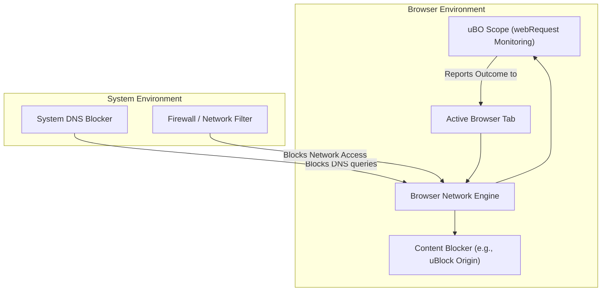

# Browser & Content Blocker Integration

Discover how uBO Scope smoothly operates alongside your favorite browsers, content blockers, and system-level privacy tools. This page explains how uBO Scope interacts with other software, what limitations to expect due to browser APIs, and typical ways to incorporate uBO Scope into your privacy workflow.

---

## Why Integration Matters

If you already use content blockers like uBlock Origin, or system-wide DNS or firewall-based blockers, you might wonder why uBO Scope is still useful and how it fits into your setup. Understanding how uBO Scope integrates empowers you to get accurate insights into your network connections without interference or confusion.

## How uBO Scope Works with Other Content Blockers

uBO Scope leverages the browser's `webRequest` API to observe all network requests made by webpages, regardless of whether other content blockers intervene. This means:

- **Visibility Across Blockers:** uBO Scope monitors requests even if they are later blocked or modified by another extension. It reflects the actual outcome of each request, whether allowed, blocked, or stealth-blocked.
- **Independent Reporting:** The extension is agnostic to what filtering rules are applied elsewhere. It reports outcomes as observed by the browser.
- **Badge Count Meaning:** The toolbar badge specifically shows the count of distinct third-party domains successfully connected to, not merely blocked requests. This clarifies the real exposure instead of relying on block counts.

### Typical User Flow with a Content Blocker

1. You browse a website with your preferred content blocker active.
2. uBO Scope monitors network requests from this site via `webRequest` events.
3. The content blocker may block or allow requests; uBO Scope records the actual final outcome for each.
4. The uBO Scope popup and badge update to show which remote servers were contacted and whether connections were blocked, stealth-blocked, or allowed.

## Interaction with System-Level Blockers (DNS, Firewalls)

System-wide DNS blockers or firewalls can stop connections before the browser even attempts them or before `webRequest` events are triggered. This creates some limitations:

- uBO Scope **only utilizes data from browser-level network events.** It cannot detect or report network activity blocked outside the browser.
- If a request is blocked or rerouted by a system-level tool such that the browser never dispatches any network event, uBO Scope will not see that request.
- Consequently, **uBO Scope provides the most comprehensive visibility possible _within_ the browser context, but not beyond it.**

## Browser Support & Limitations

uBO Scope is designed for major modern browsers supporting the `webRequest` API:

- **Chromium-based browsers** (Chrome, Edge, Brave, etc.)
- **Mozilla Firefox**
- **Safari 18.5 and later**

However, to work reliably:

- The extension must have permissions (`webRequest`, `storage`, `activeTab`).
- The browser must provide access to network request outcomes through the `webRequest` API.

<Note>
Browsers or browser modes that limit or disable `webRequest` access (e.g., certain privacy modes or upcoming Manifest V3 restrictions) may reduce uBO Scope’s accuracy or functionality.
</Note>

## Practical Integration Scenarios

### Scenario 1: Running uBO Scope Alongside uBlock Origin

Many users run uBO Scope as a companion to uBlock Origin. When you visit a webpage:

- uBlock Origin applies its filters and blocks unwanted requests.
- uBO Scope observes all requests, and notes which third-party servers were contacted or blocked.
- You check uBO Scope's badge and popup for a clear count and listing of connected remote servers.

This setup lets you verify the real-world effectiveness of your blocker and reveals stealth connections.

### Scenario 2: Using uBO Scope with a DNS-based Blocker

Your system or router applies DNS filtering to block domains:

- Requests to blocked domains fail to resolve and never reach the browser as network requests.
- uBO Scope does not see these requests at all and therefore does not track them.
- However, uBO Scope still reports on requests that make it through DNS filtering.

This helps you verify what network connections truly occur from the browser's perspective.

### Scenario 3: Privacy-Focused Browsing with Multiple Tools

Combining various content blockers, VPNs, DNS filters, and firewalls is common:

- uBO Scope sits transparently and reports actual network activity as seen by the browser.
- It acts as a reality check, assuring you that your privacy tools are effective.
- You can identify discrepancies between expected blocking (e.g., from filters) and observed connections.

## Limitations & Things to Keep in Mind

- **uBO Scope depends entirely on browser network visibility.**
- If browsers or extensions adopt stealthier blocking methods that obscure `webRequest` events, uBO Scope may miss some activity.
- Network requests issued by background apps or outside the browser (e.g., native apps) are not visible.
- Sometimes, browser optimizations like prefetch or speculative connections might show in uBO Scope; these are not always harmful but worth noting.

## Tips for Best Experience

- Make sure uBO Scope has the required permissions during installation.
- Run it in conjunction with your content blocker to get complementary insights.
- Use uBO Scope's detailed popup to explore domain statuses: allowed, stealth-blocked, and blocked.
- Review badge counts regularly to track third-party connections on visited sites.

## Summary Diagram of Integration Flow

## Where to Go Next

- Explore [Domain Status Interpretation](https://your-docs-link/guides/interpreting-results/understanding-domain-status) to better understand allowed, blocked, and stealth states.
- Review [Supported Browsers & Requirements](https://your-docs-link/getting-started/installation-basics/supported-platforms-requirements) for detailed platform compatibility.
- Learn about [How uBO Scope Works](https://your-docs-link/overview/architecture-features/system-architecture) for a deep dive into internal workflows.

---