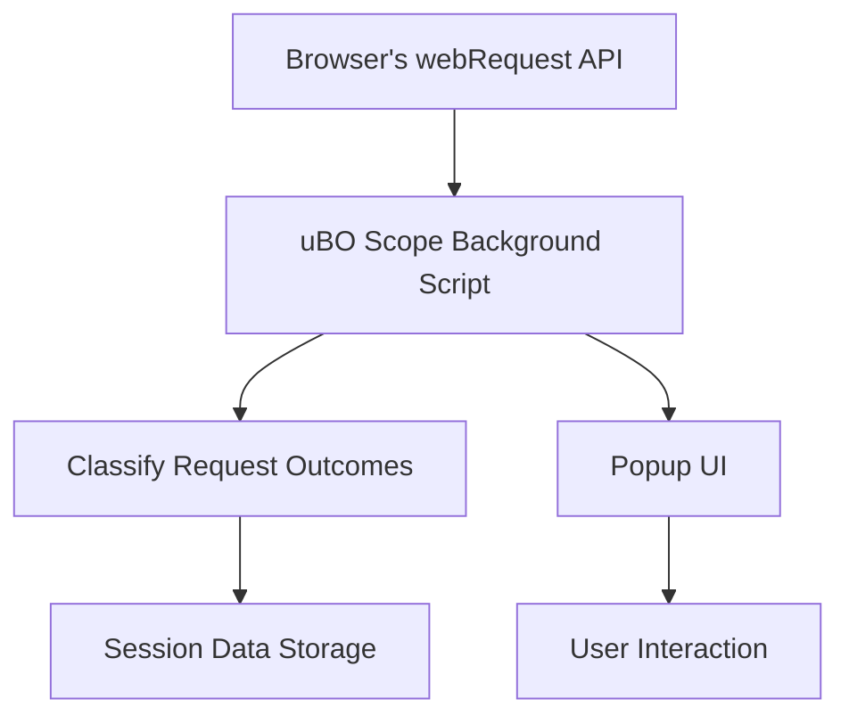

# Integration & Compatibility

Understanding how uBO Scope integrates with different browsers, interacts with other content blockers, and leverages the browser's `webRequest` API is vital to maximize its effectiveness. This page explains the extension's compatibility considerations, cooperation with other blockers, and the limitations users should anticipate regarding extension dependencies.

---

## Cross-Browser Integration

uBO Scope is designed as a manifest version 3 (MV3) browser extension and supports major browsers including Chromium-based browsers (e.g., Google Chrome, Microsoft Edge), Mozilla Firefox, and Safari. It uses browser-specific adaptations while maintaining consistent core functionality.

- **Chromium Browsers:** Leverages the service worker-based background script, with `webRequest` listeners appropriately registered to monitor network requests.
- **Firefox:** Uses a background module to observe network events with similar APIs to Chromium, respecting Firefox-specific constraints and minimum version requirements.
- **Safari:** Supports recent Safari versions with manifest and API capabilities matching MV3-style extensions, although host permissions are more limited.

This cross-browser approach guarantees that uBO Scope provides transparent and reliable network request reporting regardless of user platform.

<Info>
Browser-specific manifest configurations define permissions and background script types appropriate for each environment, ensuring smooth operation and user experience consistency.
</Info>

## Interoperability with Content Blockers

uBO Scope works seamlessly alongside popular content blockers, including uBlock Origin and others, without interfering with their blocking behavior. This is achieved through the exclusive use of the browser's `webRequest` API, which provides raw insights into all network events regardless of blocking state.

- **Independence from Blocking Logic:** uBO Scope does not alter or block requests; it only observes and records outcomes such as allowed, blocked, or stealth-blocked requests.
- **Detection Transparency:** Since it reads the final request status, uBO Scope reports the actual effect of any content blocker or DNS-level filtering in real time.
- **Badge Reflects Distinct Domains:** The toolbar icon badge counts unique third-party domains connected per tab, providing clear and unobfuscated network visibility even amidst complex blocker setups.

<Tip>
This independence makes uBO Scope ideal for debunking misconceptions about block counts and verifying the real-world effectiveness of content blockers.
</Tip>

## Leveraging the WebRequest API

uBO Scope's core functionality relies on the browser's `webRequest` API to capture detailed network traffic data including:

- Request initiations,
- Redirects,
- Successes,
- Failures or errors.

This API enables the extension to monitor URLs, request types, frame identifiers, and timing, which are processed to classify request outcomes.

The extension listens for key events like `onBeforeRedirect`, `onErrorOccurred`, and `onResponseStarted` to capture comprehensive network activity.

<Note>
The `webRequest` permission and access to webRequest API data require explicit user consent during installation, and are subject to browser security policies.
</Note>

## Limitations and Considerations

While uBO Scope reports broadly on network activity, some inherent limitations apply due to browser architecture and security models:

- **Network Requests Outside WebRequest API:** Some network traffic, such as certain WebRTC connections or native browser-initiated background processes, may not be visible.
- **Stealth Blocking Detection:** Content blockers using stealth techniques may result in some connections being reported as "stealth-blocked," which uBO Scope distinguishes from outright blocked requests.
- **Host Permissions:** The extension requires broad host permissions (`http://*/*`, `https://*/*`, `ws://*/*`, `wss://*/*`) to monitor all relevant traffic; missing or revoked permissions will limit visibility.

<Warning>
Browsers occasionally update API behavior or impose new restrictions that can impact extension monitoring capabilities. Users should ensure that uBO Scope is running on supported browser versions and granted all necessary permissions.
</Warning>

## Extension Interactions & Dependencies

- **No Dependence on Other Extensions:** uBO Scope functions independently; it does not rely on any other installed extensions or external APIs.
- **Shared Host Permissions with Content Blockers:** When installed alongside blockers like uBlock Origin, uBO Scope does not conflict but requires similar permissions to capture network data.
- **Data Persistence:** Session data about network connections is maintained using the browser's session storage, ensuring data isolation per browsing session.

## Practical Tips for Users

- Always install uBO Scope alongside your preferred content blockers to gain an unobstructed view of network request outcomes.
- Review the popup's categorized domains to understand which third parties are connected, which are blocked, and which are stealth-blocked.
- Keep your browser updated to ensure compatibility with the latest WebRequest API enhancements and behavior.
- Be aware that the badge represents distinct third-party domains and not the total number of requests.

## Troubleshooting Common Integration Issues

<AccordionGroup title="Integration Troubleshooting Steps">
<Accordion title="Missing Network Requests in Reports">
Verify uBO Scope has been granted all required host permissions during installation. Without full access to URLs, some connection data cannot be captured.
</Accordion>
<Accordion title="Badge Not Updating">
This may occur if network events are delayed or the tab is inactive. Refresh the tab or reopen the popup to force data retrieval.
</Accordion>
<Accordion title="Conflicts with Other Extensions">
Extensions using deep webRequest modifications or blocking may limit what uBO Scope can observe. Temporarily disable other blockers to verify interaction.
</Accordion>
</AccordionGroup>

---

For more detailed workflows on installation, usage, and understanding the badge and popup, consult the related guides and troubleshooting pages.

---

## See Also

- [What is uBO Scope?](/overview/intro-key-concepts/product-overview) — Understand the extension’s core purpose.
- [Core Concepts & Terminology](/overview/intro-key-concepts/core-concepts-terminology) — Definitions to interpret network data.
- [Using the Extension](/getting-started/usage-and-troubleshooting/using-the-extension) — Step-by-step usage instructions.
- [System Architecture](/overview/architecture-features/system-architecture) — Visual explanation of how uBO Scope operates internally.

---

*For the source code or to report issues, visit the [uBO Scope GitHub repository](https://github.com/gorhill/uBO-Scope).*