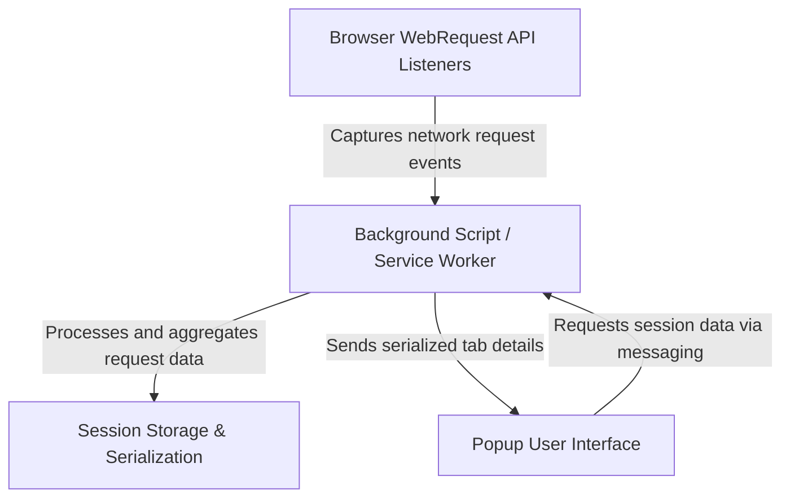

# System Architecture Overview

Understand the inner workings of uBO Scope and how it elegantly tracks your browser's network activity to reveal remote server connections. This page presents a clear architectural walkthrough that explains the journey from raw web requests to the real-time data you see in the popup UI.

---

## Core Purpose of the Architecture

Every time you browse the web, your browser makes numerous network requests to load content, some of which connect to third-party servers. uBO Scope intercepts these requests using browser APIs, classifies their outcomes, and aggregates detailed session data. This architecture enables accurate, real-time reporting of those connections, empowering you with visibility into your exposure to external domains.

---

## High-Level Architecture Flow

uBO Scope leverages standard browser extension components working in concert:

- **Background script (service worker/module):** The heart of data collection, running continually in the background to observe network requests.
- **Web Request API listeners:** Hooks into browser events that notify about network requests initiated by webpages.
- **Session and storage layers:** Persist data efficiently during browsing sessions to maintain accurate state.
- **Popup UI:** The user interface you interact with, retrieving processed session data to present a digestible summary.

The background script operates as a powerful observer and data processor, while the popup acts as an information consumer.

---

## How Network Requests Are Monitored

1. **Listening to Network Events:** uBO Scope's background script attaches listeners to key browser webRequest events such as `onBeforeRedirect`, `onErrorOccurred`, and `onResponseStarted`.
2. **Queuing Requests:** Rather than processing each network request immediately, they are queued briefly to batch-process efficiently.
3. **Session Data Structure:** Each tab maintains detailed mappings of network connection outcomes, organized by domain and hostname under three categories:
   - **Allowed:** Connections that succeeded and were not blocked.
   - **Stealth:** Requests that triggered redirects indicating stealth blocking.
   - **Blocked:** Requests that encountered errors or blocking events.
4. **Outcome Aggregation:** For each request, uBO Scope updates domain and hostname counts, effectively summarizing your exposure in real-time.

---

## Session Data Management

uBO Scope stores session data persistently using browser storage APIs. Key responsibilities include:

- **Load and save:** Session data is serialized/deserialized using a compact format to minimize overhead.
- **Public Suffix List Integration:** The extension loads and caches the public suffix list to accurately parse domain names from hostnames, critical for grouping network requests meaningfully.
- **Tab lifecycle awareness:** When tabs are closed, associated data is removed to keep session data clean.

---

## Communication Between Components

The popup UI uses extension messaging APIs to request the current tab's session data from the background script. The background responds with serialized data capturing all tracked network activity for that tab.

This design ensures the popup presents up-to-date information, reflecting your browsing session instantly.

---

## Practical Flow from Event to UI

1. **Network request occurs:** Browser triggers a webRequest event.
2. **Listeners queue the request:** Background script receives event and queues it.
3. **Batch processing:** After a brief delay, queued events are processed in bulk.
4. **Outcome recorded:** The request outcome updates allowed, stealth, or blocked maps by domain and hostname.
5. **Badge updated:** Browser toolbar badge is set to display the count of distinct allowed third-party domains.
6. **Popup refreshes:** When opened, popup requests session data and renders connection summaries with domain counts.

This flow maintains performance and responsiveness while providing comprehensive network insights.

---

## Tips for Understanding the Architecture

- The background script acts as the single source of truth for network connection states.
- Data structures use Maps keyed by domain and hostname for fast update and retrieval.
- By aggregating data per tab, the extension isolates browsing sessions and accounts for tab closures.
- Using the public suffix list ensures domain grouping considers complex domain hierarchies accurately.

---

## Troubleshooting Common Issues

- **No data visible in the popup:** Ensure your browser supports the `webRequest` API and the extension has necessary permissions.
- **Badge count not updating:** Network requests might be outside URLs monitored by uBO Scope (e.g., local files or unsupported protocols).
- **Data not persisting:** Check if browser storage is functioning and the extension has permission.

If problems persist, review browser developer tools console for error logs from the background script.

---

## Next Steps

To deepen your understanding and start hands-on:

- Visit [Feature Overview](/overview/architecture-features/feature-highlights) to learn about key functionalities.
- Explore [Integration with Browsers & Other Systems](/overview/architecture-features/integration-browser-ecosystem) for platform-specific considerations.
- Begin practical usage by following installation guides under [Getting Started].

---

For full source and updates, visit the [uBO Scope GitHub repository](https://github.com/gorhill/uBO-Scope).
