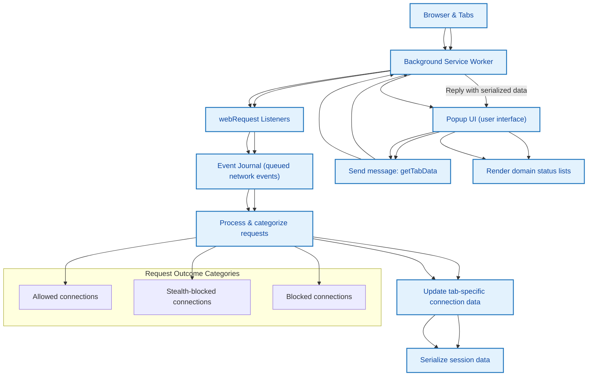

# How uBO Scope Works

Discover how uBO Scope captures, processes, and presents live network request data to reveal real-time insight into all third-party server connections from your browser. This overview breaks down uBO Scope’s architecture with a clear, step-by-step flow that explains how the extension operates independently of other content blockers.

---

## Introduction

uBO Scope is designed to deliver transparent visibility into all network connections — both allowed and blocked — that your browser makes on any webpage. It does this by listening to browser APIs to intercept network requests and report their outcomes, regardless of which content blocker you use or even if DNS-based blocking is enabled.

The core innovation is that uBO Scope does not depend on internal details of content blockers. It relies solely on the browser’s `webRequest` API, allowing it to detect connections attempted, allowed, blocked, or stealth-blocked across the board.

## Architecture Overview

At its heart, uBO Scope splits its responsibilities between two main components:

- **Background Service Worker:** Continuously monitors all network requests via webRequest listeners. Tracks request statuses including redirects, successes, and errors. Maintains session-based tracking of network activity grouped by browser tabs.

- **Popup UI:** Provides a user-facing interface that queries the background service worker for summarized data on the active tab and visually presents the domain connection status — showing domains that were allowed, stealth-blocked, or outright blocked.

This division enables efficient background monitoring independent of UI activity, while ensuring users can quickly access up-to-date connection reports on demand.

## How Network Requests Are Intercepted and Reported

1. **Request Monitoring:**
   - The extension listens to three key event types on the browser's `webRequest` API:
     - `onBeforeRedirect` for network redirects
     - `onErrorOccurred` for network failures (including blocked requests)
     - `onResponseStarted` for successful responses
   - These listeners are registered with filters applying to all HTTP, HTTPS, and WebSocket URLs allowed by the extension's manifest permissions.

2. **Event Queueing and Processing:**
   - Incoming request events are queued into a journal to batch process and optimize performance.
   - Every second, the queued requests are processed to determine connection outcomes and update tab-specific connection maps.

3. **Outcome Categorization:**
   - Each network request outcome is classified into one of three categories:
     - **Allowed:** Requests that successfully fetched resources.
     - **Stealth-blocked:** Requests that were redirected or blocked by stealth techniques.
     - **Blocked:** Requests that ended in network errors indicating explicit blocking.

   - Hostnames and domains are extracted, and connection counts are tracked separately for these categories.

4. **Session Data Maintenance:**
   - The background script maintains a complex mapping of each browser tab to its connection details, preserving the counts of allowed, stealth, and blocked domains.
   - This data is serialized to session storage to persist across reloads within a browsing session.

5. **UI Data Retrieval and Rendering:**
   - When a user opens the popup UI for the active tab, the popup sends a message to the background service worker requesting connection data.
   - The background script replies with serialized tab details.
   - The popup deserializes this and renders a clear, domain-sorted list categorized by outcome (allowed, stealth, blocked), showing counts of connections per domain.

## Visual Flow Diagram

## Practical User Flow

- When you browse the web, uBO Scope’s background worker silently listens to browser network activity.
- Every network request your browser makes is intercepted via webRequest listeners.
- The extension classifies connections as allowed, stealth-blocked, or blocked, updating the count of unique third-party domains connected in the current tab.
- This data is kept up-to-date continuously, persisting for the duration of the browsing session.
- When you click the toolbar icon, the popup UI loads, fetching current network connection stats for the active tab.
- You get a real-time, user-friendly summary showing which domains were contacted, whether they were blocked or allowed, providing transparency into your browsing privacy.

## Why This Matters

- **Transparent Measurement:** Unlike relying on block counts or filter lists alone, uBO Scope shows actual network outcomes reported by the browser.
- **Content Blocker Independent:** It reports network activity regardless of the content blocker or DNS filtering settings, giving you a reliable reality check.
- **Privacy Insight:** Understand exactly which third-party domains your browser talks to, improving your privacy awareness.
- **Filter List Validation:** Useful for maintainers and advanced users to validate or tune blocking efficacy.

## Tips & Best Practices

- To ensure accuracy, verify that your browser supports the required webRequest APIs and that uBO Scope has the necessary permissions granted on installation.
- Refresh tabs where you want to track network data right after installing uBO Scope.
- Use the popup UI for quick snapshots but know that detailed, ongoing monitoring happens in the background service worker.
- Remember that a low badge count indicates fewer third-party connections, which often correlates with better privacy.

## Troubleshooting

<AccordionGroup title="Common Issues and Solutions">
<Accordion title="No Data Showing in Popup">
- Confirm uBO Scope is installed and enabled.
- Reload the active tab to trigger new session data.
- Check browser permissions for network request monitoring.
</Accordion>
<Accordion title="Badge Count Not Updating">
- The badge updates asynchronously every second; wait briefly.
- Ensure the active tab is making network requests.
- Reload or reopen the tab to reset tracking.
</Accordion>
<Accordion title="Connections Missing Despite Using Another Content Blocker">
- uBO Scope depends on the browser’s webRequest API which may not capture requests made outside the browser or by DNS blocking.
- Use supported browsers and verify compatibility (Chrome, Firefox, Safari with described minimum versions).
</Accordion>
</AccordionGroup>

## Next Steps

Explore related documentation to deepen your understanding of uBO Scope:

- [Supported Browsers & Requirements](../../getting-started/installation-basics/supported-platforms-requirements) — to confirm compatibility
- [Feature Highlights](../feature-highlights) — for detailed feature benefits
- [Understanding Domain Status: Allowed, Stealth, Blocked](../../guides/interpreting-results/understanding-domain-status) — to interpret what domain statuses mean

---

Explore the source code or contribute at the official repository: [uBO-Scope on GitHub](https://github.com/gorhill/uBO-Scope)

