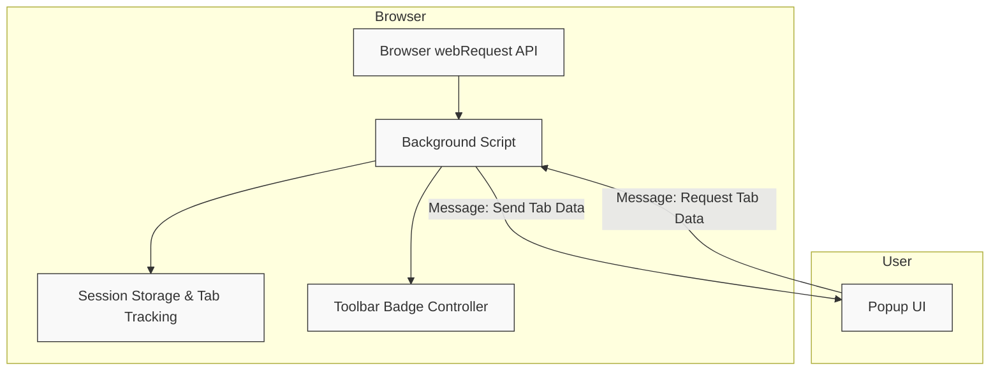

# How uBO Scope Works (with Diagram)

Understanding how uBO Scope functions behind the scenes is crucial to appreciate the clarity and insight it provides into your browser's network activity. This page offers a detailed, user-focused explanation of the core architecture of uBO Scope, accompanied by a clear diagram illustrating how network data flows from the browser to the extension's UI.

---

## The Heart of uBO Scope: Monitoring Network Events

uBO Scope operates within your browser to reveal connections to remote servers initiated by the webpages you visit. It primarily achieves this by leveraging the browser's `webRequest` API to capture key network events as they happen.

At the core:

- The **background script** listens for network requests — including redirects, errors, and successful responses.
- It organizes and categorizes these requests by tab, tracking whether connections are allowed, stealth-blocked, or outright blocked.
- The **popup UI** then fetches this summarized network data per active tab to present it in an accessible and user-friendly format.

This design offers real-time insights into the actual remote servers your browser interacts with, independent of which content blockers or DNS filters are in place.

## How Information Flows in uBO Scope

Let's break down the component interactions step-by-step to illustrate the user journey and data lifecycle:

1. When you navigate to a webpage, the background script's network listeners start capturing requests made by that tab.
2. For each request, the background script determines the hostname and domain, grouping them into outcome categories such as "allowed," "stealth-blocked," or "blocked."
3. The script aggregates these outcomes in a session-managed in-memory map keyed by tab ID.
4. To keep UI in sync, the extension updates the toolbar badge to reflect the count of distinct allowed third-party domains.
5. When you open the popup UI, it sends a message to the background script requesting the current tab's network details.
6. The background thread replies with serialized tab data, which the popup deserializes and renders into user-friendly lists.

This flow ensures you get a comprehensive and accurate snapshot of connections per tab, with minimal delay or overhead.

## uBO Scope’s Core Components

| Component         | Role                                                 | User Benefit                              |
|-------------------|------------------------------------------------------|------------------------------------------|
| Background Script | Captures network events via browser `webRequest` API | Provides reliable, ongoing connection data |
| Session Storage   | Stores per-tab network outcomes                       | Maintains session continuity across tab navigation |
| Popup UI          | Presents collected data in real-time                   | Enables immediate, clear understanding of connections |
| Domain Parsing    | Uses public suffix list to group hostnames into domains | Helps users identify third-party domains accurately |

## Visualizing the Architecture

This diagram captures the main relationships:

- The **Browser webRequest API** notifies the background script of network requests.
- The **Background Script** records data and manages storage.
- The toolbar **BadgeUpdater** reflects the current number of connected third-party domains.
- The **Popup UI** requests and displays network data for the active tab by communicating with the background script.

## Key Architectural Insights

- **Event-Driven Data Capture:** By relying on native browser APIs, uBO Scope ensures no network event is missed for monitoring.
- **Per-Tab Data Aggregation:** The background script maintains a map of each tab’s network activity, enabling targeted insights.
- **Efficient Session Management:** Data is serialized and preserved using session storage to maintain state without performance penalties.
- **Real-Time User Interface:** The popup UI presents data dynamically, synchronized through runtime messaging.

## Practical Example: What Happens When You Open a New Tab

1. You navigate to a website in a new tab.
2. The background script resets any previous tracking data for that tab.
3. It logs new network connections triggered by the website.
4. For each connection, it checks the hostname and corresponding domain, categorizing by connection outcome.
5. The toolbar badge updates to show the count of unique domains successfully connected.
6. Opening the popup UI sends a request to the background script, retrieving and displaying a breakdown of allowed, stealth-blocked, and blocked domains.

This workflow empowers you to immediately understand the nature of network connections on any site you visit.

---

## Tips for Using uBO Scope Effectively

- Remember that **lower badge counts mean fewer third-party connections**, which generally indicates better privacy.
- Use the popup UI to explore detailed connection outcomes; this helps confirm if stealth blocking or blocking behaves as expected.
- The extension's ability to independently track network requests can provide validation against other content blockers.

---

This completes the core introduction to how uBO Scope’s components work together to deliver transparent, actionable network visibility.

For a foundational understanding of relevant terms, visit the [Core Concepts & Terminology](../intro-key-concepts/core-concepts-terminology) page.

Explore how to [Use the Extension](../../getting-started/usage-and-troubleshooting/using-the-extension) to get the most value from the network insights.

---