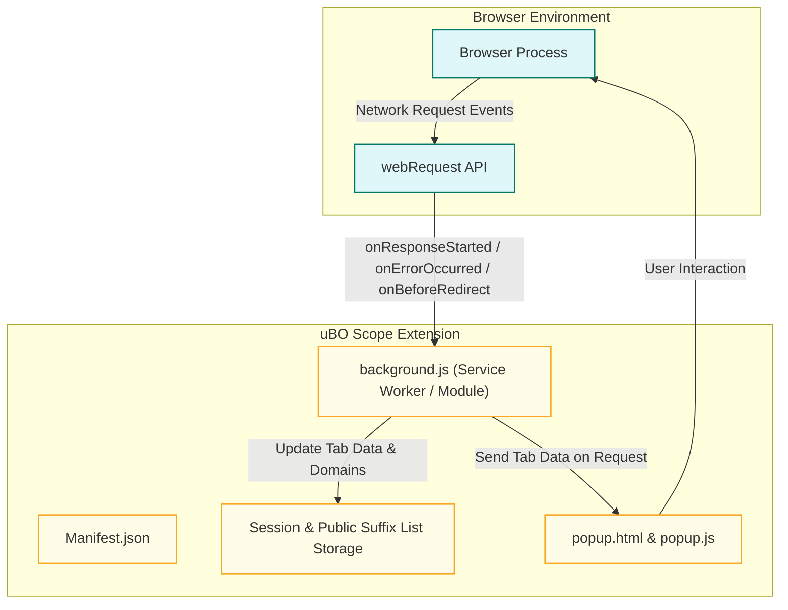

# Browser Integration & Extensibility

Understanding how uBO Scope integrates with various modern browsers is key to appreciating its transparency and reliability in reporting remote server connections. This page explains the extension's browser compatibility, how it leverages the browser's `webRequest` API, and the nuances around network requests it can monitor.

---

## Why Browser Integration Matters

Every browser handles extension capabilities differently—especially when it comes to network monitoring APIs. uBO Scope is built to work robustly across Chromium-based browsers, Firefox, and Safari by targeting their `webRequest` APIs. This ensures you get consistent data about network connections initiated by webpages you visit.

By seamlessly integrating at this core browser level, uBO Scope enables you to audit which third-party servers your browser connects to, independently of what content blockers or DNS filters are active.

---

## What This Page Covers

- How uBO Scope integrates with the browser environment
- Manifest permissions and required browser settings
- Interaction with the `webRequest` API
- Limitations around monitoring network requests
- Multi-browser compatibility considerations

---

## How uBO Scope Integrates With Browsers

At its core, uBO Scope installs as a browser extension with manifest files tailored for Chromium, Firefox, and Safari. These manifests declare the permissions and background scripts necessary to operate.

### Core Manifest Permissions

Each browser manifest explicitly requests the following:

- **`webRequest` permission:** Grants access to monitor network requests using webRequest listeners.
- **`activeTab` and `storage`:** Allow managing session data and interacting with the active tab.
- **Host permissions for URL patterns:** Typical patterns include `http://*/*`, `https://*/*`, and for Firefox, also WebSocket schemes like `ws://*/*`, `wss://*/*`.

This setup ensures that the extension receives events about all network requests that match these URL patterns.

### Background Script Integration

- **Chromium:** Runs a service worker module script (`background.js`) with the required permissions from the manifest.
- **Firefox and Safari:** Use module scripts similarly, ensuring event listeners are registered for monitoring network activity.

This script listens for three types of network request events:

- **Response started (`onResponseStarted`):** When a network request is successfully initiated.
- **Error occurred (`onErrorOccurred`):** When a network request fails or is blocked.
- **Before redirect (`onBeforeRedirect`):** To track redirection flows.

The background script aggregates these events to build a detailed tab-specific summary, which powers the popup UI display.

---

## Leveraging the WebRequest API

The `webRequest` API is the cornerstone of how uBO Scope compiles connection data:

- It listens to all matching network requests as they are made.
- It categorizes outcomes as "allowed", "blocked", or "stealth-blocked" based on success, error, or redirect events.
- It uses detailed URL and hostname parsing to accumulate data per domain using the Public Suffix List.

This approach means uBO Scope can report what is happening at the network layer independently of the browser's content blockers or DNS filters.

### What You Get

- Counting distinct third-party domains contacted per tab
- Detailed breakdown of domains by their blocking outcomes
- Real-time badge count reflecting the number of allowed third-party connections

---

## Cross-Browser Compatibility Details

### Chromium

- Supports `webRequest` with `service_worker` background.
- Requires version 122.0 or later.
- Supports WebSocket URL permissions.

### Firefox

- Supports similar permissions and listeners, extended to WebSocket schemes.
- Requires Firefox 128.0 or later.
- Integration tailored with gecko-specific manifest settings.

### Safari

- Running on Safari 18.5 or later.
- Uses event script background model.
- Supports core webRequest APIs but has stricter constraints than other browsers.

While the extension maintains functional parity across these browsers, native browser API differences or limitations may slightly affect the granularity or scope of observable requests.

---

## Limitations and Important Notes

While uBO Scope captures a comprehensive view of network activity, the following limitations are inherent:

- **Requests Outside `webRequest`’s Scope:** Network requests made by browser components or protocols outside the `webRequest` API’s reach—such as certain cached browser internal fetches or service worker controlled fetches—cannot be reported.

- **Indirect or Native Apps:** Connections initiated outside the browser or in extension-inaccessible contexts won’t be visible.

- **Non-Persistent Background:** The service worker based background can be terminated and restarted by the browser, so uBO Scope manages session data carefully to maintain continuity.

Understanding these boundaries helps set realistic expectations about the visibility of all network activity.

---

## Practical Benefits of This Integration

- **Reliable Network Transparency:** By hooking into browser network internals, you get an authoritative count and log of third-party connections.

- **Independent of Blocker Efficacy:** You see outcome data regardless of whether content blockers report blocking or not — making it an invaluable diagnostic tool.

- **Seamless User Interface Tie-In:** The popup panel dynamically shows domain connection summaries per tab, all powered by these browser events.

---

## How It All Comes Together

This flow illustrates the seamless data movement—from network interception to user presentation—enabled by browser integration.

---

## Getting Started with Browser Integration

To make the most of uBO Scope’s browser integration:

1. **Install the extension** from your browser’s official store matching your platform (Chromium, Firefox, Safari).
2. Understand that the extension requires enabling permissions like `webRequest` and host access.
3. Use the popup panel to visualize network connections for each active tab.
4. Explore related documentation such as "Reading the Popup Panel Data" to fully interpret the data.

---

## Additional Tips & Best Practices

- Keep your browser updated to ensure the latest API improvements.
- If network requests seem missing, verify you’re using compatible browser versions and uBO Scope permissions.
- The badge count on the toolbar icon reflects the number of distinct allowed third-party servers per tab — aim for fewer connections for enhanced privacy.

---

## Troubleshooting Common Integration Issues

<AccordionGroup title="Common Integration Issues & Solutions">
<Accordion title="Missing Network Data or Empty Popup">
Check that the extension has the necessary permissions granted in your browser's extension settings. Also, ensure you are using a supported browser version that allows `webRequest` monitoring.
</Accordion>
<Accordion title="Badge Count Not Updating">
Network data is processed asynchronously—allow a few seconds after page load for the badge count to refresh. If issues persist, try restarting your browser or reinstalling the extension.
</Accordion>
<Accordion title="Unexpected Blocking or No Block Data">
Remember that uBO Scope only reports network request statuses as detected by browser events and does not block or modify any traffic. Differences in content blocker configurations may affect network outcomes but won’t impact uBO Scope’s reporting.
</Accordion>
</AccordionGroup>

---

## Where to Go from Here

To fully leverage uBO Scope:

- Explore the [Overview of Core Features](./core-features-overview) to understand all data reporting abilities.
- Read [How It Works: System Architecture](./how-it-works-architecture) for detailed insights into the background processing model.
- Visit [Reading the Popup Panel Data](../../guides/interpreting-results/reading-popup) to learn how to interpret the UI display.

---

## References & Resources

- [uBO Scope GitHub Repository](https://github.com/gorhill/uBO-Scope) - Source code and latest releases
- Browser-specific install pages:
  - [Chrome Web Store](https://chromewebstore.google.com/detail/ubo-scope/bbdpgcaljkaaigfcomhidmneffjjjfgp)
  - [Firefox Add-ons](https://addons.mozilla.org/firefox/addon/ubo-scope/)
- Mozilla’s `webRequest` API documentation for deeper understanding of browser events

---

Understanding uBO Scope’s browser integration is the foundation for harnessing its power in revealing network connections and enhancing your web privacy awareness.