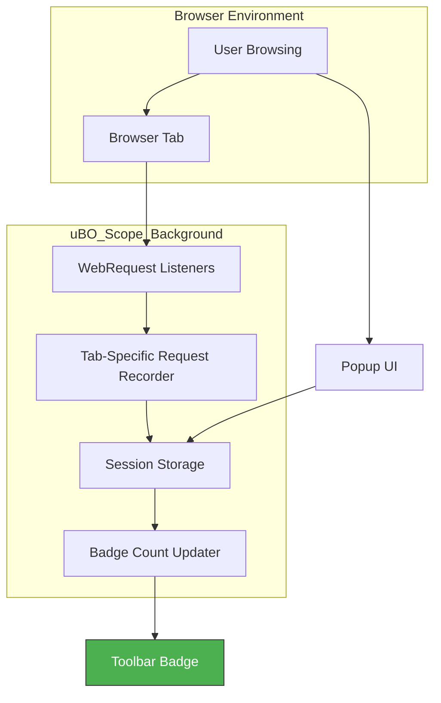

# Quick Feature Overview

uBO Scope offers a powerful yet streamlined feature set designed to empower users with clear visibility over network connections initiated by web pages. This page delivers a concise breakdown of its main capabilities, emphasizing how each enhances your ability to monitor, analyze, and control third-party connections with ease and precision.

## Per-Tab Network Request Tracking

At its core, uBO Scope meticulously tracks all network requests on a per-browser-tab basis. This means:

- Every active tab maintains its own detailed record of remote server interactions.
- Requests are categorized into three distinct outcomes:
  - **Allowed**: Connections permitted during page load.
  - **Stealth-blocked**: Requests silently blocked without the page's knowledge.
  - **Blocked**: Requests explicitly blocked.

This granular tracking allows you to see the direct impact of your blocking tools as they relate to each specific tab, isolating network exposure with precision.

## Visualizing Connections with Badge and Popup UI

uBO Scope uses a dynamic toolbar badge and an interactive popup panel to bring clarity to complex network activity:

- **Toolbar Badge**: Displays the count of distinct third-party domains contacted in the active tab, offering an instant privacy exposure metric.
- **Popup Panel**: Upon clicking the toolbar icon, a well-organized user interface presents:
  - The current tab’s main hostname and its root domain.
  - A categorized listing of all connected domains grouped by their connection outcomes.
  - Count badges adjacent to each domain indicate the number of connection attempts.

This visual approach transforms raw network data into actionable insights.

## Dissecting Third-Party Access

Beyond tracking requests, uBO Scope emphasizes third-party domain evaluation by:

- Resolving hostnames to root domains using a robust public suffix list, ensuring accurate grouping.
- Presenting connection outcomes categorized by domain, highlighting which third-parties are allowed, stealth-blocked, or blocked.
- Updating this data live alongside your browsing sessions, reflecting real-time privacy status.

This focused domain-centric perspective spotlights privacy exposures and helps users make informed decisions about which third-party servers are present.

## Support Across Multiple Browsers

Designed for broad compatibility, uBO Scope supports major browsers including Chrome, Firefox, and Safari, benefiting from:

- Unified data collection through standardized WebRequest APIs.
- Consistent user experience with identical badge counts and popup layouts.
- Low overhead impact, efficient background processing, and resilient session state management.

This cross-browser support ensures reliable network monitoring regardless of your browser choice.

---

## Practical Example: Monitoring a Privacy-Sensitive Site

Imagine browsing a website with multiple third-party content providers:

1. On page load, uBO Scope’s badge shows "5" — indicating five distinct third-party domains connected.
2. Clicking the badge reveals the popup with lists of which third-parties were allowed, stealth-blocked, or blocked.
3. You notice one unexpected domain under "Allowed" and decide to investigate or add blocking filters accordingly.

This workflow illustrates how uBO Scope facilitates real-time privacy auditing tailored per tab.

---

## Technical Snapshot

While avoiding deep implementation details, here’s a simplified flow of how uBO Scope manages data:

This flow captures the seamless capture, categorization, and reporting of network events.

---

## Best Practices and Tips

- **Keep an eye on the badge count**: A higher number indicates more third-party domains connected, signaling a potentially higher privacy risk.
- **Use the popup to understand connection outcomes**: Distinguish between allowed, stealth-blocked, and blocked domains to refine your blocker settings.
- **Compare browsing sessions**: Use uBO Scope alongside different content blockers to verify actual third-party connections.
- **Remember domain grouping matters**: uBO Scope aggregates hostnames by eTLD+1 (effective top-level domain plus one), reducing noise and focusing on distinct organizations.

---

## Troubleshooting Common Scenarios

<AccordionGroup title="Common Questions and Issues">
<Accordion title="Why does the badge count change as I browse?">
Network request activity is dynamic. New third-party domains may be contacted as you interact with a page or navigate. uBO Scope updates counts live to reflect this continuous activity.
</Accordion>
<Accordion title="Some expected trackers do not show up in the blocked list. Why?">
This often means those trackers are stealth-blocked — silently prevented without page awareness. Check the "stealth-blocked" section in the popup for such domains.
</Accordion>
<Accordion title="Why do the domain names appear sometimes truncated or strange?">
uBO Scope uses the public suffix list to parse root domains accurately. Some internationalized or multi-level domains may look unusual due to this processing but are correctly categorized.
</Accordion>
</AccordionGroup>

---

## Next Steps

With this feature overview as your foundation, proceed to explore detailed usage and interpretive guides:

- [Understanding the Toolbar Badge and Popup Data](/guides/analyzing-results/understanding-badge-popup) to learn how data maps to privacy impacts.
- [Case Studies and Practical Scenarios](/guides/analyzing-results/case-studies-blocking) for real-world applications.
- [Installation and Setup](/guides/getting-started/install-setup) to configure uBO Scope for your browser.

Harness uBO Scope’s clarity to transform how you perceive and control third-party network connections.

---

*For complete context on uBO Scope’s purpose and user benefits, refer to the [What is uBO Scope?](/overview/introduction-group/what-is-ubo-scope) and [Why uBO Scope Matters](/overview/introduction-group/why-it-matters) pages.*
