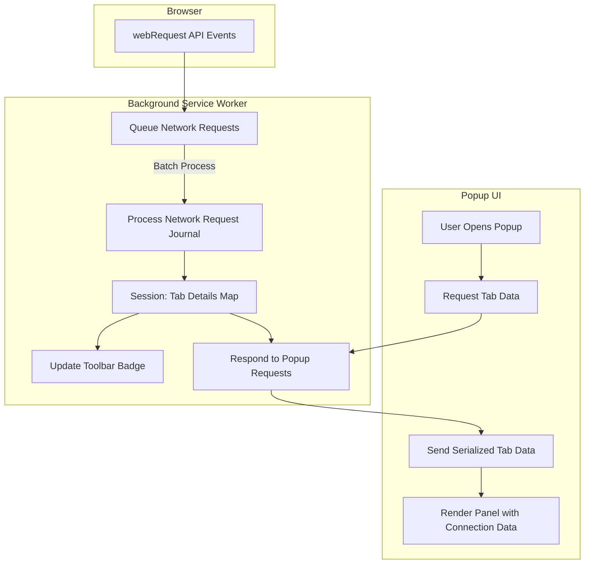

# System Architecture

## Visual Walkthrough of uBO Scope’s Architecture

Understanding how uBO Scope monitors, categorizes, and reports browser network requests is key to appreciating its real-time insights into your browsing activity. This page provides a clear, step-by-step illustration of the internal flow of data — from network events captured by the browser’s webRequest API, through processing layers, to the live visualizations you see in the popup interface.

---

### How uBO Scope Tracks and Reports Network Requests

At its core, uBO Scope listens to every network request your browser initiates or attempts. It leverages the browser's `webRequest` API to catch key events such as:

- **Redirects** (when a request is rerouted)
- **Errors** (failed requests, including blocked ones)
- **Successful responses**

Every network event is queued briefly to batch process multiple requests efficiently before updating the internal state.

#### Key Concepts in the Flow

- **Tab Details Tracking:**  uBO Scope maintains a detailed map of each browser tab’s network activities, categorizing domains and hostnames into:
  - Allowed (connections that succeeded without blocking)
  - Stealth (redirected connections treated specially)
  - Blocked (connections that failed or were blocked)

- **Domain and Hostname Extraction:** Using a public suffix list and punycode utilities, uBO Scope derives the effective domain from hostnames to group requests coherently.

- **Badge Updates:** The extension’s toolbar icon badge reflects the count of distinct third-party domains successfully connected, helping users immediately gauge their exposure per tab.

- **Popup Visualization:** On opening the popup, data for the current tab is fetched and rendered, showing categorized domains and their connection counts in a clear UI.

---

### Architecture Flow Diagram

---

### Step-by-Step User Flow

1. **Network Event Captured:** As you browse, every network request or redirect is captured by the extension’s `webRequest` event listeners.
2. **Event Queued:** Requests are batched temporarily to avoid performance hits from processing each event immediately.
3. **Journal Processing:** Batch processing updates per-tab session data, categorizing requests into allowed, stealth-blocked, or blocked.
4. **Badge Updated:** The browser action badge displays how many distinct third-party domains have been successfully connected by the current tab.
5. **Data Request by Popup:** When you open the extension popup, a message is sent to the service worker requesting the tab’s network data.
6. **Data Serialization & Delivery:** The service worker serializes the relevant data and sends it back.
7. **Popup Render:** The popup UI processes the data, decoding domain names for readability and populating categorized lists along with connection counts.

---

### Practical Benefits of This Architecture

- **Near Real-Time Transparency:** The architecture ensures that you receive up-to-date information on your tab’s network connections instantly upon opening the popup.

- **Efficiency at Scale:** By batching network events and using a centralized session map, uBO Scope handles high volumes of web requests without slowing your browser.

- **Comprehensive Coverage:** Even stealthy redirects and error events (blocked requests) are tracked, giving a full picture of network activity.

- **User-Centric Data Presentation:** Data is prepared and delivered in a form ready to be displayed meaningfully, avoiding confusing raw logs.

---

### Tips and Best Practices

- **Understanding Badge Counts:** The badge only counts allowed third-party domains, so a lower number is generally better but expect some domains for legitimate resources (e.g., CDN services).

- **Popup Timing:** Opening the popup immediately after page load provides the most accurate snapshot reflecting active network connections.

- **Refresh Tab if Data Seems Missing:** If the popup shows no data or stale data, try refreshing the tab to trigger network events anew.

- **Conflicts with Other Extensions:** Since uBO Scope relies on the browser’s `webRequest` API, some extensions that modify network requests extensively may affect data accuracy.

---

For a deep dive into the product mission and user scenarios, see [What is uBO Scope?](../../getting-started/what-is-ubo-scope) and for precise definitions used here, consult [Core Concepts and Terminology](../../getting-started/core-concepts-terminology).

