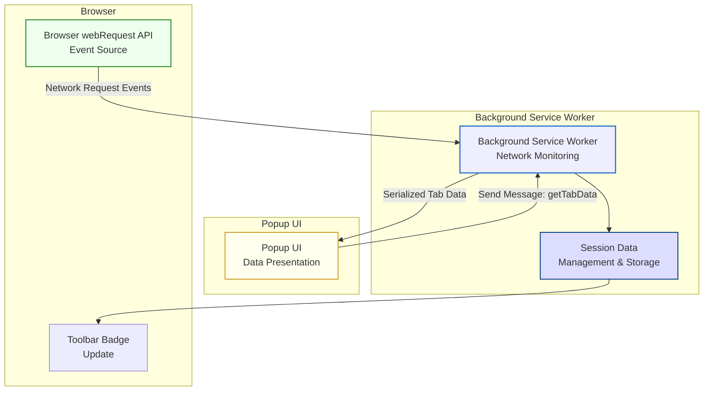

# System Architecture at a Glance

uBO Scope is designed to transparently capture, process, and present network connection data between your browser and remote servers. This page offers a high-level visualization of the main technical components involved in this process — from background network monitoring through data serialization to user interface display in the popup.

---

## Overview

At its core, uBO Scope continuously monitors network activity generated by your browser tabs. It organizes and records data about each connection attempt, categorizing them by their outcome (allowed, blocked, or stealth-blocked). This data is then serialized and stored efficiently to ensure fast retrieval and minimal resource impact.

When you interact with the extension's popup, this stored data is deserialized and presented in an easy-to-understand format, showing the domains connected and the status of these connections.

---

## Key Components

### Background Network Monitoring

- Runs within the extension's background context, typically as a service worker.
- Listens to network events via the browser's `webRequest` API.
- Captures detailed information about every network request, including URL, request type, and outcome (success, redirect, error).
- Maintains a structured session state mapping tabs to connection details.
- Updates the toolbar badge to reflect the number of allowed third-party domains per tab.

### Data Serialization and Session Management

- Uses a compact custom serialization (via the `serialize` and `deserialize` functions in `s14e-serializer.js`) to store session data efficiently.
- Saves session data asynchronously to the browser's local session storage, preserving analysis across browser sessions.
- Loads and refreshes a public suffix list to accurately determine domain boundaries.

### Popup UI Presentation

- Displays connection data on demand via a popup opened from the browser toolbar.
- Retrieves the serialized session data for the active tab via message passing.
- Deserializes and renders the data, showing distinct domain listings under categories: ‘not blocked’, ‘stealth-blocked’, and ‘blocked’.
- Uses Unicode decoding (via `punycode`) to present internationalized domain names clearly.

---

## Component Interaction Flow

The following Mermaid diagram summarizes the typical data flow and interactions:

---

## Real-World Context

Imagine browsing a webpage. As resources load, your browser initiates multiple network requests:

- Each request triggers an event captured immediately by the background service worker.
- The extension classifies each connection according to its result: successfully connected (allowed), blocked by content blocker (blocked), or stealth-blocked (not visible to the page).
- The tab’s badge updates dynamically, letting you know how many third-party domains are actively connected.
- Open the popup anytime to explore detailed insights on which domains are communicating, making the invisible transparent.

---

## Practical Tips & Best Practices

- **Performance is key**: By batching network events and saving session data periodically, the background service worker ensures minimal impact on browser speed.
- **Accurate domain parsing**: The incorporated public suffix list and punycode handling guarantee domains are identified and presented correctly, including internationalized domains.
- **Consistent badge updates**: The badge count directly reflects allowed third-party connections per tab, serving as a reliable privacy indicator.
- **Lightweight UI rendering**: The popup sticks to essential information, avoiding overwhelming users with excessive details.

---

## Troubleshooting Common Issues

- **No badge count or blank popup:** Ensure the extension is granted appropriate permissions and that the current tab is actively producing network requests.
- **Delayed updates:** Because network events are batched and processed every second, some delay is natural during heavy network activity.
- **International domains appear incorrectly:** The extension uses punycode decoding; if issues persist, verify that the browser supports such encoding.

---

## Getting Started Preview

To experience uBO Scope's architecture in action:

1. Install the extension from the appropriate browser store.
2. Browse websites with various third-party content.
3. Observe the badge updating with connected domains.
4. Click the extension icon to open the popup and review detailed domain connection statuses.

For a walk-through on installation and first use, see the [Installing uBO Scope on Your Browser](https://example.com/guides/getting-started/installing-ubo-scope) and [Your First Scan: Understanding the Badge and Popup](https://example.com/guides/getting-started/first-domain-scan) documentation.

---

For a more comprehensive understanding of uBO Scope’s purpose and terminology, refer to the introductory documentation under the Product Introduction & Core Concepts section in the Overview tab.

---

_Source code and further details are available in the [GitHub repository](https://github.com/gorhill/uBO-Scope)._
