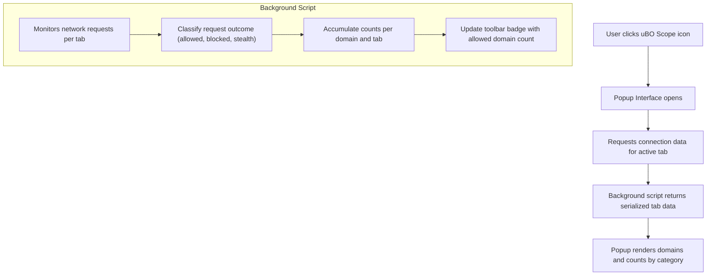

# Quick Feature Overview

## See uBO Scope in Action: Instant Insights on Network Connections

uBO Scope offers a straightforward and immediate view into your browser's network activity, revealing the domains your active tabs communicate with. This page is your gateway to understanding exactly what the extension tracks and reports, broken down into clear, actionable categories.

### What You Get at a Glance

- **Tracking Network Connections per Tab:** uBO Scope monitors each tab individually so you can see the exact remote domains a specific webpage interacts with.
- **Categorized Connection Outcomes:** Domains are grouped based on the fate of their requests:
  - **Allowed:** Connections successfully made.
  - **Blocked:** Connections prevented by your content blocker.
  - **Stealth-Blocked:** Connections hidden or redirected covertly by blockers.
- **Accurate Domain-level Reporting:** Data isn’t just per hostname but grouped by domains using the Public Suffix List for clarity.
- **Unbiased Across Content-Blocking Setups:** No matter which blocker (or DNS-based solution) you run, uBO Scope tracks actual browser network requests via the webRequest API.

### Why This Matters

Imagine opening the popup while browsing your favorite website. Instead of guesswork or partial visibility, you immediately see a comprehensive list showing how many third-party connections the page is attempting, which ones your blockers thwart, and which slip through. This empowers you to audit your privacy setup, optimize your blockers, and debunk common assumptions about what’s being blocked or allowed.

## Understanding the Popup Interface

When you click the uBO Scope icon, the popup interface presents the network connection summary for the active tab:

- **Hostname Header:** Displays the current webpage's hostname and domain in two parts, providing easy recognition.
- **Summary Section:** Shows the total number of distinct connected domains.
- **Outcome Sections:** Separate blocks show domains grouped by connection outcome:
  - **Not Blocked:** All domains successfully connected.
  - **Stealth-Blocked:** Domains affected by stealth blocking.
  - **Blocked:** Domains fully prevented.

Each domain includes a count badge showing how many connections to that domain were made, giving insight into connection intensity.

## Feature Details & User Benefits

| Feature                | What It Does                                                     | User Benefit                                                |
|------------------------|-----------------------------------------------------------------|-------------------------------------------------------------|
| Per-tab connection tracking | Monitors network activity specific to the active browser tab       | Enables precise inspection of network behavior per page     |
| Blocked, allowed, stealth categories | Categorizes each domain by the network request outcome               | Helps users quickly gauge which connections are managed how  |
| Domain-based grouping   | Groups hostnames under their registered domains (e.g., example.com) | Simplifies understanding by reducing complexity and noise    |
| Live data rendering     | Dynamically shows up-to-date network status on popup open       | Immediate access to current tab connection info              |
| Compatibility with all blockers | Works regardless of content blocking method in place                  | Trustworthy view without being blocked by DNS or stealth tech |

## Real-World Example

Consider you're browsing a news website prone to many third-party trackers. Opening uBO Scope’s popup reveals:

- 12 domains under “Not Blocked” including essential CDNs and media hosts.
- 5 domains stealth-blocked, which are silently redirected or obscured.
- 3 domains fully blocked (e.g., known trackers).

This immediate snapshot gives confidence about what is happening behind the scenes, letting you adjust filters or privacy settings SMARTLY.

## Tips for Maximizing Use

- Refresh the popup each time you need up-to-date network connection info.
- Use the domain counts to spot unexpectedly frequent connections that may require further investigation.
- Remember the badge count on the toolbar icon reflects unique allowed third-party domains, helping gauge overall exposure quickly.

## Common Pitfalls to Avoid

- Don’t confuse high block counts with better blocking; uBO Scope reflects distinct third-party connections allowing smarter interpretation.
- While the popup lists domains per tab, network requests initiated by background tabs or extensions may not be shown.

## How It Works Behind the Scenes (Conceptual Overview)

The extension listens to the browser's network requests and classifies each based on its outcome:

- Requests completing successfully are marked allowed.
- Requests canceled or errored out due to blocking are categorized blocked.
- Redirects by stealth blocking mechanisms fall under stealth.

These results accumulate per tab and domain and are displayed live through the popup interface.



## Getting Started Preview

To try out this quick feature overview yourself:

1. Install uBO Scope on your preferred browser—compatible with Chromium, Firefox, and Safari.
2. Navigate to any active webpage with third-party connections.
3. Click the uBO Scope toolbar icon and watch the popup render the domains communicating with that page.

For detailed setup instructions, visit the [Installing uBO Scope](../getting-started/installation-basics/installing-extension) page.

---

> Ready for the next step? Explore [Your First Use: Understanding Connections](../getting-started/first-use-config/getting-started-using) to learn how to interpret this connection data effectively.

---

## Additional Resources

- [What is uBO Scope?](../introduction-core-concepts/what-is-ubo-scope)
- [Core Concepts & Terminology](../introduction-core-concepts/core-concepts-terminology)
- [System Architecture](../architecture-quick-insights/system-architecture)


---

This quick feature overview gives you the knowledge to use uBO Scope's popup effortlessly and understand its domain-level network tracking at a glance—transforming complex privacy data into actionable insights instantly.


---

## Code Snippet: Rendering Domains in the Popup

This simplified example from `popup.js` shows how uBO Scope renders domain counts by category on the popup:

```javascript
function renderPanel(data = {}) {
    const { hostname: tabHostname, domain: tabDomain, allowed, blocked, stealth } = data;

    // Display tab domain
    dom.text('#tabHostname > span:last-of-type', tabDomain);

    // Clear previous domains
    dom.clear('.outcome.allowed .domains');
    dom.clear('.outcome.blocked .domains');
    dom.clear('.outcome.stealth .domains');

    const rowTemplate = qs$('template#domainRow');

    // Render allowed domains
    allowed.domains.forEach((count, domain) => {
        const row = rowTemplate.content.cloneNode(true);
        dom.text(qs$(row, '.domain'), domain);
        dom.text(qs$(row, '.count'), count);
        qs$('.outcome.allowed .domains').append(row);
    });

    // Similar rendering logic for blocked and stealth domains...
    
    // Summary count
    dom.text('#summary > span', allowed.domains.size.toLocaleString());
}
```

This example highlights how the extension processes and presents data to the user intuitively.

---

For full source code and contribution details, visit the [uBO Scope GitHub repository](https://github.com/gorhill/uBO-Scope).
