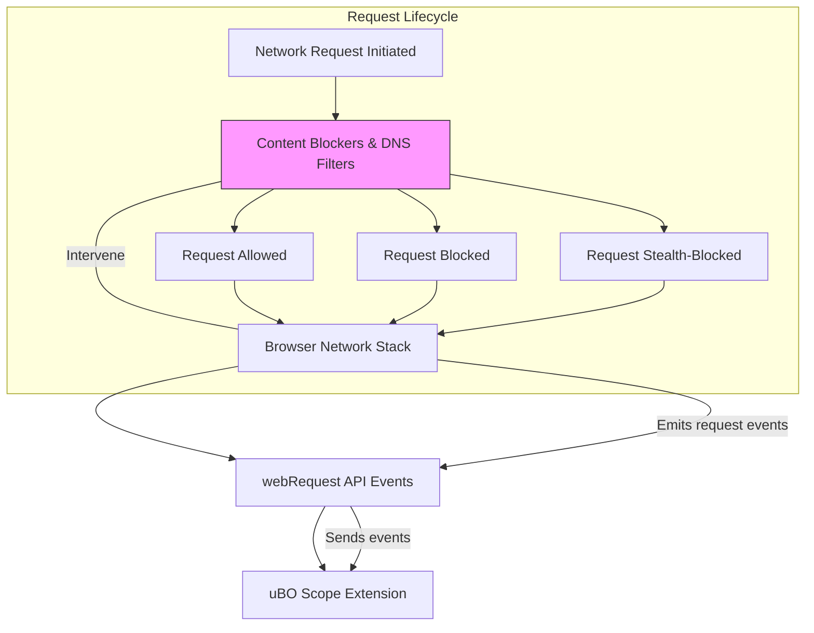

# Integration with Browsers and Other Content Blockers

Discover how uBO Scope leverages browser APIs to deliver accurate, independent network connection data even when other content blockers or DNS-level filters are active. This page breaks down the interaction between uBO Scope and the browser environment, clarifies interoperability considerations, and highlights the extension's unique approach that ensures reliable visibility into your browser's network requests.

---

## How uBO Scope Integrates with Browser APIs

uBO Scope uses the browser's `webRequest` API to monitor all network requests initiated by webpages in real time. By subscribing to specific lifecycle events such as request redirects, errors, and responses, it captures the status of each network connection attempt your browser makes. This integration enables uBO Scope to independently report:

- Successful connections
- Requests blocked by any mechanism
- Redirects indicating stealth blocking

These insights come directly from the browser's perspective, regardless of what other content blockers are installed or whether DNS-level filtering is applied.

### Why `webRequest` API Matters

The `webRequest` API is the only source of truth available to extensions for observing network activity made through the browser's own network stack. uBO Scope listens through this API to obtain granular, tab-specific details including:

- URL and resource type
- Outcome of the request (success, error, redirect)
- Frame and initiator information

Because all extensions and filters rely on the browser's network engine, uBO Scope's event-driven monitoring offers a dependable, side-channel view of network requests.

---

## Independent and Accurate Monitoring Despite Other Content Blockers

Content blockers (like uBlock Origin) and DNS-based filters actively prevent connections by intercepting or blocking requests. However, these blockers do not expose their internal workings or results directly. uBO Scope stands apart by:

- Observing network requests _after_ the browser processes any block or allow decisions
- Reporting outcomes as seen by the browser, not relying on other extensions
- Maintaining visibility even when content blockers operate stealthily

This means uBO Scope accurately accounts for network activity whether requests are allowed, fully blocked, or stealth-blocked (such as redirected or dropped without notification).

### Real-World Scenario

Imagine you have two content blockers installed alongside uBO Scope, both attempting to block ads through different techniques:

- Blocker A blocks many requests, causing fewer connections
- Blocker B blocks fewer requests but triggers stealth blocking via DNS

uBO Scope will detect and categorize the network outcomes from the browser's perspective, showing you the true number of distinct third-party servers your browser contacted or tried to contact. This clarity helps you evaluate blocker effectiveness without relying on superficial block counts.

---

## Limitations and Considerations

While uBO Scope is robust, it has inherent limitations tied to the browser APIs:

- **No visibility for network requests outside `webRequest` scope:**
  Requests originating from native browser features or system-level services, such as DNS queries or OS-level VPN filtering, cannot be observed by uBO Scope.

- **Variations across browsers:**
  The availability and fidelity of `webRequest` events can vary, especially on browsers like Safari or mobile versions, affecting monitoring completeness.

- **Impact of aggressive blocking:**
  Some content blockers may interfere with the `webRequest` APIs' reporting in ways that temporarily obscure connection details, though this is uncommon.

### Best Practice Tip

To maximize the usefulness of uBO Scope:

- Use it to _complement_ your content blockers rather than replace them.
- Understand that the badge count represents third-party server connections that _were allowed_, emphasizing privacy transparency.
- Refer to the [Prerequisites & System Requirements](../getting-started/installation-basics/prerequisites-system-requirements) to ensure your browser supports needed APIs.

---

## How uBO Scope Differentiates Itself from Other Monitoring Tools

Unlike traditional content blockers or simple network monitors, uBO Scope:

- Does not block or filter connections — it only measures and reports.
- Provides tab-level granularity on network connection outcomes.
- Categorizes connections into allowed, blocked, and stealth-blocked using browser-reported events.
- Operates transparently, without interfering with other extensions or network behavior.

This unique role enables users, filter list maintainers, and privacy-conscious individuals to gain an unfiltered, authoritative perspective on third-party network interactions their browsers perform.

---

## Summary Diagram of uBO Scope Integration with Browser and Content Blockers

---

## Troubleshooting Common Interoperability Issues

<AccordionGroup title="Troubleshooting Integration with Other Content Blockers">
<Accordion title="Why am I seeing no data or incomplete data in uBO Scope?">
Ensure your browser supports the required `webRequest` API with sufficient permissions. Verify that uBO Scope is enabled and has 'host permissions' for all URLs (`http://*/*`, `https://*/*`, `ws://*/*`, `wss://*/*`). Also, check for other extensions imposing aggressive privacy controls that might block these APIs.
</Accordion>
<Accordion title="Are there conflicts when using multiple blocking extensions?">
uBO Scope observes the browser's network events passively and does not interfere with content blockers. However, extremely aggressive blockers or privacy tools may cause inconsistent reporting or cause the browser to withhold detailed request info, limiting uBO Scope's visibility.
</Accordion>
<Accordion title="Why does uBO Scope's badge count differ from my content blocker’s block count?">
The badge count in uBO Scope reflects the number of distinct third-party remote servers _allowed_ connections, not the total block count. Content blockers may count blocked requests differently, sometimes counting requests that were ultimately allowed or redirected stealthily. For a meaningful assessment, focus on uBO Scope’s allowed connection count.
</Accordion>
</AccordionGroup>

---

## Next Steps

- To learn how the different uBO Scope components work together behind the scenes, visit the [System Architecture](./system-architecture) page.
- Explore [Quick Feature Overview](./feature-overview) to understand the key features visible in the popup UI.
- Begin monitoring your first tab connections step-by-step via [Your First Use: Understanding Connections](../../getting-started/first-use-config/getting-started-using).

---

## References

- [uBO Scope GitHub Repository](https://github.com/gorhill/uBO-Scope)
- [Browser webRequest API Documentation](https://developer.mozilla.org/en-US/docs/Mozilla/Add-ons/WebExtensions/API/webRequest)
- [Public Suffix List](https://publicsuffix.org/)

---

This page situates uBO Scope within the browser's ecosystem and clarifies its unique value as an independent network connection monitor that complements other content blockers without conflict or dependency.