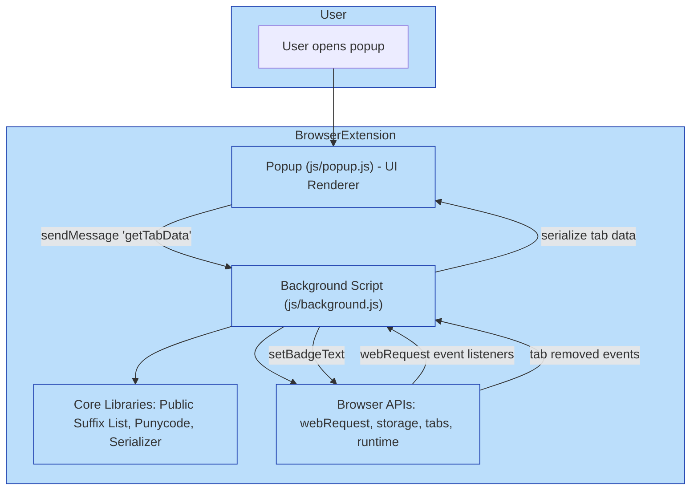

# System Architecture

Visualize the internal architecture of uBO Scope to understand how its components collaborate to deliver real-time insights on your browser's network connections. This page focuses on the flow of data, key background processes, and user interface elements working behind the scenes.

---

## Overview

At its core, uBO Scope is a browser extension designed to monitor network requests in real time, categorize their outcomes, and present these insights through a responsive popup interface. This architecture ensures you get accurate visibility on which domains your browser is contacting, which connections are allowed, stealth-blocked, or fully blocked.

Users benefit from a seamless and efficient model where the heavy lifting of tracking and data aggregation happens in the background script. The popup provides an up-to-date and clear report, letting you quickly understand your current browser tab's connection profile.

---

## Core Components and Their Roles

### Background Script (js/background.js)
- Watches all network requests using browser `webRequest` APIs
- Records request outcomes: allowed, blocked, or stealth-blocked
- Maintains session data mapping of tabs to domain connection details
- Updates the toolbar badge with a count of distinct allowed third-party domains
- Handles persistence of session data and loading of the Public Suffix List for accurate domain parsing

### Popup Script (js/popup.js)
- Activated when the user opens the extension popup
- Requests the current tab's connection data from the background script
- Renders the detailed domain lists categorized by outcome
- Displays domain counts and formats domain names for readability, including punycode conversion

### Shared Libraries and Utilities
- Public Suffix List (psl): Used to extract registrable domains from hostnames accurately
- Punycode Library: Converts internationalized domain names for friendly display
- Session Storage APIs: Store and retrieve data efficiently during the browsing session

---

## User Interaction Flow

1. **Network Request Event:** As you browse, the background script listens to every network request your browser performs.
2. **Outcome Recording:** Each request is classified as allowed, blocked, or stealth-blocked based on the event received.
3. **Data Aggregation:** The background script updates its internal map associating tab IDs with detailed connection data.
4. **Badge Update:** The toolbar badge dynamically reflects the number of distinct allowed third-party domains for the active tab.
5. **Popup Rendering:** When you open the extension popup, it queries the background script for the current tab's data.
6. **Display:** Domains are shown in separate sections based on their outcome, allowing instantaneous insight into your tab's network connections.

---

## Mermaid Diagram

---

## Practical Example

Imagine you are surfing a news website. As pages load, uBO Scope's background script intercepts all network requests that are triggered:

- The main frame URL is processed and its allowed domains are logged.
- Requests redirected silently are tagged as stealth-blocked.
- Requests blocked due to content blocking are recorded accordingly.

Later, you open the extension popup to see exactly how many third-party domains were contacted:

- The popup displays a count under "domains connected".
- Domains are sorted into sections: not blocked, stealth-blocked, and blocked.
- Each entry shows the domain name and the number of requests made.

This transparency empowers you to understand which external connections your browser is making and assess the effectiveness of your content blockers or privacy settings.

---

## Tips for Users

- **Focus on the Badge**: The toolbar badge count represents distinct allowed third-party servers — a lower count typically indicates better privacy.
- **Popup Detail**: Drill into the popup to differentiate between blocked, stealth-blocked, and allowed connections.
- **Tab-Specific Data**: Data is isolated per tab, so results change as you navigate.
- **Persistence Awareness**: Data for closed tabs is removed to reflect real-time browsing activity.

---

## Troubleshooting

- If the badge count is missing or not updating, ensure your browser supports the `webRequest` API fully and that the extension has permissions.
- Sometimes network delays can cause slight lags in update; wait a moment for data processing.
- Opening the popup in a new or inactive tab may show no data until network requests occur.

---

## Next Steps

To start using uBO Scope effectively, visit the "Getting Started" guides covering installation and first use. For deeper understanding, explore "Core Concepts & Terminology" to learn about domain handling and request outcomes.

Explore related documentation:

- [What is uBO Scope?](/overview/introduction-core-concepts/what-is-ubo-scope)
- [Core Concepts & Terminology](/overview/introduction-core-concepts/core-concepts-terminology)
- [Target Audience & Use Cases](/overview/introduction-core-concepts/target-audience-use-cases)
- [Quick Feature Overview](/overview/architecture-quick-insights/feature-overview)

---

_Source code and diagram context from [uBO Scope GitHub repository](https://github.com/gorhill/uBO-Scope/blob/main/js/background.js) and [js/popup.js]._