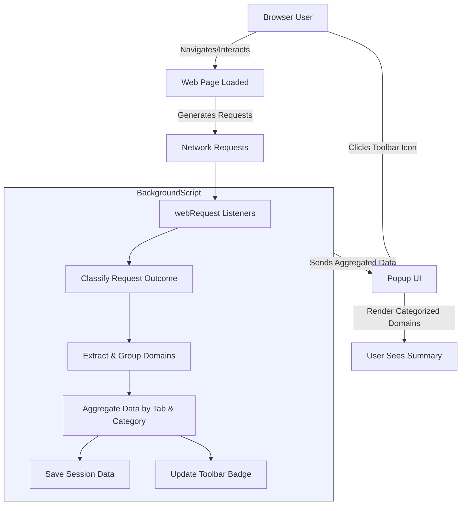

# How It Works: Architecture & Data Flow

Discover the inner workings of uBO Scope, your transparent window into browser network connections. This page guides you through the seamless flow from network event capture, through data processing and aggregation in the background, all the way to the intuitive user interface displaying real-time connection insights.

## Understanding uBO Scope's Architecture

uBO Scope operates as a browser extension tightly integrated with your browsing activity to monitor every outgoing request. It turns the complex process of connection events into clear, organized information you can understand at a glance. Here's how each part plays a role:

- **Network Event Capture:** Listeners hook into all outgoing HTTP and WebSocket requests made during your browsing session.
- **Data Categorization:** Requests are analyzed and classified as allowed, stealth-blocked, or blocked, giving you precise visibility into what network connections your browser actually establishes or rejects.
- **Domain Grouping:** Using the Public Suffix List (PSL), uBO Scope aggregates network requests by domain, so you see meaningful groups rather than raw hostnames.
- **Persistent Session Storage:** Data for each browser tab is saved and restored to maintain continuity.
- **User Interface Rendering:** The popup panel presents a categorized summary of connections sorted by their blocking outcome.

## Step-by-Step Data Flow

This user journey showcases the flow of data and control within uBO Scope:

1. **Request Initiation:** As you load or interact with a webpage, the browser generates network requests.
2. **Event Triggered:** uBO Scope's background script listens to network events such as redirects, responses, or errors.
3. **Outcome Classification:** Each request is evaluated:
   - **Allowed:** The request succeeded and the resource was loaded.
   - **Stealth-Blocked:** The request was intercepted stealthily (e.g., hidden redirect).
   - **Blocked:** The request failed or was explicitly blocked.
4. **Domain Extraction:** Hostnames extracted from URLs are normalized and reduced to their effective second-level domain using the PSL.
5. **Data Aggregation:** Counts of requests are stored and updated per domain and per category (allowed, stealth, blocked) in session storage linked to each tab.
6. **Badge Update:** The toolbar icon badge shows the count of distinct allowed third-party domains for quick awareness.
7. **Popup UI Rendering:** When you open uBO Scope's popup, the latest aggregated data is fetched and rendered, displaying domains categorized by request outcome.

## Components Breakdown

### Background Script (background.js)

This is the heart of data gathering and session management:
- Monitors network events via `webRequest` API listeners.
- Classifies each request event into allowed, blocked, or stealth with precise domain parsing.
- Uses Public Suffix List to correctly group requests by registrable domains.
- Maintains a tab-specific data map tracking request outcomes.
- Updates the browser action badge to reflect allowed third-party domain counts.
- Persistently saves and restores session data for continuity across browser restarts.

### Popup UI (popup.html, popup.js)

The visual and interactive layer:
- Shows the current active tab's hostname and domain.
- Displays categorized lists of domains involved in network requests:
  - Allowed (not blocked)
  - Stealth-blocked
  - Blocked
- Uses a clean and responsive layout styled for light and dark modes.
- Translates ASCII Punycode domain names to Unicode for better readability.
- Presents counts of requests per domain for detailed insight.

### Domain Grouping with Public Suffix List

uBO Scope leverages the Public Suffix List to:
- Accurately identify registrable domains from full hostnames, ignoring subdomains.
- Aggregate counts by meaningful domain groups rather than listing every hostname.
- Prevent confusing user with excessive granularity, making insights clear and actionable.

## Illustrated Architecture Diagram

## Practical Example: From Request to Popup Display

Consider you load a website that contacts multiple third-party servers:

- The background script intercepts each request.
- Requests to cdn.example.com and analytics.thirdparty.com succeed → counted as allowed.
- Requests to ads.unwanted.com get blocked → counted as blocked.
- Some requests are redirected stealthily → counted as stealth-blocked.
- Data aggregated and stored for the active tab.
- Popup displays:
  - **Domains connected:** 2
  - **Allowed:** cdn.example.com (5 requests), analytics.thirdparty.com (3 requests)
  - **Stealth-blocked:** stealthytracker.net (2 requests)
  - **Blocked:** ads.unwanted.com (4 requests)

This breakdown helps you see exactly which third parties are active, which get blocked, and which operate stealthily.

## Tips for Interpreting the Data Flow

- **Badge Count Meaning:** Represents how many distinct allowed third-party domains connected for the current tab — lower is usually better for privacy.
- **Stealth Blocking:** Indicates network requests blocked in ways that are not obvious to the website, crucial for effective content blocking.
- **Domain Grouping:** Avoid confusing you with complex hostnames by presenting data aggregated to registrable domains.
- **Session Persistence:** Data remains available as long as the tab exists, even through page reloads.

## Common Pitfalls to Avoid

- Do not rely solely on the block count badge as a measure of blocking effectiveness — uBO Scope highlights distinct domains connected, which is more meaningful.
- Networks requests initiated outside the standard browser API scope may not be reported.
- The extension respects the browser's minimum version and permissions; older versions or incompatible browsers might not fully support all features.

## Summary

uBO Scope provides a reliable, clear picture of your browser’s network interactions by capturing requests at the network level, classifying their outcomes, grouping them effectively, and presenting them in an intuitive popup panel. This architecture ensures transparency and empowers you to understand third-party connections without overwhelming technical details.

---

For detailed insights on installation, usage, and interpreting results, explore these related pages:

- [What is uBO Scope?](../introduction-core-concepts/what-is-ubo-scope)
- [Product Value and Benefits](../introduction-core-concepts/value-proposition-benefits)
- [Core Concepts & Terminology](../introduction-core-concepts/core-concepts-terminology)

Start your journey to enhanced network transparency today with uBO Scope.

---

## Source Code Reference

For in-depth understanding, the primary logic resides in:

- [Background script: js/background.js](https://github.com/gorhill/uBO-Scope/blob/main/js/background.js)
- [Popup UI: popup.html and js/popup.js](https://github.com/gorhill/uBO-Scope/blob/main/popup.html), [js/popup.js](https://github.com/gorhill/uBO-Scope/blob/main/js/popup.js)

You can explore the full repository here: [uBO-Scope GitHub](https://github.com/gorhill/uBO-Scope)
