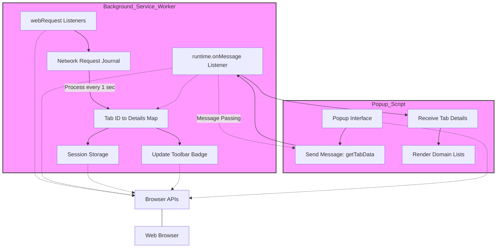

# How uBO Scope Works (Architecture Diagram)

Discover how uBO Scope harnesses browser APIs to provide an unparalleled view into all remote connections initiated by your browser tabs. This page presents a clear, step-by-step walkthrough alongside a detailed Mermaid.js diagram illustrating the synchronized roles of the extension's background and popup scripts, and how they collaborate through browser APIs to monitor, record, and display all attempted or successful remote network requests—even when traditional content blockers are active.

---

## What This Page Covers

This document dives into the inner working flow of uBO Scope, explaining how it uses browser capabilities to track network requests for every tab in real time. It explains the roles of the background service worker and the popup script, emphasizing their cooperation to build and present rich domain connection statistics that empower users with transparency over their web connections.

---

## A High-Level View: uBO Scope’s Architecture in Action

At its core, uBO Scope leverages the browser’s `webRequest` API to listen to all network requests from webpages. These requests are continuously tracked by the background service worker script, which maintains an up-to-date map of domains connected from each open tab.

Meanwhile, the popup script fetches this tab-specific data on demand to populate the popup interface with domain connection details and live statistics.

This separation of responsibilities allows uBO Scope to efficiently capture all network activities, regardless of the presence or activity of other content blockers, and present them in an elegant, user-friendly manner.

---

## Core Components and Their Roles

### Background Service Worker

- **Listener for network requests:** Uses the `webRequest` events (`onBeforeRedirect`, `onErrorOccurred`, `onResponseStarted`) to catch network request outcomes—whether successful, redirected, or blocked.
- **Network request processing:** Maintains a journal of these requests, categorizing endpoints into _allowed_, _blocked_, or _stealth-blocked_ per tab.
- **Data storage and synchronization:** Stores tab-specific connection details in session storage and updates the toolbar badge count dynamically with the number of distinct connected domains.

### Popup Script

- **Data retrieval:** Upon popup open, sends a message to the background service worker requesting detailed connection data for the active tab.
- **Data rendering:** Displays a categorized domain list with counts of connections — distinguishing allowed, stealth-blocked, and blocked domains.
- **Domain normalization:** Converts punycode-encoded domains into readable Unicode using integrated libraries to present user-friendly hostnames.

### Browser APIs Utilized

- **`webRequest` API:** Captures real-time network request events, which is the backbone of the data collection mechanism.
- **`runtime.sendMessage` API:** Enables communication between the popup and background scripts for fetching up-to-date data.
- **Storage API (session storage):** Holds session state and data to maintain continuity across page reloads or tab events.
- **Tabs API:** Tracks active tabs and listens for tab lifecycle events to manage cleanup and data accuracy.

---

## Diagram Walkthrough

This diagram shows the asynchronous, coordinated flow between the background service worker, listening for and processing all network requests, and the popup script fetching and rendering this data for user interaction. Browser APIs provide the underlying plumbing for event listening, messaging, storage, and tab management.

---

## User Journey: How This Works For You

1. **Browsing the Web:** As you navigate websites, uBO Scope’s background service worker intercepts all network requests your browser attempts.
2. **Request Categorization:** Each request is evaluated — Was it allowed (success), stealth-blocked (redirected), or blocked (error)? This data is associated with the specific browser tab.
3. **Badge Updates:** The toolbar icon dynamically reflects the number of distinct domains connected for the active tab, giving you real-time insight without needing to open the popup.
4. **Inspecting Connections:** Opening the popup triggers a request to the background worker to retrieve detailed statistics, grouped into _allowed_, _stealth-blocked_, and _blocked_ domains.
5. **Understanding Connection Details:** The popup then presents a clear and readable list, helping you analyze remote server connections per tab.

---

## Practical Tips & Best Practices

- **Rely on Badge Counts to Gauge Active Connections:** The badge number is not just a count but a distinct tally of domains successfully connected to, granting a more reliable representation of your exposure.
- **Interpret Stealth Blocking Correctly:** Domains categorized as stealth-blocked indicate requests that were redirected or filtered silently — useful for advanced analysis.
- **Use Popup Data to Validate Content Blocker Effectiveness:** With exact domain lists, you can understand what connections slip through different blockers.
- **Refresh Tabs if Data Seems Stale:** The service worker maintains session data, but closing tabs removes their data, so reopening tabs provides fresh monitoring.

---

## Troubleshooting Common Issues

<AccordionGroup title="Common Issues & Resolutions">
<Accordion title="Popup Shows ‘No Data’ or Empty">
Make sure the popup is opened on an active browsing tab with network activity. Some tabs (like internal browser pages) do not support data collection. Reload the tab or try a different website.
</Accordion>
<Accordion title="Badge Does Not Update As Expected">
Confirm that the browser is granting the extension the required permissions (`webRequest`, `activeTab`, and `storage`). Sometimes restarting the browser or reinstalling the extension resolves transient permission issues.
</Accordion>
<Accordion title="Visible Connections Despite Other Content Blockers">
uBO Scope monitors network request events regardless of content blocker activity, so seeing connections does not mean blockers are failing. Instead, the extension shows all attempts, which helps validate blocker accuracy.
</Accordion>
</AccordionGroup>

---

## Next Steps

Continue your journey in understanding how to use uBO Scope effectively by visiting the following pages:

- [Quick Feature Overview](/overview/architecture-usage/feature-tour) — Explore all features briefly.
- [Who Should Use uBO Scope?](/overview/architecture-usage/who-should-use) — Learn if this tool fits your needs.
- [How uBO Scope Monitors Connections](/getting-started/first-steps-usage-validation/how-it-works) — Detailed monitoring mechanics for first users.

This architecture insight combined with practical guides will empower you to master uBO Scope’s transparency for enhanced web privacy awareness.

---

## References

- [uBO Scope GitHub Repository](https://github.com/gorhill/uBO-Scope)
- [uBO Scope Popup Interface](popup.html)

---

_Last updated for version 1.0.1 on main branch._