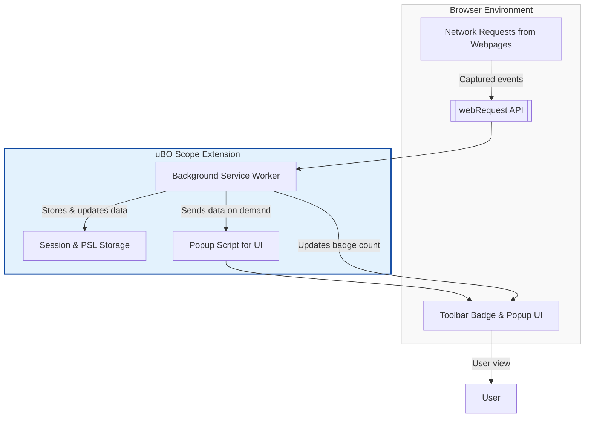

# Integration and Browser Support

## Seamless Support Across Major Browsers

uBO Scope is designed to operate smoothly across the three primary browser environments: **Chromium-based browsers**, **Mozilla Firefox**, and **Apple Safari**. This broad support ensures that no matter which platform you use, uBO Scope integrates effectively to reveal all remote server connections initiated by the webpages you visit.

- **Chromium:** Install via the [Chrome Web Store](https://chromewebstore.google.com/detail/ubo-scope/bbdpgcaljkaaigfcomhidmneffjjjfgp). Supports the latest Chromium versions starting from Chrome 122.0 and above.
- **Firefox:** Available on [Firefox Add-ons](https://addons.mozilla.org/firefox/addon/ubo-scope/), compatible with Firefox 128 and later.
- **Safari:** Requires Safari 18.5 or newer. Installation through Safari's extension mechanism with manifest support for this platform.

Each browser leverages its native extension APIs to allow uBO Scope to monitor network requests comprehensively.

---

## How uBO Scope Integrates with Browser APIs

uBO Scope taps into the browser's **`webRequest` API**, a low-level network observing interface that provides visibility into every network request a webpage attempts or completes. This integration method is central to the extension's ability to report requests regardless of other content blocking tools or DNS-layer filters in place.

**Key integration points:**

- Listens to events such as request start, redirect, success, and error through `webRequest` listeners.
- Collects domain-level data on connections per browser tab, categorizing requests as allowed, blocked, or stealth-blocked.
- Updates the toolbar badge with the count of distinct third-party remote servers.

Because `webRequest` is a browser-provided API, uBO Scope does not depend on or conflict with other content blockers, allowing it to faithfully observe what network activity actually occurs (or is suppressed stealthily).

---

## Installation and Permissions Overview

uBO Scope requires minimal but essential permissions aligned with its core functionality:

- **`activeTab`**: To interact with the currently viewed tab for context.
- **`storage`**: To cache session details and the Public Suffix List, improving performance and maintaining state.
- **`webRequest`**: To observe and collect network request outcomes.
- **`host_permissions`**: Broad URL access (`http://*/*`, `https://*/*`), including `ws://` and `wss://` for WebSocket tracking on Chromium and Firefox.

These permissions strike a balance between capability and user trust, enabling uBO Scope to deliver comprehensive insights without overreaching.

---

## Operating Independently From Content Blockers and DNS Filters

Unlike traditional content-blocking extensions that actively prevent or modify content, uBO Scope functions as a **transparent observer**. It records all connection attempts seen by the browser’s network layer, including those that other tools block silently or at different points in the network stack.

- **Content blockers:** uBO Scope recognizes connections regardless of whether another blocker prevented resource fetching. It specifically detects stealth blocking through redirects and errors.
- **DNS-layer blocking:** Since DNS-level filters operate outside the browser, some network requests may be blocked before reaching the `webRequest` API. uBO Scope will not see network requests outside its API's purview.

This independent operation ensures uBO Scope provides an accurate, unfiltered picture of remote server interaction as seen by the browser’s network subsystem.

---

## Summary of Supported Platforms and Key Manifest Features

| Browser    | Minimum Version | Installation Source                             | Notable Manifest Features          |
|------------|-----------------|------------------------------------------------|-----------------------------------|
| Chromium   | 122.0+          | [Chrome Web Store](https://chromewebstore.google.com/detail/ubo-scope/bbdpgcaljkaaigfcomhidmneffjjjfgp) | Service worker background, webRequest host permissions including websocket URLs |
| Firefox    | 128.0+          | [Firefox Add-ons](https://addons.mozilla.org/firefox/addon/ubo-scope/) | Module background script, webRequest including websocket URLs, strict min version in gecko settings |
| Safari     | 18.5+           | Safari Extension Mechanism                     | Script background, manifest strict min version, limited websocket host permissions |

Each manifest is tailored to platform requirements while maintaining consistent functionality.

---

## Best Practices for Ensuring uBO Scope Works Smoothly

- **Keep your browser up to date:** Using supported browser versions ensures access to the latest `webRequest` API improvements and security.
- **Avoid disabling necessary permissions:** Without `webRequest` and appropriate host permissions, uBO Scope cannot observe network activity effectively.
- **Understand browser privacy and security settings:** Some environments or browser privacy modes may limit network request visibility.
- **Complement rather than replace content blockers:** Use uBO Scope alongside blockers to **assess** their actual effect rather than trying to block content itself.

---

## Troubleshooting & Compatibility Notes

- uBO Scope relies on the browser’s `webRequest` API, so any network requests **not** reported through this API (such as browser prefetching or DNS filtering outside the browser) will be invisible to the extension.
- Some browsers or platforms might delay enabling all APIs for extensions; expect a brief loading period after installation.
- Minimal overlapping functionality with uBlock Origin or other blockers means uBO Scope rarely conflicts but focuses on observation.

---

## Visualizing uBO Scope's Integration Flow

Above flow shows how uBO Scope listens to browser network events, processes them in the background worker, stores session data, and updates the UI elements dynamically for user insight.

---

## Next Steps

- For detailed installation instructions, see [Installing uBO Scope](../../guides/getting-started-with-ubo-scope/installation-on-chromium-firefox-safari).
- Learn how to interpret tracking insights in [Understanding the Toolbar Badge & Popup](../../guides/getting-started-with-ubo-scope/understanding-badge-and-popup).
- Explore in-depth architecture in [How uBO Scope Works (Architecture Diagram)](/overview/architecture-usage/how-it-works-architecture).

---

<Note>
If you use additional content blockers or DNS filtering, remember uBO Scope shows the network requests as reported by the browser and may not see all DNS-layer blocking.
</Note>

<Check>
Verify that your browser version meets minimum requirements to enable full functionality.
</Check>

<Check>
Ensure you've granted all requested permissions during installation for complete data collection.
</Check>

---

By integrating with modern browsers' native APIs, uBO Scope empowers you with transparent, comprehensive visibility into third-party network activity, independent of other content blockers or filters. Its minimal yet robust design guarantees reliable operation across platforms, assisting both privacy-conscious users and filter list maintainers to make informed decisions about their browsing environment.
