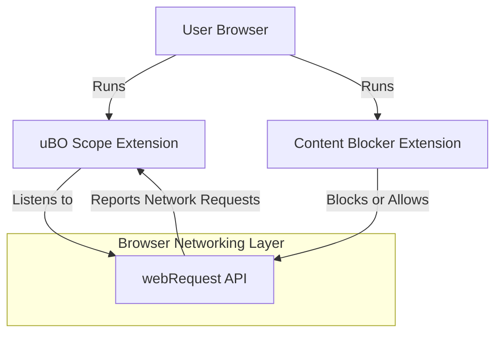

# Integration & Compatibility

uBO Scope is designed to operate seamlessly alongside other content blockers and privacy tools, offering transparent and independent reporting of all network connections your browser makes. This page explains how uBO Scope integrates technically with major browsers, coexists with various content-blocking solutions, and ensures accurate network connection reporting regardless of other privacy extensions or configurations.

---

## Why Integration & Compatibility Matter

When you use multiple privacy tools or content blockers, it’s crucial to know how they interact and whether your monitoring tool accurately reflects network activity. uBO Scope addresses this by:

- Operating independently of active content blockers, so it does not interfere with or get affected by them.
- Leveraging browser-native `webRequest` APIs to detect all network requests and their outcomes, regardless of other privacy filters in use.
- Supporting a range of popular browsers with manifest and code adaptations for each, ensuring broad compatibility.

This guarantees reliable visibility into network activities and third-party connections, helping you assess privacy exposure without blind spots caused by other tools.

## How uBO Scope Works Alongside Content Blockers

### Independent Monitoring
uBO Scope uses dedicated listeners on network requests (`webRequest` API events like `onBeforeRedirect`, `onErrorOccurred`, `onResponseStarted`) to collect connection data directly from the browser’s networking layer. It observes all the requests initiated by web pages whether or not they are blocked or allowed by other extensions or DNS-based blockers.

This means uBO Scope shows you the _actual_ connections attempted or established, rather than just relying on data filtered through the lens of another blocker. 

### Reporting Outcomes Accurately
Requests can be classified as:

- **Allowed:** Connections that succeeded and were not blocked.
- **Stealth-blocked:** Connections intercepted silently by content blockers preventing detection by the page.
- **Blocked:** Requests that errored or failed due to active blocking.

By independently logging these outcomes, uBO Scope provides an undistorted picture of your tab’s network activity.

### Compatibility with Any Privacy Configuration
Whether you use uBO Scope with uBlock Origin, other blockers, or no blockers at all, it will reliably report the connections your browser sees. This holds for blockers on the browser extension level and DNS-level content blocking, as long as the browser exposes request details via its API.

## Supported Browsers and Extension Installation Paths

uBO Scope has tailored manifests and background scripts to work with major browsers, respecting their extension architecture and permission models.

| Browser    | Installation Source                                                | Notes                                      |
|------------|------------------------------------------------------------------|--------------------------------------------|
| Chromium   | [Chrome Web Store](https://chromewebstore.google.com/detail/ubo-scope/bbdpgcaljkaaigfcomhidmneffjjjfgp)    | Requires Chrome 122+ for Manifest V3 compliance |
| Firefox    | [Firefox Add-ons](https://addons.mozilla.org/firefox/addon/ubo-scope/)                        | Supports desktop and Android Firefox versions 128+     |
| Safari     | Distributed via Safari Extensions with strict minimum version 18.5          | Uses Safari-specific APIs and module background scripts |

### Manifest Details

Each browser’s manifest defines permissions like `webRequest`, `storage`, and `activeTab`, as well as host permissions covering all HTTP/S and WebSocket URLs. This broad permission set is essential for full visibility of network connections.

### Permissions Summary

- **`webRequest` permission:** Crucial for listening to network requests and their lifecycle events.
- **`storage` permission:** Enables saving session and public suffix list data for accurate domain parsing.
- **`activeTab` permission:** Allows interaction with the current tab context.

## Technical Basis of Browser Integration

uBO Scope leverages these browser APIs and extension design practices:

- **Background Scripts / Service Workers:** Run persistently or on-demand to collect network data uniformly across tabs.
- **WebRequest API Listeners:** Capture detailed network event data to determine individual request status.
- **Session Storage:** Uses session-scoped storage to maintain state such as tab details and connection lists ensuring continuity.
- **Public Suffix List Integration:** Parses domain names accurately for grouping requests by their registrable domain.

This structure ensures uBO Scope functions reliably no matter the browsing scenario or other extensions.

## Practical User Scenario

Imagine you’re running uBO Scope alongside uBlock Origin while browsing a website:

1. A page loads, issuing many network requests.
2. uBO Scope catches all requests via browser APIs.
3. Some requests are allowed, others blocked by uBlock Origin, and some silently intercepted.
4. uBO Scope logs these distinctions independently.
5. The toolbar badge reflects the count of allowed third-party domains actually connected.
6. You can inspect detailed domain-level outcomes via the popup UI.

This unconditional logging empowers you to evaluate your real network exposure precisely.

## Tips for Ensuring Compatibility

- Keep your browser updated to meet the minimum version requirements (Chromium 122+, Firefox 128+, Safari 18.5+).
- Install uBO Scope directly from the verified official stores to avoid modification incompatibilities.
- Use uBO Scope alongside your preferred content blockers without disabling either.
- If you face issues with connection reporting, verify that your browser supports the `webRequest` API fully, as some browsers or privacy modes may limit access.

## Common Integration Pitfalls & Troubleshooting

<AccordionGroup title="Common Integration Issues">
<Accordion title="No Data or Empty Badge Count">
This can happen if the browser restricts `webRequest` API access (often in incognito/privacy modes) or if permissions are denied. Ensure permissions are granted and try disabling other extensions temporarily to isolate conflicts.
</Accordion>
<Accordion title="Inconsistencies with Other Content Blockers">
Remember that uBO Scope reports actual network events from the browser API, independent of what the page or other extensions report. Differences in counts or block logic are expected and reflect true network behavior, not errors.
</Accordion>
<Accordion title="Browser Compatibility Problems">
uBO Scope requires minimum browser versions for Manifest V3 support and API availability. Double-check your browser version and update if necessary.
</Accordion>
<Accordion title="Issues with WebSocket Request Reporting">
Some browsers may have limited support for WebSocket tracking in their `webRequest` API. This could reduce visibility of such connections.
</Accordion>
</AccordionGroup>

---

## Summary

uBO Scope integrates tightly with major browsers while operating independently alongside other content blockers. Its architecture leverages browser `webRequest` APIs and session storage to deliver accurate, undistorted visibility of network connections and outcomes.

By understanding installation paths, permissions, and integration details, users can confidently deploy uBO Scope as a complementary tool in their privacy toolkit.

---

For detailed hands-on usage and further architectural insights, see related documentation sections.

---

<AccordionGroup title="References and Related Documentation">
<Accordion title="What is uBO Scope?">
Introduction to uBO Scope’s core purpose and user benefits. [Read More](/overview/introduction-core-concepts/what-is-uboscope)
</Accordion>
<Accordion title="Core Concepts & Terminology">
Understanding of domain statuses and privacy metrics essential for interpreting connection data. [Read More](/overview/introduction-core-concepts/core-concepts-terminology)
</Accordion>
<Accordion title="System Architecture">
Explains internal data flows and components working together for monitoring. [Read More](/overview/architecture-usage/system-architecture)
</Accordion>
<Accordion title="Installing uBO Scope">
Step-by-step guides for supported browsers. [See installation guides](https://github.com/gorhill/uBO-Scope)
</Accordion>
</AccordionGroup>

---

### Code Example: Permissions in Chromium Manifest (manifest.json)
```json
{
  "permissions": ["webRequest", "storage", "activeTab"],
  "host_permissions": ["https://*/*", "http://*/*", "wss://*/*", "ws://*/*"]
}
```

### Practical Tip
- Installing uBO Scope from official browser stores assures updated manifests tailored specifically for that browser’s extension environment.

---

### Visual Overview of Integration


This diagram highlights that uBO Scope listens directly to the browser’s network events independently of what other blockers do.

---

For full source details and manifest files, visit the [uBO Scope GitHub repository](https://github.com/gorhill/uBO-Scope).