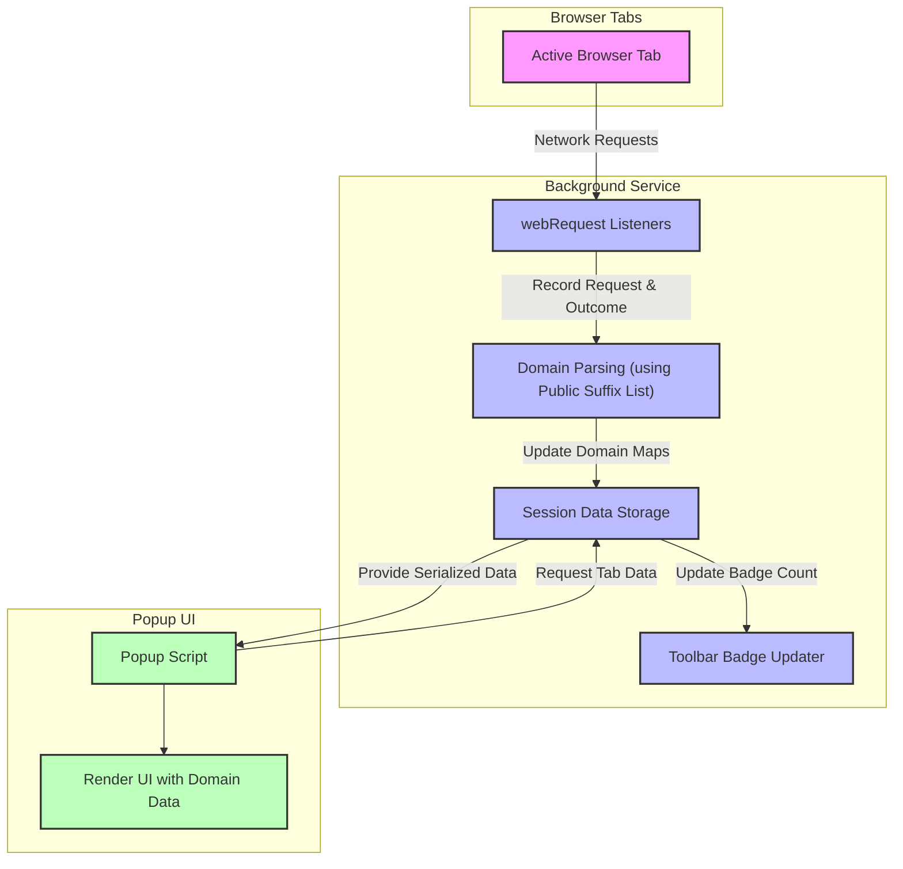

# System Architecture

## Overview

This page visualizes and explains the core architecture of uBO Scope, illustrating how its components interact to provide comprehensive visibility into browser network connections. It focuses on the flow of data between browser tabs, the background monitoring system, and the popup user interface that displays relevant information to users.

Understanding this architecture helps users appreciate how uBO Scope achieves real-time monitoring of network requests, processes outcomes, and presents actionable insights about third-party connections.

---

## Core Components and Their Roles

- **Browser Tabs**: Each active tab hosts webpages which initiate network requests. uBO Scope tracks connection attempts and outcomes on a per-tab basis to isolate third-party network activities.

- **Background Monitoring Service**: Running behind the scenes, this module listens to all relevant network request events through the browser's `webRequest` API. It records whether requests succeed, fail, or redirect, categorizing them accordingly while maintaining tab-specific details.

- **Public Suffix List Processor**: Utilized to accurately extract registered domains from hostnames, this component enables grouping requests by domain, crucial for tallying unique third-party connections.

- **Popup User Interface**: When users interact with uBO Scope's toolbar icon, the popup UI fetches the current tab's recorded data and renders a detailed report of all allowed, blocked, and stealth-blocked domains.

---

## Data Flow and Interaction

The following diagram depicts the main data flow and interactions within uBO Scope’s architecture, providing clarity on how browser network events translate into meaningful user insights.

---

## How uBO Scope Uses Browser APIs

- **webRequest API**: This is the backbone for monitoring network activity. uBO Scope attaches listeners to critical lifecycle events:
  - `onBeforeRedirect`: Captures redirection events, logged as "stealth" outcomes.
  - `onErrorOccurred`: Records failed network requests.
  - `onResponseStarted`: Marks successful connections that passed any content blocking.

- **Tabs API**: Enables associating network data with specific browser tabs, managing lifecycle events such as tab closure to discard stale data.

- **Storage API**: Session storage is leveraged to preserve per-tab details of network connections, enabling quick retrieval and efficient state management.

- **Action API**: Controls the toolbar icon’s badge, updating the count of unique allowed third-party domains in real-time.

---

## Data Tracking and Categorization

uBO Scope maintains a structured record of network request outcomes grouped in three main categories:

- **Allowed**: Requests that succeeded and fetched resources from third-party domains.
- **Blocked**: Requests that failed or were explicitly blocked.
- **Stealth**: Requests redirected to alternative destinations, typically indicating stealth blocking by content blockers.

Each category tracks counts both at the hostname and domain level, enabling the popup UI to present summaries and detailed breakdowns.

---

## User Interaction Flow

1. **Network Monitoring**: As users browse, uBO Scope’s background service captures network traffic events in real-time.
2. **Data Aggregation**: Outcomes are parsed, organized by tab and domain, and saved in session data.
3. **Badge Update**: The toolbar icon updates a badge reflecting the count of distinct allowed third-party domains.
4. **Popup Access**: Clicking the icon triggers the popup UI to request and display detailed network connection data for the active tab.

This seamless flow ensures users always have instant, clear insight into third-party connections per tab.

---

## Practical Tips & Best Practices

- **Refresh Awareness**: The data resets with each page load (main frame navigation), so users inspecting new tabs or reloading pages will see fresh connection data.

- **Interpreting Badge Counts**: A lower badge count indicates fewer unique third-party connections, typically a more privacy-respecting browsing session.

- **Limitations on Requests**: Requests originating outside of the `webRequest` API scope (such as from extensions or certain browser internals) are not tracked.

- **Impact of Content Blockers**: uBO Scope reports network outcomes independently of what content blockers do behind the scenes; this transparency helps debunk inaccurate blocker metrics.

---

## Troubleshooting Common Issues

<AccordionGroup title="Troubleshooting Network Event Monitoring">
<Accordion title="Why are some network requests not shown in uBO Scope?">
Requests made outside the reach of the browser's `webRequest` API — for example, certain internal browser communications or web extensions — cannot be captured by uBO Scope. This is a browser API limitation, not an extension fault.
</Accordion>
<Accordion title='Why does the badge show a high number even on "clean" pages?'>
Some legitimate third-party domains, like widely used CDNs, count towards the badge. A higher count isn't always bad but suggests more external connections. Use the popup UI to investigate which domains are involved.
</Accordion>
<Accordion title="Popup UI shows 'NO DATA' or no update after navigation">
This might occur if the background service has not finished processing recent network events. Refresh the popup by closing and reopening, or wait a few seconds for data to synchronize.
</Accordion>
</AccordionGroup>

---

For further reading and to deepen understanding, visit the [Core Concepts & Terminology](../introduction-core-concepts/core-concepts-terminology) and [Feature Highlights](../introduction-core-concepts/feature-highlights) pages.

---

## Source and Contribution

uBO Scope is an open-source project by Raymond Hill. Explore the full codebase, including this architecture's implementation, on GitHub:

[https://github.com/gorhill/uBO-Scope](https://github.com/gorhill/uBO-Scope)

---