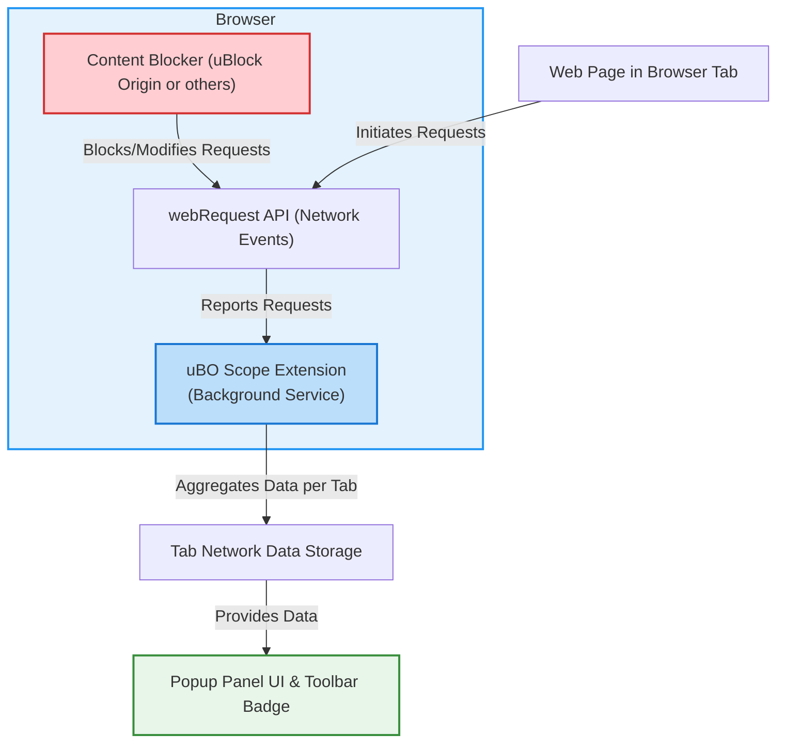

# How uBO Scope Integrates with Browsers & Blockers

Discover how uBO Scope seamlessly integrates with different browsers and content blockers to provide comprehensive and transparent insights about third-party network connections. This page guides you through the extension's leverage of browser APIs, cross-platform deployments, and inherent limitations tied to browser-level network monitoring.

---

## 1. Introduction: Why Integration Matters

uBO Scope's core value lies in its ability to expose all attempted and successful third-party connections a webpage makes, regardless of the content blockers you have enabled. To achieve this, it relies heavily on browser network reporting capabilities. This means uBO Scope integrates directly with browser APIs to monitor network requests in real-time, giving you an unfiltered and trustworthy lens into your browsing activity.

Understanding the nature of this integration ensures users can appreciate uBO Scope's unique capabilities and recognize the factors that influence its behavior.

## 2. Leveraging Browser APIs: The Backbone of Connection Insight

At the heart of uBO Scope’s monitoring is the browser’s `webRequest` API — a powerful interface that reports all network requests initiated from browser tabs.

- **Network Monitoring with `webRequest`**
  - uBO Scope hooks into these network event listeners to capture details about every outgoing request: whether it was allowed, blocked, or stealth-blocked.
  - This integration ensures the extension can detect third-party connections regardless of any content blocking in place.

- **Monitoring Events**
  - The extension specifically listens for `onBeforeRedirect`, `onErrorOccurred`, and `onResponseStarted` events.
  - This means uBO Scope is alerted to network redirects, errors (such as blocked connections), and successful responses, providing a detailed picture.

- **Data Aggregation and Presentation**
  - The data collected by these listeners is aggregated per browser tab, summarizing distinct allowed, blocked, and stealth-blocked domains.
  - Insights are displayed in the popup UI and as a badge count on the toolbar, giving quick and meaningful feedback on network activity.

<Tip>
The reliance on the `webRequest` API means uBO Scope only reports connections visible to the browser’s network stack. Any network activity invisible to this API, such as certain DNS-level blocks or requests made outside the browser, cannot be captured.
</Tip>

## 3. Cross-Browser Deployment: Universal Visibility

uBO Scope is designed to run on multiple popular browsers, ensuring broad applicability and consistent experience.

- **Supported Browsers**
  - Chromium-based browsers (Google Chrome, Microsoft Edge, Brave, etc.)
  - Mozilla Firefox
  - Apple Safari (version 18.5 and newer)

- **Manifest and Permissions**
  - Each browser’s extension manifest includes permissions for `webRequest`, `storage`, and `activeTab`, which are essential for capturing network requests and managing user data.
  - Host permissions cover typical web protocols such as `https://*/*` and `http://*/*`, ensuring comprehensive monitoring coverage.

- **Background Scripts vs Service Workers**
  - In Chromium, uBO Scope runs its network monitoring as a service worker for efficiency.
  - Firefox and Safari use background scripts complying with their distinct extension models but preserving identical event listening capabilities.

- **Consistent User Interface**
  - Despite platform differences, the popup panel and badge count functionalities are uniform, keeping the user experience cohesive.

<Note>
Availability of certain browser-level APIs (especially `webRequest`) and permissions might evolve, so ensure your browser version supports these APIs for uBO Scope to function optimally.
</Note>

## 4. Understanding Limitations: What Browser Integration Can and Cannot Do

While uBO Scope delivers unrivaled transparency into third-party connections, its capabilities are bound by the constraints of browser architecture.

- **Network Visibility Bound to `webRequest` API**
  - Requests made outside the scope of the browser’s `webRequest` listeners — for example, some WebSocket connections in particular browsers or certain DNS-based blocking approaches — may not be reported.
  - Connections initiated by browser components outside extension context (like internal browser updates or prefetching that bypass the API) remain invisible.

- **Content Blocker Diversity**
  - uBO Scope reports independently of which content blocker is active, whether uBlock Origin or others. This makes it an impartial observer.
  - However, blocking implemented outside the browser’s network stack (e.g., at the router or DNS server) will not generate network events visible to the extension.

- **Browser-Specific Differences**
  - Some browsers restrict or limit the data available in `webRequest` events (especially post Manifest V3 changes in Chromium), which might impact the granularity of reporting.

- **Privacy Restrictions**
  - Browsers may impose limitations on extensions to protect user privacy, potentially impacting the extension’s access to full request details.

<Tip>
To get the most accurate and comprehensive insights, keep your browser updated and prefer browsers that fully support declarative network listeners required by uBO Scope.
</Tip>

## 5. Visualizing the Integration Workflow

The following diagram captures how uBO Scope interacts with browsers and content blockers to collect and present network request data:

## 6. Practical Example: Impact of Browser-Level Reporting on User Experience

Imagine visiting a webpage known for loading various third-party scripts:

- Without uBO Scope, you cannot easily see which remote servers the page actually connected to after your content blocker filtered them.

- With uBO Scope, the extension relies on browser network events to report:
  - Which remote domains your browser reached or attempted despite your blocker.
  - Which were stealth-blocked (silently stopped by blockers without obvious signs).
  - Which requests failed altogether.

This empowers you to **validate your content blocker's effectiveness** across different browsers and configurations, a capability unavailable if the browser does not expose such network events fully.

## 7. Tips for Users Regarding Browser and Blocker Integration

- Keep your browser up to date to benefit from the most complete network event reporting.
- Make sure uBO Scope is installed with all requested permissions to monitor effectively.
- Use uBO Scope in conjunction with your content blocker to gain transparent insights and avoid false assumptions based on blocker badge counts alone.
- Understand that some network requests might escape all layers of monitoring due to browser or network constraints.

## 8. Summary

uBO Scope depends directly on browser APIs, primarily the `webRequest` API, to collect comprehensive network request data across Chromium, Firefox, and Safari browsers. Its integration ensures transparency into all third-party connections, regardless of your chosen content blocker. However, it is vital to grasp that browser-level limitations set the boundaries of this insight. By understanding these integrations and constraints, you can leverage uBO Scope to monitor web tracking reliably and strengthen your online privacy awareness.

---

## Related Documentation

- [What is uBO Scope?](/overview/introduction/what-is-ubo-scope) — Learn more about the product purpose and how it works at a high level.
- [Features At a Glance](/overview/architecture/feature-at-a-glance) — Get an overview of core features relevant to network and blocker integration.
- [Core Concepts & Terminology](/overview/introduction/core-concepts-and-terms) — Understand key definitions for outcomes reported by uBO Scope.
- [How uBO Scope Works: Architecture Overview](/overview/architecture/high-level-architecture) — See how the system components communicate internally.

## Next Steps

- Review [Installing uBO Scope](/getting-started/prerequisites-installation/installing-browser-extension) to get set up on your preferred browser.
- Explore [Understanding the Popup Panel](/getting-started/first-run-experience/understanding-popup-panel) to make the most of the data the extension surfaces.

---

For source code and further details, visit the official repository: [https://github.com/gorhill/uBO-Scope](https://github.com/gorhill/uBO-Scope)

---