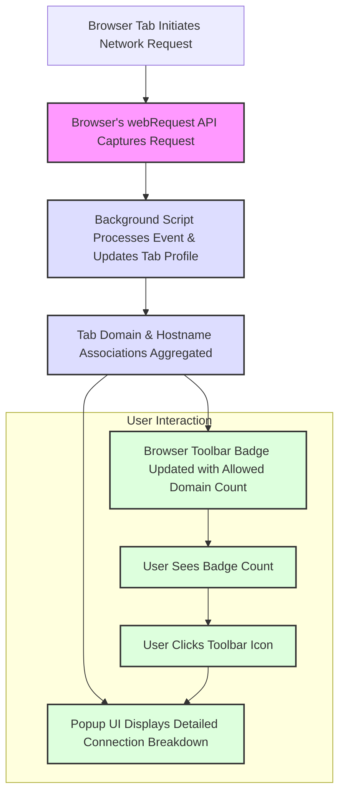

# System Architecture at a Glance

Get an immediate, clear understanding of uBO Scope's network monitoring workflow. This page breaks down how uBO Scope captures, processes, and displays network connection data per browser tab—transforming complex browser interactions into actionable insights.

---

## How uBO Scope Captures Network Data

At the core, uBO Scope relies on the browser's powerful `webRequest` API to monitor all network requests initiated by your open tabs. Whenever a webpage or resource connects to a remote server, this API reports the event to the extension.

- **Tab-centric monitoring:** uBO Scope tracks network requests by individual browser tabs, enabling precise mapping between tabs and the third-party servers they contact.
- **Event types captured:** Redirects, errors (blocked or failed connections), and successful responses.

This granular tracking is essential for revealing exactly which remote servers are contacted — whether allowed, blocked, or stealth-blocked by content blockers or network filters.

## Background Processing: Turning Data into Meaningful Insights

The raw network events flow into the extension’s background script (running as a service worker or background module depending on browser) where:

- **Session state management:** Each tab has a profile that records distinct domains and hostnames under categories — allowed, stealth-blocked, or blocked.
- **Domain extraction:** The extension uses a public suffix list algorithm to group connections by registered domain, not just hostname.
- **Outcome aggregation:** Connections are tallied separately by domain and hostname, enabling both broad and precise views.
- **Badge updating:** The count of distinct allowed third-party domains is surfaced immediately on the browser toolbar icon badge.
- **Data persistence:** Session information is saved using browser session storage APIs ensuring state continuity as users navigate.

This processing pipeline runs continuously in the background with careful throttling to batch updates and maintain browser performance.

## User Interface: Popup & Toolbar Badge

### Toolbar Badge

The badge overlays the uBO Scope icon on the browser toolbar, always visible during browsing.
- Displays the **count of distinct third-party domains allowed** within the active tab.
- Encourages awareness by showing a simple numeric indicator — a lower badge count means fewer third parties connected.

### Popup UI

Click the toolbar icon to open a detailed, tab-specific popup with:

- **Tab hostname and domain prominently displayed** for context.
- Three clearly defined sections breaking down connections:
  - **Not blocked:** Successfully connected domains.
  - **Stealth-blocked:** Connections that were attempted but stealth-blocked (e.g., by content blockers or filters not exposing classical block signals).
  - **Blocked:** Explicitly blocked connections or errors.

- Each section lists domains with associated connection counts, helping you identify which third parties are engaging with your current tab.

## Workflow Illustration

This diagram shows how tab-driven network events propagate from the browser to background processing, ultimately feeding the user-facing visuals.

## Practical Insights

- The **toolbar badge count updates dynamically**, reflecting real-time third-party activity for the active tab.
- The **popup UI categorizes connections by outcome**, making it easier to spot stealth-blocked vs. permitted domains.
- By grouping by domain first, uBO Scope provides a **higher-level view of network exposure** without overwhelming users with every hostname.

## Tips for Using the System Architecture to Your Advantage

- Watch the badge count closely to detect sudden spikes in third-party access when visiting a new website.
- Open the popup UI when curious about stealth-blocked connections, a key feature distinguishing uBO Scope from typical content blockers.
- Understand that uBO Scope captures data independent of the content blocker in effect, providing an objective view of network activity.

## Troubleshooting

- If the badge doesn’t update, ensure permissions for `webRequest` and host access are granted.
- Some network requests may not be capturable if the browser does not expose them via the `webRequest` API.
- Closing tabs clears their data from the internal session state to keep the accounting focused and relevant.

---

This concise system overview grounds users in the fundamental workflow of uBO Scope: capturing network requests via browser APIs, processing connection outcomes in the background, and clearly surfacing these insights through badge counts and popup UI. Once familiar with this flow, users can confidently leverage uBO Scope’s transparency to make informed privacy decisions.

[Explore the popup interface in depth →](https://docs.ubo-scope/getting-started/first-insights)

[Learn how this fits in with your content blocker →](https://docs.ubo-scope/overview/introduction/value-proposition)

[Back to full architecture navigation →](https://docs.ubo-scope/overview/architecture/integration-support)
