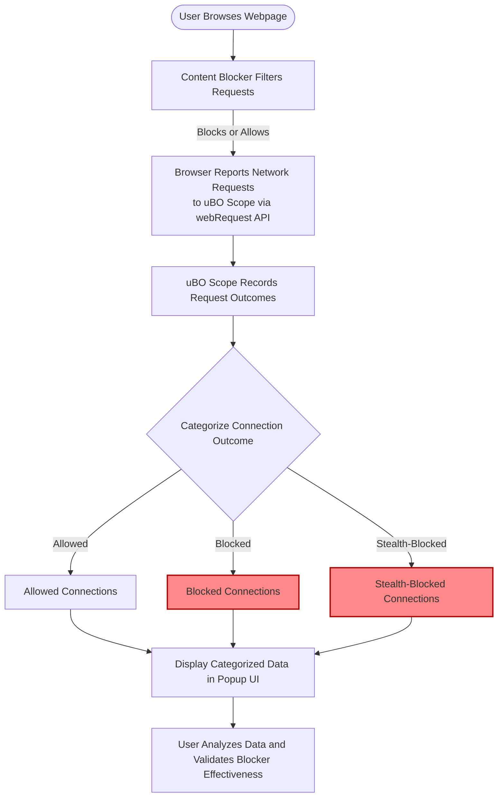

# Integration with Content Blockers and Browser Tools

## Unveiling Transparent Network Monitoring Alongside Your Content Blockers

When you rely on content blockers to protect your privacy and improve your browsing experience, you expect clear, reliable insights into what’s actually happening behind the scenes. The **Integration with Content Blockers and Browser Tools** page is your gateway to understanding how **uBO Scope** operates alongside any content blocker—complementing, not conflicting—and providing an independent, accurate record of all network requests your browser makes.

### Why This Matters to You

Content blockers vary widely in approach and effectiveness, and browsing diagnostics can be elusive or misleading without the right perspective. uBO Scope respects all active content filtering, reporting only the actual, browser-level network activity visible through trusted browser APIs. This transparency empowers you to:

- **Validate your content blockers' efficacy:** Know what connections your browser tries to make, regardless of whether blockers let them through or not.
- **Diagnose privacy concerns:** Spot third-party connections that bypass or evade blocking silently.
- **Compare tools accurately:** Measure how different blockers impact your browsing in real-world conditions, not synthetic tests.

### How uBO Scope Works with Content Blockers and Browser Tools

uBO Scope leverages browser APIs such as the `webRequest` interface to observe network activity independently from any content blocker you have enabled. Here’s how this synergy unfolds in practice:

- **Content blocker applies its filtering:** Your active blocker (like uBlock Origin) operates as usual, enforcing its rules to allow, block, or stealthily block network requests.
- **Browser reports network events to uBO Scope:** Through browser APIs, uBO Scope sees every network request outcome—whether it succeeded, was blocked, or redirected—without intervening.
- **uBO Scope categorizes outcomes transparently:** It sorts all observed requests into three categories: **allowed (not blocked)**, **blocked**, and **stealth-blocked** (blocked silently), preserving the context from the browser level.

This approach guarantees that uBO Scope’s data is an independent ledger reflecting the true state of network traffic at the browser level, immune to the nuances or obfuscations of specific blockers.

### Real-World User Flow Example

Imagine you want to check if your content blocker is actually stopping trackers or if some are slipping through unnoticed:

1. **Activate uBO Scope alongside your content blocker.**
2. **Browse a site as you normally would.**
3. **Open uBO Scope’s popup UI.**
4. **Review the categorized domains:**
   - Domains listed under **Not Blocked** are connections that your browser successfully made despite third-party status.
   - Domains under **Blocked** are those your blocker explicitly stopped.
   - Domains under **Stealth-Blocked** indicate silent blocking without triggering typical errors or block counts.
5. **Draw conclusions:** If you see suspicious third-party domains under "Not Blocked," you can adjust your blocker or investigate further.

This workflow highlights uBO Scope as a companion tool that helps you understand the real impact of your content blockers with precise, browser-level visibility.

### Key Benefits of This Integration

- **Comprehensive network perspective:** Works alongside any content blocker without interference.
- **Independent and accurate data:** Relies on browser APIs, not self-reported blocker metrics.
- **Supports all content filtering:** Reports on DNS filtering, extension blocking, and stealth blocking alike.
- **Facilitates validation and debugging:** Ideal for privacy-conscious users and filter list maintainers.

### Practical Tips and Best Practices

- **Use uBO Scope to verify blocker performance** routinely, especially if you suspect new trackers or ads slipping through.
- **Combine results with filter list maintenance:** Filter list developers gain precise data on stealthy connections and network behaviors.
- **Do not rely solely on block count badges:** Remember that a higher block count does not necessarily mean better blocking.
- **Open uBO Scope’s popup on active tabs:** It provides per-tab unique network data to hone in on specific site behavior.

### Common Pitfalls and How to Avoid Them

- **Overlooking stealth-blocked connections:** Without uBO Scope, stealth blocking can be invisible, misleading you about true network activity.
- **Relying on synthetic ad blocker tests:** These tests often fail to simulate real-world network conditions effectively.
- **Assuming all third-party connections are bad:** Use uBO Scope’s data to discern between legitimate services (like CDNs) and trackers.

### How uBO Scope Maintains Integrity Across Browsers and Blockers

uBO Scope uses browser-supported APIs (e.g., `webRequest` in Chromium and Firefox) that expose network events irrespective of filters applied. This means:

- It captures redirects, successful responses, and errors as they happen.
- It preserves tab-specific context so you view network activity per tab.
- It responds dynamically as blockers handle requests, showing you the real outcome no matter the underlying filtering.

---

### Visualizing the Integration Workflow

---

### Next Steps

To maximize the value of this integration:

- Explore the [Who Should Use uBO Scope?](/overview/audience-and-integration/target-audience) page to understand if this fits your needs.
- Read the [What is uBO Scope?](/overview/introduction-and-value/what-is-ubo-scope) for a broader product overview.
- Learn how to [Launch and Use uBO Scope](/getting-started/first-run-and-configuration/launching-ubo-scope) to start monitoring network requests immediately.

---

<u>Harness the power of true visibility: combine your content blockers with uBO Scope to see network activity as it really happens, empowering your privacy and control.</u>
