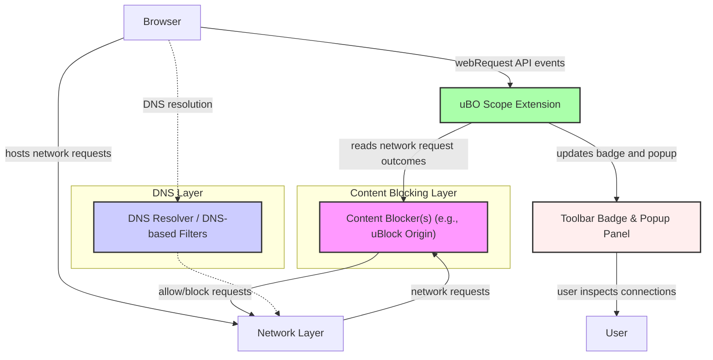

# Integration & Interoperability

uBO Scope is designed to complement your existing privacy and content-blocking tools, providing unique insights into browser network activity without interfering with or replacing those tools. This page explores how uBO Scope integrates seamlessly within your browser environment and alongside other privacy or measurement systems, clarifying what it does and does not replace, and highlighting its independence from DNS configuration.

---

## Why Use uBO Scope Alongside Content Blockers?

Most users employ content blockers — like uBlock Origin, Privacy Badger, or DNS-based filters — to restrict unwanted network requests and improve privacy. However, these blockers usually report only how many requests they have blocked, which can be misleading. uBO Scope does not block or filter; instead, it reveals the full picture of all attempted and successful network connections your browser makes when loading web content.

By working independently, uBO Scope helps you:

- **Understand Actual Network Activity:** See which third-party domains your browser connects to — whether these are blocked, allowed, or stealthily redirected.
- **Evaluate Blocking Effectiveness:** Check if your content blocker is truly limiting third-party tracking, beyond raw block counts.
- **Detect Unexpected Connections:** Reveal any connections made outside filtering rules or DNS settings, providing critical visibility.

Because uBO Scope tracks network requests via the browser's native `webRequest` API, it captures connection outcomes regardless of any filtering method in use.

## Independence From Content Blocking and DNS

uBO Scope’s operation is independent of content blocker implementations and DNS settings:

- It does **not** replace any content blocker. It solely observes network requests.
- It does **not** rely on or modify DNS configurations.
- It receives events from the browser about network requests, capturing the real outcomes:
  - **Allowed:** Requests successfully made.
  - **Blocked:** Requests that failed due to content blockers or network errors.
  - **Stealth-blocked:** Redirects that hide the original request.

This independence means uBO Scope accurately reports network activity even if:

- You use multiple content blockers or DNS-level blocking.
- Your DNS settings use privacy-focused services or filters (e.g., DNS-over-HTTPS).

## Visualizing uBO Scope's Relationship with Browser APIs

uBO Scope relies directly on the browser's `webRequest` API to gather its data. It listens to the lifecycle of HTTP and WebSocket requests, categorizing each as allowed, blocked, or stealth-blocked.

### Key Integration Points

- **WebRequest API:** The core source of data for tracking network requests.
- **Browser Action Badge:** Displays a count of distinct third-party domains connected successfully.
- **Popup Panel:** Provides detailed per-tab information on connected domains, grouped by outcome.

Unlike content blockers, uBO Scope’s background service worker (or background script) does not intercept or modify network requests; it only listens and records.

## Using uBO Scope Data With Other Tools

You can incorporate uBO Scope’s insights into broader privacy or measurement workflows:

- **Combine With Content Blockers:** Cross-reference uBO Scope’s domain connection data with your content blocker's block lists to verify blocking coverage and leak detection.
- **Filter List Maintenance:** Filter authors and privacy researchers can use uBO Scope to discover potential third-party domains missed by current rules.
- **Privacy Audits:** Leverage uBO Scope data alongside network analysis tools to get a full picture of a browsing session’s external communications.

Since uBO Scope exports identifiable third-party domains (through its popup interface and badge counts), you can analyze whether any unexpected services are connecting during browsing.

## Practical Tips for Integration

- **Keep uBO Scope Enabled Regardless of Other Blockers:** To get accurate, unbiased network connection measurements.
- **Treat the Badge Count as a Privacy Metric:** The badge shows the number of distinct third-party connections not blocked — aiming for a lower count improves privacy.
- **Use the Popup Panel for Deep Dives:** Inspect allowed, stealth, and blocked domains on a per-tab basis to understand browsing impact.
- **Do Not Rely Solely on DNS Blocks:** DNS may block some requests, but uBO Scope detects all attempts visible to the browser’s network layer.

## Common Questions

<AccordionGroup title="Frequently Asked Questions about Integration">
<Accordion title="Does uBO Scope block ads or trackers?">
No. uBO Scope is strictly a measurement tool. It does not block or alter any network requests. It provides transparency about connections your browser makes.
</Accordion>
<Accordion title="Will uBO Scope replace my content blocker or VPN?">
No. uBO Scope works independently. It does not replace content blocking tools or VPNs, but complements them by revealing connection details otherwise hidden.
</Accordion>
<Accordion title="If I change my DNS, will uBO Scope's data change?">
uBO Scope observes what the browser reports through webRequest API, so changes in DNS resolver or settings that affect actual connections will reflect in uBO Scope data. However, uBO Scope does not rely on DNS and remains independent.
</Accordion>
<Accordion title="Can I use uBO Scope data in automated privacy tools or reports?">
Yes. The extension’s per-tab domain data can be accessed via its popup panel or message API, allowing integration with external privacy auditing or data analysis tools.
</Accordion>
</AccordionGroup>

## Next Steps

To leverage uBO Scope effectively alongside your privacy stack:

- Explore the [Popup Panel](../guides/interpreting-results/understanding-popup) to see real-time domain connections.
- Review the [Core Concepts & How It Works](../../overview/core-concepts-architecture) pages to understand measurement and terminology.
- Consult [Who Should Use uBO Scope?](../overview/audience-usecases-integration/audience-usecases) to see practical integration cases.

---

## Diagram: uBO Scope Integration Overview

