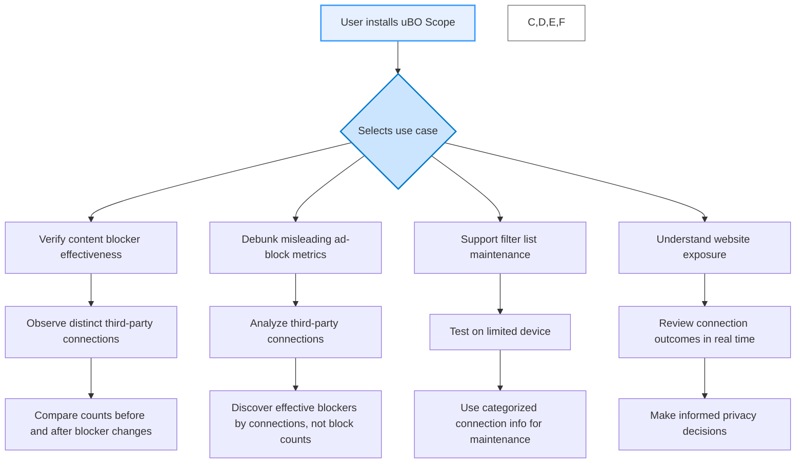

# Practical Use Cases

Understanding how uBO Scope fits into real-world scenarios empowers you to make smarter decisions about your web privacy and content blocking strategies. This page walks you through typical workflows illustrating how uBO Scope advances your insight into network activity, debunks common misconceptions, and assists filter list maintainers—even when devices have limited tooling access.

---

## Verifying Content Blocker Effectiveness

When using content blockers, it's easy to focus on the number of blocked requests or the block count shown in their interfaces. However, such metrics can be misleading. uBO Scope shifts the focus to what truly matters: the number of distinct third-party remote servers your browser connects to.

### How uBO Scope Helps

- Displays real-time counts of distinct third-party domains connected to, revealing real network exposure.
- Shows categorized connection outcomes (allowed, stealth-blocked, blocked) for concrete insight.
- Works independently from any content blocker, providing an unbiased view into actual network connections.

### Workflow Example

Suppose you installed a new content blocker and want to check if it actually reduces third-party network exposure:

1. Open uBO Scope's popup to observe the badge count indicating distinct third-party connections.
2. Load the web page you want to analyze.
3. Review the connections categorized as "allowed," "stealth-blocked," or "blocked."
4. Compare the count before and after enabling/disabling your content blocker.

If the count decreases with the content blocker enabled, it confirms effective reduction in network exposure. If not, reconsider the blocker's settings or choose an alternative.

---

## Debunking Misleading Ad-Block Metrics

Many users judge content blockers by their block count badges, mistakenly assuming that a higher block count always means better blocking.

### Why This Is a Myth

- A higher block count can coincide with **more** third-party server connections overall, meaning more domains slipping through.
- Some blockers block many requests per domain but fail to block connections to additional unwanted domains.
- 'Ad blocker test' webpages are unreliable and often use fabricated networks not reflective of real browsing.

### uBO Scope's Role

- Shows distinct third-party server counts, enabling users to measure true network reduction, not just raw block counts.
- Provides transparency that reveals when a blocker is allowing connections despite many blocked requests.

### Practical Scenario

You’re comparing two blockers:

- Blocker A shows 500 blocks.
- Blocker B shows 200 blocks.

Using uBO Scope, you discover Blocker B results in fewer distinct third-party connections, proving it better at limiting network exposure despite fewer blocks.

---

## Supporting Filter List Maintenance on Limited Devices

Filter list maintainers frequently access uBO Scope to verify which remote servers are contacted during browsing or testing, especially on devices where standard developer tools are limited or unavailable.

### Why It Matters

- Some environments have restricted access to browser developer consoles or network inspection tools.
- uBO Scope provides a lightweight, focused means to monitor network connections without extra tools.

### How uBO Scope Supports This

- Monitors all connection attempts via the `webRequest` API, including those blocked at DNS or by other means, if reported by the browser.
- Presents clear categorizations of allowed, blocked, and stealth-blocked domains helping maintainers identify false positives or under-blocked servers.
- Enables maintainers to track third-party exposure in real-time while testing filter rules.

### Use Case

A filter list maintainer testing on a locked-down tablet uses uBO Scope:

1. Install uBO Scope extension.
2. Browse a test site and open uBO Scope popup.
3. View summary of domains connected and how blocking impacts them.
4. Use this insight to adjust filter list entries remotely or on less capable devices.

---

## Understanding Website Exposure

Being aware of the extent to which a website communicates with third-party domains is crucial for privacy-conscious users.

### What uBO Scope Reveals

- Shows the number of distinct third-party servers contacted by the currently active tab.
- Differentiates connections succeeded, blocked, or stealth-blocked, providing nuance on network interactions.

### User Workflow

1. User opens a webpage and clicks the uBO Scope toolbar icon.
2. The popup displays the main site’s hostname and domain.
3. Three sections categorize remote domains:
   - **Not Blocked:** Domains where your browser successfully connected.
   - **Stealth-blocked:** Connections redirected or hidden by blockers without breaking site functionality.
   - **Blocked:** Domains where connections failed or were blocked outright.
4. User reviews the total number of connected third-party domains as a direct privacy insight.

### Benefit

This empowers users to grasp which websites expose them to third parties, influencing choices about browsing habits, privacy settings, or blocker configurations.

---

## Common Tips and Pitfalls

### Tips

- Regularly monitor badge counts after changing filters to immediately see impact.
- Use uBO Scope alongside other privacy tools for comprehensive protection.
- Pay attention to domains labeled under "stealth-blocked" as some third-party content may be stealthily blocked without breaking pages.

### Pitfalls to Avoid

- Do not rely solely on block counts from your main content blocker to assess effectiveness.
- Avoid basing conclusions on misleading ad-block testing websites.
- Recognize that some third-party connections are legitimate (e.g., CDNs) and a low number is generally better.

---

## Next Steps

After exploring practical use cases, proceed to:

- **Who Should Use uBO Scope?** to confirm if this extension matches your needs: [/overview/audience-usecases/who-should-use](/overview/audience-usecases/who-should-use)
- **Key Benefits & Value Proposition** for deeper understanding of advantages: [/overview/intro-basics/value-prop-benefits](/overview/intro-basics/value-prop-benefits)
- **Install and Activate uBO Scope** to get started: [/guides/getting-started-essentials/installing-activating-ubo-scope](/guides/getting-started-essentials/installing-activating-ubo-scope)

---

For a deeper technical understanding of how uBO Scope tracks and categorizes connections, visit [Architecture Overview & Data Flow](/overview/how-it-works/architecture-overview).

---

# Visual Summary of Use Cases

<Check>
Remember: uBO Scope's badge represents the count of **distinct third-party remote servers connected**—a lower number reflects better content blocking and privacy.
</Check>

<Info>
For more practical workflows, see the [A Typical uBO Scope Investigation Workflow](/guides/getting-started-essentials/core-usage-workflow).
</Info>
