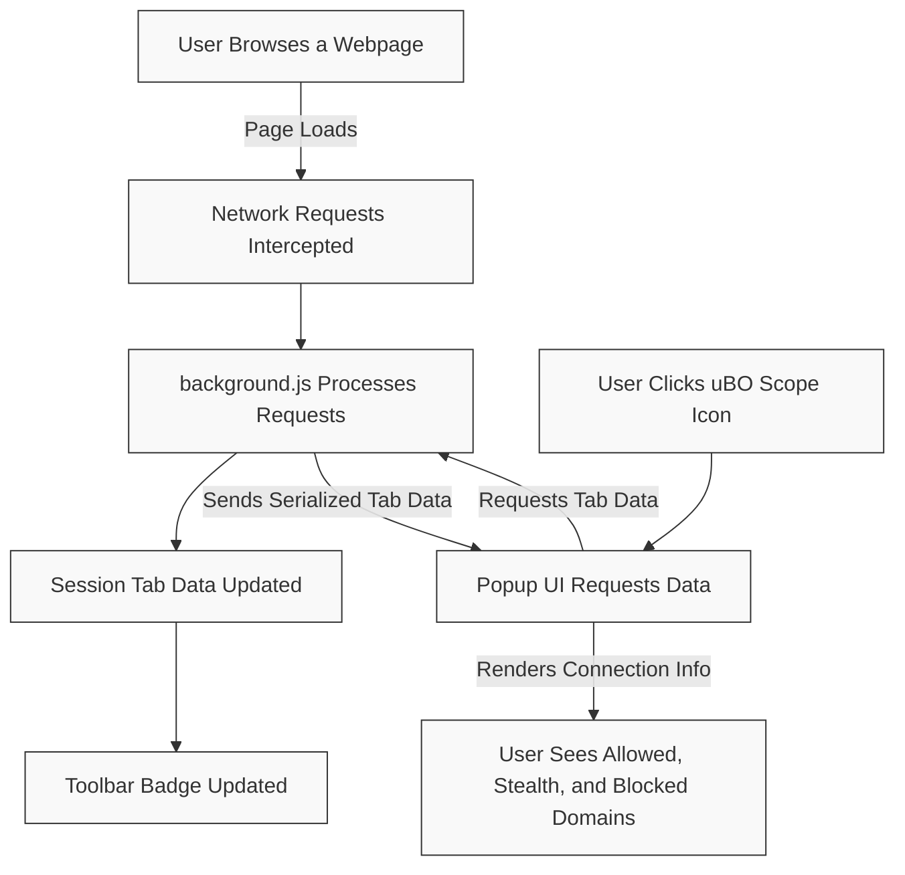

# Typical User Scenarios

Discover how uBO Scope empowers a wide range of users—from privacy-conscious individuals to filter list maintainers—to gain unmatched visibility into their browser’s real network activity. This page provides practical, real-world examples demonstrating when and why deploying uBO Scope makes a difference, helping you understand its value beyond abstract block counts or specialized test pages.

---

## Routine Privacy Audits

Imagine you are a privacy-focused user who wants to understand exactly which third-party servers your favorite websites communicate with during a browsing session. Rather than relying on general assumptions or block count metrics, uBO Scope reveals every connection attempt, whether allowed, blocked, or stealth-blocked.

**Workflow:**

1. Install uBO Scope (see [Supported Browsers & Installation](./overview/architecture-and-operation/browser-support.md)).
2. Browse the web as usual.
3. Click the uBO Scope toolbar icon to open the popup.
4. Review the categorized lists of domains your current tab connected to under **not blocked**, **stealth-blocked**, and **blocked**.

<u>Benefits:</u>
- Pinpoint unexpected third-party connections that could impact your privacy.
- See stealthy redirects or blocks that typical content blockers don’t reveal.
- Validate the effectiveness of your content blocker configuration by examining actual network outcomes.

**Example:** Visiting a news site, uBO Scope shows connections to a handful of content delivery networks (CDNs) as well as some analytics domains silently redirected and blocked stealthily. This empowers you to decide whether to fine-tune your blocking rules or accept the connections as legitimate.

---

## Security Research and Transparency

Security analysts and researchers require a transparent audit trail of network events originating from web pages. uBO Scope offers a comprehensive view uncoupled from content blockers, uniquely capturing all browser-reported network events.

**Scenario:** A researcher measures third-party server contact and blocking patterns on banking and e-commerce sites to assess data leak risks.

**Core Advantage:**

- Bypass misleading block counts typical of content blockers that don’t expose allowed remote hosts.
- Access real connection outcomes including stealth blocking and redirects.

**Insights Gained:**
- Identification of potentially risky third-party communications.
- Validation of stealth blocking behavior that often escapes notice.

---

## Filter List Maintainer Validation

Filter list maintainers often need to verify how well their filters perform in real-world browsing, especially on devices or environments lacking rich browser developer tools.

**Use Case:** Using uBO Scope as a lightweight companion to test blocking rules across multiple browsing sessions.

**Steps:**

1. Deploy uBO Scope alongside your content blocker.
2. Browse sites known for heavy ad or tracking content.
3. Refer to uBO Scope’s popup to observe domains classified as blocked, stealth-blocked, or allowed.
4. Correlate results with filter rules for accuracy assessment.

**Advantages:**
- Works independently from your content blocker, providing an objective measure.
- Shows domains responsible for network requests instead of just raw block counts.
- Allows filter developers to diagnose under-blocking or over-blocking without full developer tool access.

---

## Investigating Content Blocker Myths

Users often encounter confusing claims such as “Higher block count means better blocking” or “Ad blocker test sites provide reliable assessments.” uBO Scope helps debunk these by revealing the full connection landscape.

**Illustration:** Two different content blockers show differing block counts on the badge. uBO Scope reveals that the one with a higher block count nonetheless allowed connections to more distinct third-party domains, exposing potential gaps.

**Why This Matters:**
- Badge block counts alone are misleading metrics.
- Test webpages for blockers often simulate unrealistic network behavior not found in normal browsing.

Use uBO Scope to ground blocker effectiveness discussions in actual network outcomes, rather than superficial statistics.

---

## Limited Browser Tools Environment

On some devices, especially mobile or locked-down environments, browser development tools are minimal or inaccessible. uBO Scope offers an approachable, extension-based solution to audit network activity without complex setups.

**Scenario:** A user on a corporate or managed device cannot open developer tools but wants insight into network connections made by web pages.

**How uBO Scope Helps:**
- Installs quickly as a browser extension.
- Uses the browser’s webRequest API to monitor all URL connections transparently.
- Presents data visually in a user-friendly popup.

This reduces the barrier to understanding web communication patterns and privacy exposures on constrained platforms.

---

## Summary of Typical User Workflows

| Scenario                        | Purpose                               | Key Steps                                                       | Outcome                                                        |
|--------------------------------|-------------------------------------|-----------------------------------------------------------------|----------------------------------------------------------------|
| Routine Privacy Audits          | Discover third-party connections    | Browse → Open uBO Scope → Inspect domain outcomes              | Understand and control privacy exposures                       |
| Security Research              | Analyze network behavior             | Enable uBO Scope → Audit connections on sensitive sites        | Transparency on allowed vs blocked connections                 |
| Filter List Validation          | Assess filter effectiveness          | Use alongside blockers → Review domain categories              | Validate and improve blocking lists                            |
| Debunking Myths                | Clarify misleading metrics           | Compare block counts with uBO Scope insights                   | Accurate understanding of blocking effectiveness              |
| Browsing with Limited Tools    | Network auditing without devtools   | Install uBO Scope → Use popup UI                               | Access to network activity insights on constrained devices    |

---

## Practical Tips & Best Practices

- **Start each audit with a fresh tab load:** The popup UI resets on navigation, ensuring current session data is relevant.
- **Interpret domain groupings carefully:** ‘Allowed’ domains are those with successful connections; ‘Blocked’ indicates failed network attempts; ‘Stealth-blocked’ are connections redirected or blocked invisibly.
- **Use the toolbar badge as a privacy metric:** A lower count of distinct third-party domains is generally better.
- **Remember limitations:** uBO Scope reports only network requests visible to the browser's `webRequest` API; certain browser-internal or extension-isolated communications may not appear.
- **Combine with other privacy tools:** uBO Scope is a visibility tool and does not block by itself; use it alongside blockers for best protection.

---

## Troubleshooting Common Scenarios

<AccordionGroup title="Troubleshooting Typical Issues">
<Accordion title="No Data Shown in Popup">
If the popup shows 'NO DATA' or an empty domain list:

- Ensure you have actively loaded a webpage in the current tab.
- Make sure uBO Scope has permission to access webRequest for the site.
- Confirm the browser supports the webRequest API fully.
- Try reloading the tab to refresh network data.
- See [Supported Browsers & Installation](./overview/architecture-and-operation/browser-support.md) for compatibility.
</Accordion>
<Accordion title="Toolbar Badge Count Not Updating">
The badge count may lag if network events are delayed or the tab was inactive:

- Wait a few seconds after page load for processing.
- Reload the page for fresh data.
- Check your browser’s extension permissions.
</Accordion>
<Accordion title="Stealth Blocked Domains Confusing Me">
Stealth blocking involves redirects or silent blocking. To clarify:

- These domains may have requests that never fully resolve.
- They appear separately to highlight subtle differences in network outcome.
- Use this info to fine-tune filters or investigate suspicious redirects.
</Accordion>
</AccordionGroup>

---

For detailed information on understanding domain classifications, see [Core Concepts & Terminology](./overview/concepts-and-use-cases/key-terms.md).

Learn more about interpreting badge counts at [Understanding the Toolbar Badge](./overview/introduction-and-value/badge-count-meaning.md).

Explore foundational architecture to deepen your knowledge at [System Architecture](./overview/architecture-and-operation/system-architecture.md).

---

**Ready to experience transparency into your web connections?**

Get started by installing uBO Scope and monitor your browsing in real time.

---

# Mermaid Diagram: Typical Data Flow for a User Scenario

---