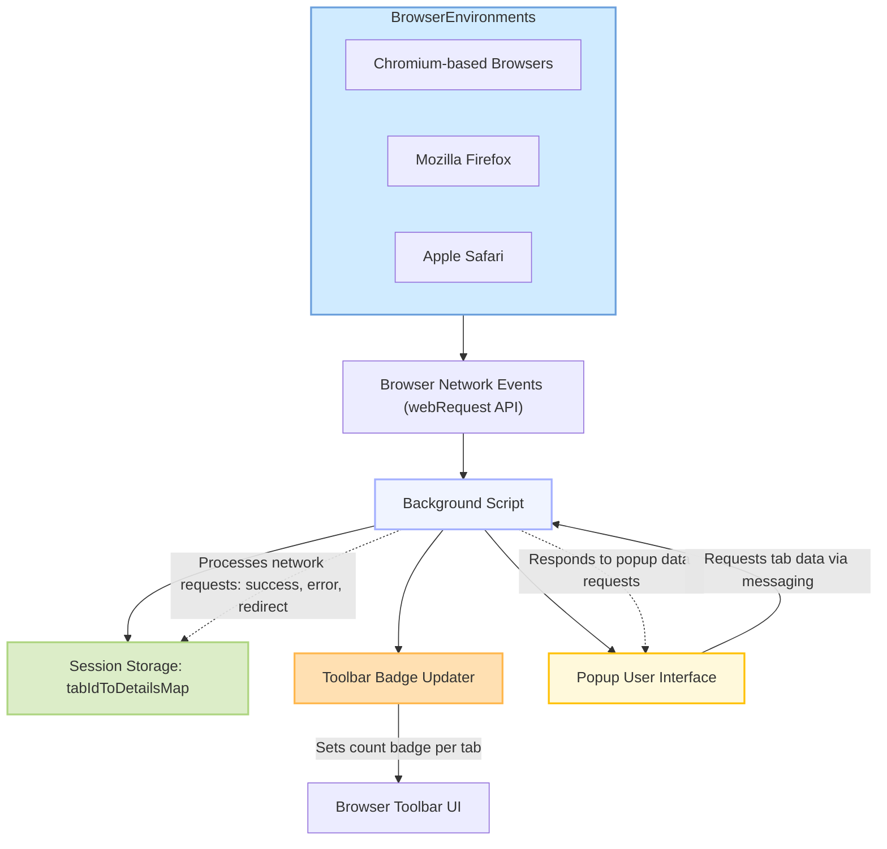

# How uBO Scope Works: Architecture Overview

Understanding how uBO Scope operates behind the scenes helps you appreciate its precision and reliability in revealing third-party network connections. This page provides a clear visualization supported by a Mermaid diagram that outlines the data flow within the extension and explains how uBO Scope supports multiple browser environments while tracking network request outcomes.

---

## High-Level Architecture of uBO Scope

At its heart, uBO Scope listens to your browser's network events using the `webRequest` API to capture every connection a web page attempts with remote servers. These events are processed in the background script, aggregated into meaningful statistics about allowed, blocked, and stealth-blocked connections per tab, and then presented through an interactive popup UI and a real-time badge on the toolbar.

The extension maintains this data in session storage, ensuring persistence as you browse, and dynamically updates the user interface to reflect live network activity.

---

## Key Components and Their Roles

- **Browser Network Events (`webRequest` API):**
  uBO Scope taps into this browser-provided API which provides detailed hooks into network request lifecycles. This includes capturing when requests start, complete successfully, get redirected, or fail.

- **Background Script:**
  This core module aggregates network requests on a per-tab basis. It:
  - Tracks connections classified as `allowed`, `blocked`, or `stealth-blocked`.
  - Uses public suffix list parsing to derive domains from hostnames for meaningful grouping.
  - Stores and updates the session data to persist monitoring across browsing sessions.

- **Session Storage:**
  A dedicated in-browser storage area holds the collected data, like which domains were contacted and their outcome statuses, keyed by tab IDs. This ensures data remains available as users interact with multiple tabs.

- **Toolbar Badge Updater:**
  Dynamically updates the extension's icon badge visible in the browser toolbar. The number reflects the count of distinct third-party domains contacted by the active tab that were allowed. This real-time summary empowers users to quickly understand third-party exposure at a glance.

- **Popup UI:**
  When users click the toolbar icon, the popup displays detailed domain information for the current tab categorized by connection outcome (not blocked, stealth-blocked, blocked). It retrieves this detailed data by messaging the background script and rendering it for easy inspection.

- **Browser Environment Support:**
  uBO Scope supports all major browsers—Chromium, Firefox, and Safari—leveraging their respective `webRequest` API implementations. Subtle differences in each platform’s handling are abstracted away in the background script so users experience consistent functionality.

---

## Tracking Network Request Outcomes

uBO Scope classifies observed network requests into three connection states:

- **Allowed:** Requests to distinct third-party domains that successfully completed and were not blocked.
- **Stealth-Blocked:** Redirected requests that do not surface visibly but are tracked internally.
- **Blocked:** Requests that failed or were denied, either by content blockers or other mechanisms.

Each request is analyzed by hostname and mapped to its corresponding domain using the public suffix list. Counts are maintained for each outcome, giving a clear assessment of all remote servers contacted during your browsing session.

This granular tracking allows uBO Scope to accurately report the number of third-party connections beyond simple block counts, revealing the actual exposure surface.

---

## How the Popup UI Data Flow Works

When you open the uBO Scope popup:

1. The popup script queries the background script via messaging for the current active tab's network connection data.
2. The background script retrieves the data from session storage, serializes it, and sends it back.
3. The popup script deserializes the data and renders three distinct sections with counts and domains categorized as 'Not Blocked', 'Stealth-Blocked', and 'Blocked'.
4. The hostname and domain are displayed in a user-friendly manner using Unicode conversion to support internationalized domains.

This live interaction bridges the internal data collection with your real-time inspection needs.

---

## Supporting Multiple Browsers

uBO Scope's design abstracts browser-specific APIs and permissions to support major browsers:

- **Chromium:** Uses a service worker background script and supports `webRequest` with broad host permissions including `http`, `https`, `ws`, and `wss`.
- **Firefox:** Runs a module-based background script compatible with Firefox's extension architecture, with support for identical host permissions.
- **Safari:** Integrates within Safari's strict version requirements and API differences, employing the same conceptual workflow.

This multi-browser strategy ensures that no matter your environment, uBO Scope delivers consistent insight into network connection behavior.

---

## Summary

uBO Scope tracks all remote server connections initiated by webpages through the `webRequest` API, processes the requests in its background script by categorizing them into allowed, stealth-blocked, and blocked outcomes, and stores this information per browser tab. The data is exposed in real time via the toolbar badge and popup UI, providing transparency about third-party exposure across major browser platforms.

For a practical and privacy-conscious user, this architecture guarantees reliable insight with minimal overhead.

---

## Next Steps

- Explore the [Core Concepts & Key Terminology](https://yourdocs/overview/concepts-architecture-workflow/core-concepts-terminology) to deepen your understanding of uBO Scope's reporting.
- Learn about the [Core Features and Value](https://yourdocs/overview/product-introduction-features/core-features-and-value) to see how this architecture delivers actionable benefits.
- Start using uBO Scope with guides on [Understanding the Badge and Popup](https://yourdocs/getting-started/using-ubo-scope/understanding-badge-and-popup).

---

_Source code reference: [js/background.js](https://github.com/gorhill/uBO-Scope/blob/main/js/background.js), [js/popup.js](https://github.com/gorhill/uBO-Scope/blob/main/js/popup.js)_
