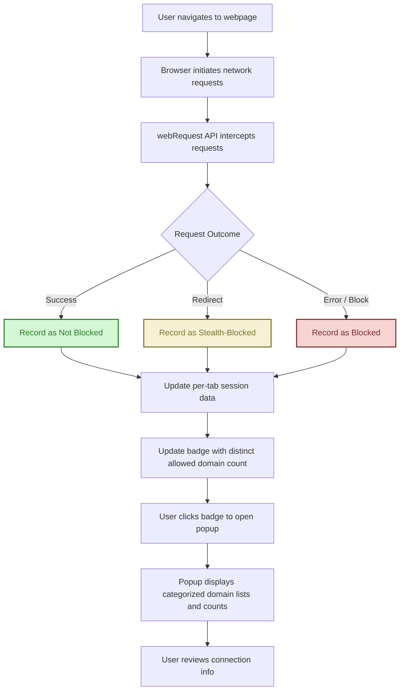

# Quick Feature Overview & Example Workflow

Understanding what happens behind the scenes when you visit a webpage is key to making the most out of uBO Scope. This walkthrough explains how the extension tracks and presents third-party connections, illustrates what the badge count signifies, and guides you on interpreting the popup UI for actionable insights.

---

## What Happens When You Visit a Webpage?

When you load a webpage, your browser initiates multiple network requests to fetch resources such as HTML, images, scripts, stylesheets, and more. Among these are requests to various remote servers, some belonging to the webpage's domain (first-party) and others belonging to different domains (third-party).

uBO Scope steps in silently to observe these network activities using the browser's `webRequest` API. It records each outgoing request to identify which remote servers the page attempts to connect with and whether those requests are allowed, blocked, or stealth-blocked.

---

## Understanding the Badge Count

The badge count on the uBO Scope toolbar icon represents the number of **distinct third-party domains** the current tab has successfully connected to or attempted to connect to. Here's what you need to know:

- **Lower is better:** A lower badge count indicates fewer third-party connections, reducing your exposure to external servers.
- **Third-party focus:** Only connections to domains different from the main website's domain count.
- **Counting logic:** Each unique third-party domain encountered contributes one to the badge count, regardless of how many individual requests it handled.

<u>Example:</u> If you visit example.com and uBO Scope shows a badge with "3," it means your browser connected with three unique third-party domains, such as CDNs or analytics servers.

---

## How Domain Connections Are Categorized

uBO Scope classifies network connections into three clear categories based on their outcome:

| Category        | Description                                                                                             | User Takeaway                                   |
|-----------------|-----------------------------------------------------------------------------------------------------|------------------------------------------------|
| **Not Blocked** | Connections that succeeded without interference. These third-party domains fetched resources.         | These domains were fully contacted by your browser.
| **Stealth-Blocked** | Connections that were silently blocked or redirected by a content blocker without triggering page errors or alerts. | These domains were effectively hidden from the webpage.
| **Blocked**     | Connections that resulted in errors or were actively blocked and reported as such.                    | These domains' connection attempts failed or were denied.

This categorization helps you understand which external domains interact with your browser and how content blockers affect those connections.

---

## Reading and Interpreting the Popup UI

Clicking the uBO Scope icon opens a popup that breaks down connection data in a detailed, user-friendly manner:

### Popup Sections

- **Tab Hostname:** Displays the main domain of the current webpage, separating the subdomain portion for clarity.
- **Domains Connected:** Shows a total count of distinct third-party domains contacted (matches the badge number).
- **Not Blocked:** Lists all third-party domains successfully connected, each with a count indicating how many requests were made.
- **Stealth-Blocked:** Lists domains whose connections were silently blocked or redirected, helping to audit content blocker effectiveness.
- **Blocked:** Shows domains whose connections failed due to errors or explicit blocking.

### Practical Interpretation
For example, if a popular news site connects to a handful of ad networks or trackers, these will appear appropriately categorized in the popup. You can quickly audit which third parties your browser actually communicated with, see what your blockers are blocking or stealth-blocking, and identify possible privacy exposures.

---

## Behind the Scenes: Mapping User Interactions to Logic

| User Interaction                 | Underlying Behavior & Logic                                            | Result and User Benefit                      |
|---------------------------------|----------------------------------------------------------------------|----------------------------------------------|
| Visit a webpage                 | uBO Scope listens to all network requests via the `webRequest` API. | Records each request with domain and status. |
| Toolbar badge updates           | Counts distinct allowed third-party domains per tab.                  | Badge shows real-time connection exposure.  |
| Click toolbar icon to open popup | Extension fetches serialized session data for the current tab.       | Popup renders categorized lists of domains with request counts. |
| Review 'stealth-blocked' domains | Captures redirects or invisible blocks from content blockers.        | Reveals hidden blocking that pages or blockers might not show.  |
| Close or reload tab             | Tab session data is cleared to keep reports current and relevant.     | Ensures badge and popup reflect active connections only.        |

---

## Visual Workflow Diagram

---

## Tips for Getting the Most From uBO Scope

- Monitor the badge while browsing to get a quick sense of third-party exposure.
- Use the popup details to identify unexpected or suspicious third-party domains.
- Cross-reference stealth-blocked domains with your content blockers to verify silent blocking effectiveness.
- Refresh pages and watch the badge update to confirm the live nature of monitoring.

---

## Troubleshooting Common Scenarios

<AccordionGroup title="Troubleshooting & Common Questions">
<Accordion title="Why does the badge count sometimes reset or disappear?">
When you switch tabs or close a tab, session data clears for that tab, so badge counts update accordingly. If no third-party connections have been recorded yet, the badge will be empty.
</Accordion>
<Accordion title="What if the popup shows no data?">
This can happen if the page has not initiated any network requests yet, or if the extension is still loading data. Try refreshing the page or waiting a moment before opening the popup again.
</Accordion>
<Accordion title="Are all third-party servers necessarily harmful?">
Not necessarily. Many, such as CDNs or essential service domains, are legitimate. The badge count helps you stay informed and make decisions, but interpreting the data in context is key.
</Accordion>
</AccordionGroup>

---

## Next Steps

- Explore [What is uBO Scope?](/overview/product-introduction-features/what-is-ubo-scope) for foundational knowledge.
- Learn about [Core Features and Value](/overview/product-introduction-features/core-features-and-value) to understand all capabilities.
- Review [Target Audience & Typical Use Cases](/overview/product-introduction-features/who-should-use) to see if this tool fits your needs.
- Once ready, proceed to [Installation & Setup](/getting-started/installation-and-setup/system-requirements) to get started.

---

With this understanding and workflow, you can confidently use uBO Scope to gain clear, transparent insight into the connections your browser makes, empowering you to maintain control of your privacy and security online.
