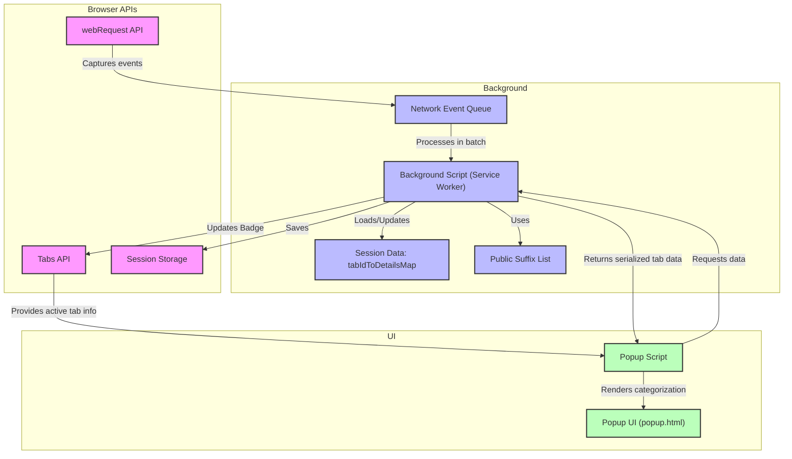

# How uBO Scope Works: Architecture & Data Flow

## Unlocking the Inner Workings of uBO Scope

Understanding how uBO Scope collects and presents data helps you appreciate the transparency it offers into your browser's network activities. This page dissects uBO Scope's technical architecture and data flow—from the moment a network request is captured by browser APIs to how it’s categorized and displayed in the popup UI.

Whether you're a curious privacy advocate, a filter list maintainer, or a power user, this guide illuminates exactly how uBO Scope works behind the scenes, empowering you to trust and leverage its insights effectively.

---

## What This Page Covers

- The core components of uBO Scope, including background scripts and popup UI
- How network requests are intercepted and processed
- How results are categorized into allowed, blocked, and stealth-blocked
- The seamless flow of data through the extension
- A detailed mermaid diagram visualizing all component interactions

---

## The Architecture of uBO Scope: A Clear Path from Request to Result

At its heart, uBO Scope is a browser extension designed to comprehensively monitor every network request your browser makes. It achieves this by utilizing native browser APIs to intercept, classify, and present requests in real time.

### Key Components and Their Roles

- **Browser APIs:** The foundation that captures network activity. uBO Scope listens to network events like request starts, redirects, and errors through the browser's `webRequest` API.

- **Background Script (Service Worker):** Acts as the vigilant observer. It receives raw network request events via the browser API and categorizes them as allowed, blocked, or stealth-blocked based on request outcomes.

- **Session Management:** Maintains dynamic state per browser tab, tracking domain and hostname details, and accumulates connection counts.

- **Popup UI:** Your window into this data. Displays categorized connection results—grouped into not blocked, stealth-blocked, and blocked domains—to help you quickly understand the network behavior of the active tab.

### How The Flow Unfolds

Every network connection attempt your browser makes triggers one of these events:

- **Success:** The request completed successfully.
- **Redirect:** The request was redirected (a subtle indicator often related to stealth blocking).
- **Error:** The request failed or was blocked.

The background script queues these events and processes them in batches to efficiently update internal data structures. It keeps a map keyed by tab ID, aggregating counts of domains and hostnames by outcome category.

When you open the popup, it requests this aggregated data for the active tab, and the popup script renders the network request summary in an intuitive, categorized layout.

---

## Anatomy of Data Processing

1. **Intercepting Requests:**
   The extension registers listeners on network events for all URLs (`http://*/*`, `https://*/*`, `ws://*/*`, `wss://*/*`). This guarantees full visibility into your browser’s connections.

2. **Classifying Outcomes:**
   - **Allowed:** Requests that succeeded.
   - **Blocked:** Requests that failed (errors).
   - **Stealth-Blocked:** Requests that were redirected unexpectedly, indicating stealth blocking techniques.

3. **Mapping Domains and Hostnames:**
   For each request, uBO Scope extracts the hostname and determines its registered domain using the public suffix list. This domain normalization groups related subdomains, simplifying insights.

4. **Updating Tab Badge:**
   The extension updates the toolbar badge dynamically, reflecting the count of distinct third-party domains connected.

5. **Session Persistence:**
   Session data is stored in the browser's session storage to maintain state during browsing sessions, allowing seamless user experience and data consistency.

6. **Popup Rendering:**
   When activated, the popup queries the background for the current tab’s network data. It then displays counts and lists domains grouped by connection outcome, updated with Unicode-friendly domain names for clarity.

---

## Visualizing the Architecture & Data Flow

This flowchart captures how uBO Scope uses browser APIs to intercept network requests, manages and persists session state within its background service worker, then presents categorized connection results to the user through the popup UI.

---

## Real-World Example: From a Webpage Load to Your Popup

Imagine loading a popular news website. As the page loads, dozens of connections initiate:

- The main site’s server (allowed).
- CDN servers delivering images and JavaScript (allowed).
- Analytics or advertising domains that the user or content blockers prevent (blocked or stealth-blocked).

uBO Scope's background script tracks each of these connection attempts by monitoring the browser's network events.

Later, when you click the uBO Scope toolbar icon to open the popup:

- The popup script queries the background script for the current tab’s aggregated network data.
- It presents a clear list of connected domains, categorized by allowed, stealth-blocked, and blocked.
- The toolbar badge shows a concise count of distinct allowed third-party domains.

This lets you instantly judge the privacy impact of the page load, verifying how many third-party servers are contacted successfully despite any blockers.

---

## Tips and Best Practices

- **Opening the Popup Often:** Since network activity is dynamic, opening the popup refreshes the view with the latest data for the active tab.

- **Consider Tab Context:** The extension tracks connection data per tab. Closing a tab clears its stored data, keeping your analysis focused.

- **Understand Stealth Blocking:** Redirect events often indicate stealth-blocked requests — these can be subtle but critical privacy signals.

- **Be Patient with Badge Updates:** The background processes network events in batches every second, so badge counts update smoothly but with a slight delay.

- **Session Storage Use:** For longevity during your browsing session, uBO Scope stores session state, but data isn’t persisted between browser restarts.

---

## Troubleshooting Common Issues

<AccordionGroup title="Troubleshooting Network Data Visibility">
<Accordion title="Why does the badge show no count on certain tabs?">
The badge updates only when network requests for the active tab are observed. If a tab has no network activity or network requests are not using HTTP, HTTPS, WS, or WSS protocols, no data will appear.
</Accordion>
<Accordion title="The popup shows 'NO DATA' or is empty">
uBO Scope relies on the browser’s webRequest API. If this API is unavailable or restricted in some browsing contexts, the popup may fail to retrieve or display data. Also, ensure the active tab is a web page and not a browser internal page.
</Accordion>
<Accordion title="Unexpected high counts despite content blockers">
Remember that block counts represent failed request attempts, but the badge shows allowed distinct domains. A high block count does not necessarily mean fewer third-party connections; it may indicate more aggressive content blockers triggering more blocked attempts.
</Accordion>
</AccordionGroup>

---

## Getting Started Preview

To see uBO Scope in action, install the extension on your browser, navigate to any webpage, and click the toolbar badge to open the popup UI. Watch how the network requests are categorized and counted to understand your browsing privacy footprint deeply.

For installation and configuration details, refer to the [Getting Started guides](../../getting-started/installation-setup/installing-extension).

---

With this knowledge of uBO Scope's architecture and data flow, you are well equipped to interpret its insights accurately and make informed decisions about your browser's network exposure.

---

## Further Reading & Related Documentation

- [What is uBO Scope?](../intro-value-target/what-is-ubo-scope) — Understand the product’s mission and value.
- [Core Concepts & Terminology](./core-concepts-terminology) — Get clear on essential terms used throughout uBO Scope.
- [Interpreting the Toolbar Badge and Popup](../../getting-started/first-steps-usage/interpreting-results) — Learn how to read and make sense of the UI results.
- [Public Suffix List](https://publicsuffix.org/list/) — External resource used for domain parsing in uBO Scope.

---

## Source Code and Repository

Explore the source at the [uBO Scope GitHub Repository](https://github.com/gorhill/uBO-Scope). Key files include:

- `background.js` — Manages interception, classification, and session management.
- `popup.js` — Handles UI rendering and interaction.
- `manifest.json` — Declares extension permissions and settings.

Use this understanding for further customization or contribution.

---
