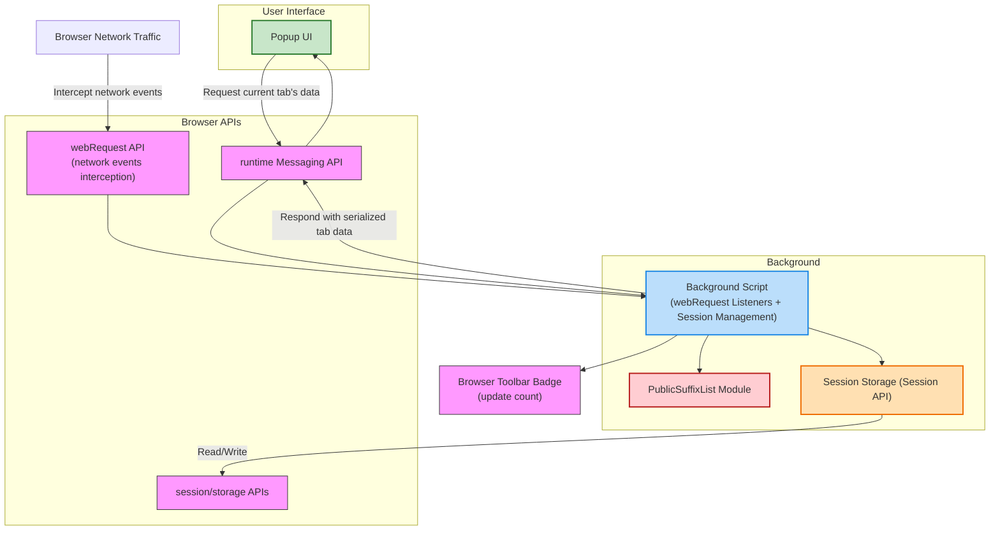

# Architecture Overview

## Understanding uBO Scope's Core Structure and Data Flow

uBO Scope is designed as a streamlined browser extension that transparently monitors and reports on all network connections initiated during your web browsing sessions. This page presents a high-level view of its architecture, highlighting how the background monitoring component and popup user interface collaborate through browser APIs and persistent session data to provide instant and detailed reports about remote connections related to the active tab.

---

## Architecture at a Glance

At its core, uBO Scope is composed of two primary components working in tandem:

- **Background Script**: This persistent (or service worker) script, running invisibly, intercepts and processes network request events at the browser level.
- **Popup UI**: The user-facing interface triggered from the browser toolbar, displaying summarized and categorized connection data.

These components communicate indirectly via the browser's messaging and storage APIs, with session data acting as the bridge ensuring stateful, responsive reporting.

---

## Key Components Explained

### Background Script

The background script is the engine room of uBO Scope. It listens for network events through the browser's `webRequest` API, capturing every request's outcome: whether it was allowed, blocked, or stealth-blocked (e.g., redirected or otherwise affected). This script maintains an in-memory session map organized by tab IDs, categorizing domains contacted in real time.

#### Responsibilities:

- **Intercept Network Events:** Listens to `onBeforeRedirect`, `onErrorOccurred`, and `onResponseStarted` events.
- **Session Data Management:** Uses browser session storage to persist active tab's connection data, ensuring data continuity across reloads and navigation.
- **Public Suffix List (PSL) Integration:** Determines registrable domains using the PSL to aggregate hosts properly and avoid counting subdomains multiple times.
- **Badge Update:** Updates the browser toolbar badge with the count of distinct third-party domains connected per tab.

### PublicSuffixList Module

This specialized module enables accurate domain parsing, crucial for grouping network requests at a sensible domain level rather than raw hostnames. It ensures that connection counts reflect meaningful distinct entities, helping users better interpret exposure.

### Popup UI

The popup interface fetches serialized tab data via runtime messaging, deserializes it, and presents a categorized summary:

- **Allowed Domains:** Third-party domains from which resources were successfully allowed.
- **Stealth-Blocked Domains:** Domains affected by stealth blocking techniques.
- **Blocked Domains:** Domains from which requests were outright blocked.

Data is displayed in a clear, count-annotated format that allows users to quickly grasp the current tab’s network exposure.

### Browser APIs

- **webRequest API:** Provides hooks to observe and categorize every network request.
- **Messaging API:** Allows the popup to request up-to-date data from the background process.
- **Storage API:** Supports session persistence, so data survives page navigation or reloads within tabs.
- **Browser Action API:** Manages the extension’s toolbar icon and badge text.

---

## How Data Flows Through uBO Scope

1. **Network Request Capturing:**
   As you browse, the background script intercepts network requests, analyzing each for type, URL, and outcome.

2. **Domain Categorization:**
   Using the PublicSuffixList module, the script extracts registrable domains from hostnames and maps request outcomes into allowed, stealth, or blocked collections per tab.

3. **Session Data Storage:**
   These categorized datasets are serialized and saved to session storage for immediate retrieval.

4. **Popup Data Retrieval:**
   When you open the popup, it sends a message requesting the current tab's data.

5. **Data Presentation:**
   Background responds with serialized data; the popup deserializes and renders an easy-to-digest summary, highlighting domain counts and categories.

6. **Badge Update:**
   Concurrently, the background updates browser toolbar badge counts to provide at-a-glance information without opening the popup.

---

## Practical Example

Imagine visiting a news website that loads content from multiple third-party providers:

- The background script detects outgoing requests to analytics and ad servers.
- Some requests are silently blocked or stealth-blocked depending on your content blocker.
- The background script aggregates this data granularly by registrable domain and stores it.
- When you click the uBO Scope icon, the popup instantly reports that you connected to 3 distinct third-party domains, listing them under 'not blocked', 'stealth-blocked', and 'blocked'.
- The toolbar badge shows '3', indicating your exposure at a glance.

---

## Best Practices and Tips

- **Understanding Badge Counts:** A lower badge count usually means fewer distinct third-party connections — often a sign of better privacy.
- **Using Popup Insights:** Consult the categorized lists to identify potentially unwanted connections and tailor your content blockers accordingly.
- **Persistence Limitations:** Data reflects the current session state per tab; switching tabs or closing the browser clears session data.
- **Browser Compatibility:** uBO Scope leverages modern WebExtension APIs compatible with Chromium, Firefox, and Safari (≥ v18.5).

---

## Troubleshooting Common Issues

<AccordionGroup title="Common Challenges and Solutions">
<Accordion title="Popup Shows 'NO DATA'">
Check if you have a tab active and that it has at least loaded a webpage with network activity. Data is only available after the background script has processed requests for the tab.
</Accordion>
<Accordion title="Badge Count Not Updating">
Browser or extension may be suspending the background script or session storage has an issue. Reload the extension or the tab. Ensure your browser supports the required APIs.
</Accordion>
<Accordion title="Third-Party Domains Appear Inaccurate">
Remember domains are aggregated by registrable domains via the Public Suffix List. This is to avoid counting subsites separately and reflects meaningful distinct domains.
</Accordion>
</AccordionGroup>

---

## Next Steps

To deepen your understanding of uBO Scope and start using it effectively:

- Visit the [What is uBO Scope?](https://your-docs-link/overview/product-intro/what-is-ubo-scope) page to understand the tool's purpose.
- Explore [Key Features](https://your-docs-link/overview/product-intro/key-features) for detailed capabilities.
- Consult the [Target Audience & Use Cases](https://your-docs-link/overview/product-intro/use-cases) to see real-world scenarios.
- For hands-on guidance, check out the [Navigating the Popup](https://your-docs-link/guides/getting-started/tour-popup-interface) and [Analyzing Domains](https://your-docs-link/guides/core-scenarios/analyze-domains).

This architecture overview equips you with the foundational knowledge of how uBO Scope works behind the scenes, so you can better trust the insights it provides about your browsing network activity.

---