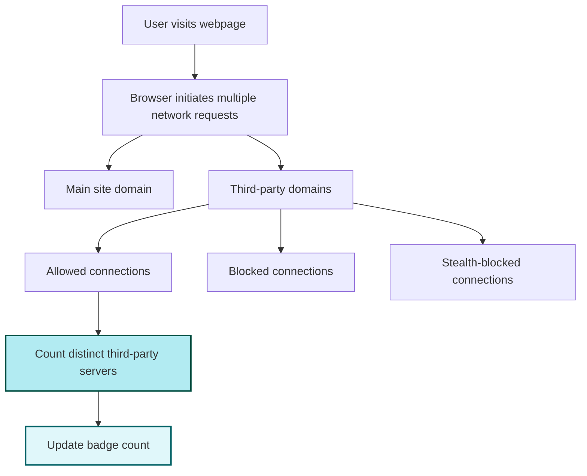

# Concepts & Terminology

Understanding uBO Scope begins with clear definitions of the key terms and concepts that shape how this extension tracks and reports browser network activity. This page unpacks critical terminology such as 'third-party remote servers', 'webRequest listeners', and 'badge count'. Grasping these ideas is essential to interpreting the data you see and appreciating the value uBO Scope provides.

---

## What Does uBO Scope Track?

At its core, uBO Scope is a lens on your browser’s network behavior. It reveals every remote server your browser tries to communicate with — whether these connections succeed, get blocked outright, or are stealth-blocked by your content blockers.

### Third-Party Remote Servers

- **Definition:** These are remote servers different from the main webpage’s domain you are visiting.
- **Relevance:** uBO Scope tracks how many distinct third-party domains your browser contacts because a higher count often means more external resources or trackers are loaded.
- **Example:** If you visit `example.com` but your browser requests resources from `cdn.example.net` and `ads.tracking-network.com`, these latter domains count as third-party.

The extension uniquely emphasizes counting **distinct third-party servers**, not just the number of requests.

<Tip>
A lower number of third-party servers generally indicates better privacy and fewer external dependencies. However, not all third-party connections are undesirable — for example, content delivery networks (CDNs) commonly serve legitimate assets.
</Tip>

### webRequest Listeners

- **Definition:** These are interfaces provided by modern browsers that allow extensions like uBO Scope to observe and analyze network requests made by webpages in real time.
- **How uBO Scope Uses them:** It listens to all network connections initiated by your browser, including those blocked by content blockers or DNS-level filters.
- **Limitations:** If a network request happens outside the browser’s webRequest API (e.g., some native or very low-level operations), uBO Scope cannot detect it.

<Tip>
Browsers must support webRequest APIs for uBO Scope to function fully. This allows the extension to report accurately on every connection attempt.
</Tip>

### Badge Count Explained

- **Meaning:** The badge number you see on the uBO Scope toolbar icon indicates the **number of distinct third-party remote servers** your browser connected to on the current tab.
- **Why This Matters:** Unlike block counts in content blockers (which may inflate numbers by counting multiple blocked requests from fewer servers), uBO Scope’s badge count represents unique external domains successfully contacted.
- **User Takeaway:** A lower badge count signifies fewer remote servers contacted, which can imply better privacy and less external tracking.

<Warning>
Do not use content blocker block counts to assess blocking effectiveness without considering the number of distinct servers connected. A higher block count can correlate with more unique third-party connections — meaning more exposure, not less.
</Warning>

### Outcomes of Network Requests

uBO Scope categorizes network requests into three outcomes:

| Outcome        | Description                                     |
|----------------|------------------------------------------------|
| **Allowed**    | Connection succeeded. The resource was loaded. |
| **Blocked**    | Connection failed due to a content blocker or other error. |
| **Stealth-Blocked** | Connection was intercepted stealthily by a content blocker to avoid detection, often reported as a redirect or similar behavior. |

These outcomes help users differentiate between requests actually loaded versus those prevented or hidden.

---

## Why These Distinctions Matter

Accurately understanding the distinctions ensures you interpret uBO Scope’s data correctly:

- Distinguishing *distinct third-party servers* focuses on privacy — fewer servers contacted means fewer data points shared.
- Transparent tracking via *webRequest listeners* means uBO Scope works reliably regardless of the content blockers in place, reporting what your browser truly does.
- The *badge count* gives a clear, immediate privacy indicator specific to each tab.

<Tip>
By learning the terminology, you empower yourself to leverage uBO Scope to verify and compare your content blockers' effectiveness beyond surface-level block counts or misleading "ad-blocker test" webpages.
</Tip>

---

## Related Terms Quick Reference

| Term                     | Description                                                      |
|--------------------------|------------------------------------------------------------------|
| **Domain**               | The registered domain name part of a hostname (e.g., example.com). Used for grouping network requests. |
| **Hostname**             | Full hostname of a URL (e.g., ads.tracking.example.com).         |
| **Content Blocker**      | Browser extension or system that blocks unwanted network requests. |
| **DNS-Level Blocking**   | Blocking performed by DNS servers before connection attempts reach the browser. |
| **Tab**                  | Browser tab identifier to isolate network activity reporting.   |

---

## Practical Example

Imagine you open a webpage in a tab:

- The main site is `news.example.com`.
- Your browser contacts 3 distinct third-party domains:
  - `cdn.static.net` (allowed)
  - `ads.tracking.net` (blocked)
  - `beacon.analytics.net` (stealth-blocked)

In this case, uBO Scope’s badge count will show "1" because only one third-party server (`cdn.static.net`) was successfully connected to. The popup UI will display details showing the blocked and stealth-blocked domains separately to clarify what was prevented.

---

## Summary Diagram of Concepts

---

## Troubleshooting and Best Practices

<AccordionGroup title="Common Questions & Pitfalls">
<Accordion title="Why is my badge count sometimes zero even though the page loads?">
The badge shows distinct third-party servers connected, excluding the main site. If the page or its resources come only from the main domain or blocked third parties, the count can be zero.
</Accordion>
<Accordion title="Why does uBO Scope not track some network requests?">
Requests made outside browser APIs (e.g., native app requests) or to localhost/internal addresses may not be visible to uBO Scope due to browser API limitations.
</Accordion>
<Accordion title="How do stealth-blocks differ from regular blocks?">
Stealth blocks use redirection or subtle interference so that the webpage or trackers cannot detect blocking has occurred, enhancing compatibility and privacy.
</Accordion>
</AccordionGroup>

---

## Next Steps

With these concepts and terminology now clearly defined, you are well-prepared to move forward and make full use of uBO Scope’s tracking insights.

- Explore [What is uBO Scope?](/overview/introduction-and-value/product-purpose) to understand its core purpose.
- See [Who Should Use uBO Scope?](/overview/introduction-and-value/target-audience-use-cases) for user scenarios applicable to you.
- Check out [Core Features at a Glance](/overview/introduction-and-value/feature-highlights) to learn about its key capabilities.

Detailed usage begins with installing the extension—visit [System Requirements](/getting-started/setup-introduction/system-requirements) followed by [Installing uBO Scope](/getting-started/setup-introduction/installation-overview).

---

## References

- [Public Suffix List](https://publicsuffix.org/list/) — to understand domain and hostname boundaries.
- Browser `webRequest` API documentation for underlying technical foundation.

---

For complete and contextual details, please refer to the navigation map to explore related documentation pages that complement your understanding of uBO Scope.