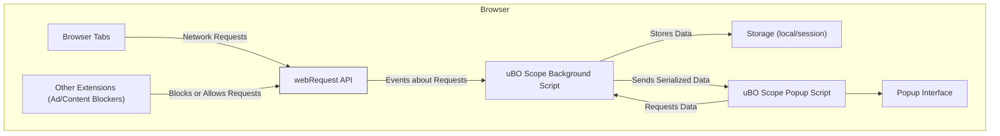

# Integrations & Compatibility

Understanding how uBO Scope interacts with other extensions and browser capabilities is essential for maximizing its usefulness and ensuring accurate network monitoring. This page explains uBO Scope’s operational boundaries, its reliance on specific browser APIs, and how it remains independent of other content blockers.

---

## How uBO Scope Works Alongside Other Extensions

uBO Scope is designed as a lightweight, standalone extension that reports on all network connections initiated by your browser, irrespective of any other content blocking or filtering extensions you may have installed. It does not interfere with or rely on any specific content blocker to work.

- **Independent Monitoring:** uBO Scope taps directly into the browser's `webRequest` API to observe network requests. This direct approach ensures it captures all connection events, including requests allowed, blocked, or stealth-blocked by other extensions.
- **Complementary, Not Conflicting:** Because uBO Scope simply listens to network request outcomes, it coexists seamlessly alongside ad blockers, tracker blockers, and other content filters.
- **Content Blocker Transparency:** It helps you verify what your content blockers are actually doing by exposing the true outcomes of network requests — so you can detect if any blocker is failing to prevent unwanted connections.

### Real-World Scenario
Imagine you use a popular ad blocker extension along with uBO Scope. While the ad blocker silently blocks unwanted ads, uBO Scope displays which third-party domains were successfully contacted, which were stealth-blocked (hidden blocking actions by extensions), and which are still allowed through. This visibility empowers you to audit and tune your privacy setup effectively.

## Role of the `webRequest` API

The `webRequest` API is crucial to uBO Scope’s functionality:

- **Network Event Capture:** It provides programmatic access to all network requests initiated by the browser, including HTTP(S) and WebSocket protocols.
- **Request Outcome Reporting:** uBO Scope listens for network request lifecycle events (`onBeforeRedirect`, `onErrorOccurred`, `onResponseStarted`) to classify connections as allowed, blocked, or stealth-blocked.
- **Core Integration Point:** Without access to `webRequest`, uBO Scope cannot monitor network activity, making this API an indispensable foundation.

### Important Points
- Browsers must support the `webRequest` API for uBO Scope to function correctly.
- Some network requests made outside the scope of the `webRequest` API (such as those through native browser components or certain DNS-based blocking) will not be captured or reported.

## Supported Browsers & Platform Compatibility

uBO Scope is designed to work across major browsers that support Manifest Version 3 (MV3) and the required APIs:

| Browser | Minimum Version  | Support Remarks               |
|---------|------------------|------------------------------|
| Chromium-based browsers (Chrome, Edge, Brave, etc.) | 122+               | Full support for required APIs and service worker-based background scripts. |
| Firefox                           | 128.0+            | Supports MV3 + `webRequest` with adequate permissions. |
| Safari                            | 18.5+             | Limited support with some adjustments for Safari's web extension model. |

### Permissions Summary
For proper functioning in all supported browsers, uBO Scope requests the following permissions:

- **activeTab:** To access details about the active browser tab.
- **storage:** To save and load session data persistently.
- **webRequest:** To listen to network request events.

These permissions reflect browser standards and are aligned with the extension's role as a network observer.

## Integration Boundaries and Limitations

Understanding what uBO Scope cannot do is just as important:

- **No Content Blocking:** uBO Scope does not block or modify network requests itself; it only reports on them.
- **Independent of Content Blockers:** It does not depend on or integrate with any ad/content blocker; any blocking or filtering is reflected in the network request outcomes it receives.
- **Depends on Browser Reporting:** If the browser or another extension handles network requests in a way that bypasses `webRequest` events (e.g., DNS-level blocking invisible to the browser), those requests will not appear in uBO Scope's reports.

## Practical Tips for Users

- Ensure you install uBO Scope on browsers that fully support the MV3 `webRequest` API for accurate data.
- Use uBO Scope in combination with your content blockers to audit real network behavior.
- Remember that a lower badge count in uBO Scope indicates fewer third-party remote servers contacted, which aligns with better privacy but isn't the sole metric to judge.

## Summary

- uBO Scope runs independently of other extensions, providing a transparent window into all network requests.
- It leverages the browser’s `webRequest` API, requiring browser support and permissions to function.
- Compatible with major browsers supporting Manifest V3 and required permissions.
- Serves as a valuable auditing and diagnostic tool rather than a blocking extension.

---

## Technical Diagram: How uBO Scope Integrates Within the Browser Environment

This diagram illustrates that uBO Scope listens to `webRequest` API events provided by the browser, independently from other installed extensions. It collects and stores data about requests, which the popup interface accesses to display summarized connection information.

## Additional Resources

To gain a deeper understanding of uBO Scope and its context, consider reviewing the following documentation:

- [What is uBO Scope?](https://example.com/overview/product-intro/what-is-ubo-scope) — foundational product overview
- [Key Features](https://example.com/overview/product-intro/key-features) — learn specific capabilities
- [Target Audience & Use Cases](https://example.com/overview/product-intro/use-cases) — understand who benefits and how
- [Architecture Overview](https://example.com/overview/concepts-architecture/architecture-overview) — technical insight into operation

---

## Troubleshooting

<AccordionGroup title="Common Issues and Tips">
  <Accordion title="Browser Compatibility Problems">
    Ensure you are running one of the supported browser versions listed above. Older browser versions may lack required APIs.
  </Accordion>
  <Accordion title='uBO Scope Shows No Data or "No Data" Message'>
    - Confirm uBO Scope has the required permissions (`webRequest`, `activeTab`, `storage`).
    - Check that other extensions or browser settings are not disabling or restricting API access.
    - Refresh the active tab or restart the browser to reset data collection.
  </Accordion>
  <Accordion title="Badge Count Does Not Change Despite Network Activity">
    - Refresh the tab to trigger data update.
    - The badge reflects distinct third-party remote servers; multiple connections to the same server count once.
    - Some network traffic may bypass the `webRequest` API and won't be counted.
  </Accordion>
</AccordionGroup>

---

By understanding these integration nuances, users can effectively leverage uBO Scope’s transparent network monitoring capabilities across multiple browsers and alongside their favorite content blockers.