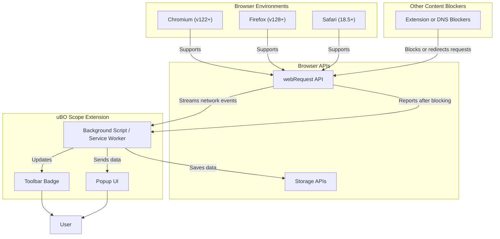

# Browser Compatibility & Extension Integration

## Unlocking Transparent Network Insights Across Browsers

uBO Scope supports major modern browsers — Chromium-based browsers (like Google Chrome, Edge), Mozilla Firefox, and Apple Safari — enabling users to see every network connection their browser attempts. This page details which browsers are fully supported and explains how uBO Scope integrates seamlessly alongside existing content blockers or DNS filtering tools by leveraging the native webRequest API each browser provides.

---

## Why Browser Compatibility Matters

Every user wants a reliable, consistent experience with uBO Scope across different browsing platforms. Since network monitoring relies heavily on browser-specific APIs, understanding compatibility ensures you get accurate, trustworthy reports regardless of your browser choice. This section guides you through which browsers uBO Scope supports and describes how it operates without interfering with your existing privacy defenses.

---

## Supported Browsers

uBO Scope is engineered to work reliably across the following browsers:

- **Chromium-based browsers** (Google Chrome, Microsoft Edge, and derivatives)
- **Mozilla Firefox** (including Firefox for Android)
- **Apple Safari** (version 18.5 and later)

### Chromium

- Leverages Manifest Version 3 with a module-based service worker background script.
- Explicitly requests permissions to monitor both HTTP(S) and WebSocket (ws:// and wss://) traffic.
- Requires Chrome version 122 or above to ensure full webRequest API compatibility.

### Firefox

- Uses Manifest Version 3 with background scripts and supports the webRequest API reliably.
- Requires Firefox 128 or newer.
- Supports both HTTP(S) and WebSocket protocols.

### Safari

- Built as a Safari Web Extension requiring macOS versions with Safari 18.5 or above.
- Uses background module scripts per Safari’s Manifest Version 3 guidelines.
- Supports monitoring HTTP(S) requests but may have inherent platform differences due to Apple's security model.

---

## How uBO Scope Integrates with Other Content Blockers

No need to disable your favorite content blocker to benefit from uBO Scope’s transparency. Here’s how integration works under the hood:

- **Browser native webRequest API as the foundation:**
  uBO Scope taps into this API, which all supported browsers provide, to intercept and observe web requests.

- **Works independently alongside any content blocking extensions or DNS filtering:**
  Because the webRequest API reports what requests the browser actually makes, uBO Scope reflects the real, post-blocking network activity.

- **Reports both allowed and blocked requests, including stealth blocking:**
  Some content blockers stealthily block resources to avoid detection; uBO Scope reveals these by monitoring network outcomes.

- **Relies on browser permissions carefully managed through manifest files:**
  Each browser version explicitly requests `webRequest`, `storage`, and `activeTab` permissions, ensuring smooth operation without overreach.

### What Does This Mean for You?

- **Accurate visibility without interference:**
  You get truthful insights even if you use complex multi-layered blocking strategies (extensions + DNS filters).

- **No extra configuration needed:**
  The extension automatically hooks into browser APIs and updates badge counts and reports based on actual network outcomes.

- **Consistency across browsers:**
  The extension behaves similarly regardless of your choice among Chromium, Firefox, or Safari, reducing surprises.

---

## Behind the Scenes: Leveraging the webRequest API

At the core, uBO Scope uses the browser’s `webRequest` listeners to observe network events:

- **onBeforeRedirect:** Captures redirects to reclassify outcomes
- **onErrorOccurred:** Detects failed or blocked requests
- **onResponseStarted:** Notes successful requests

All these events are captured only for URLs defined by the extension’s host permissions (usually all HTTP(S) and WebSocket traffic).

The extension records the domain and hostname of each request and classifies them into:

- **Allowed (Successful connections)**
- **Blocked (Explicitly blocked requests)**
- **Stealth Blocked (Requests that were silently intercepted or redirected by blockers)

This classification is presented in an easy-to-understand popup UI and reflected in real-time badge counts on the toolbar icon.

---

## Permissions and Manifest Highlights by Browser

| Browser     | Minimum Version | Relevant Permissions           | Notes                                             |
|-------------|-----------------|------------------------------|---------------------------------------------------|
| Chromium    | 122+            | `activeTab`, `storage`, `webRequest` | Also requests host permissions for HTTP, HTTPS, WS, WSS |
| Firefox     | 128+            | `activeTab`, `storage`, `webRequest` | Includes Firefox-specific manifest settings    |
| Safari      | 18.5+           | `activeTab`, `storage`, `webRequest` | Has Safari-specific browser version restrictions |

---

## Practical Tips for Ensuring Best Compatibility

- **Keep your browser up to date:**
  To guarantee uBO Scope functions optimally, always run versions meeting or exceeding the stated minimum.

- **Verify extension permissions:**
  Grant `webRequest` and relevant host permissions during install or update.

- **Use alongside any DNS or extension-based blockers confidently:**
  uBO Scope will observe and report network activity without interfering.

- **Be mindful that some mobile or unusual browsers may not fully support `webRequest` API:**
  In such cases, uBO Scope’s data may be incomplete or unavailable.

---

## Example Scenario: Using uBO Scope on Chromium

1. Install uBO Scope from the Chrome Web Store.
2. Ensure you have a content blocker enabled (e.g., uBlock Origin).
3. Browse your favorite website.
4. Observe the toolbar badge — it reflects how many distinct third-party servers you’re connected to after blocking.
5. Open the popup to see detailed classifications of allowed, blocked, and stealth-blocked domains.

This flow works identically on Firefox and Safari (subject to version and permission requirements).

---

## Troubleshooting Common Issues

<AccordionGroup title="Troubleshooting and Compatibility FAQs">
<Accordion title="Why does uBO Scope show no data on some browsers?">
uBO Scope relies on the webRequest API. Some browsers or versions restrict access to webRequest or do not support session storage APIs used for caching. Make sure your browser meets minimum version requirements and that the extension has all requested permissions.
</Accordion>
<Accordion title="Can I use uBO Scope with other extensions like uBlock Origin or DNS filtering?">
Yes. uBO Scope passively listens to network requests reported by the browser and does not interfere with content blocking or DNS filtering extensions. You will see net activity after these blockers have taken effect.
</Accordion>
<Accordion title="Are there any differences in data reported between browsers?">
Minor implementation differences exist in browser APIs, but uBO Scope’s core behavior remains consistent. Safari may have some platform-specific limitations or delays due to its system design.
</Accordion>
</AccordionGroup>

---

## Next Steps

- Explore the [Core Features at a Glance](/overview/introduction-and-value/feature-highlights) page to learn how to interpret uBO Scope’s visual reports.
- Visit [Who Should Use uBO Scope?](/overview/introduction-and-value/target-audience-use-cases) to understand if this extension is right for you.
- Start using uBO Scope by following the [Installation Overview](/getting-started/setup-introduction/installation-overview).

---

For deeper insights into uBO Scope’s internals and how it tracks network requests in real-time, see the [Architecture Overview](/overview/concepts-architecture/system-architecture).

---

## References

- [uBO Scope GitHub Repository](https://github.com/gorhill/uBO-Scope)
- [Chromium Manifest Documentation](https://developer.chrome.com/docs/extensions/mv3/manifest/)
- [Mozilla Firefox Add-ons Documentation](https://developer.mozilla.org/en-US/docs/Mozilla/Add-ons/WebExtensions)
- [Apple Safari Web Extensions](https://developer.apple.com/documentation/safariservices/safari_web_extensions)

---

<Mermaid>

</Mermaid>
