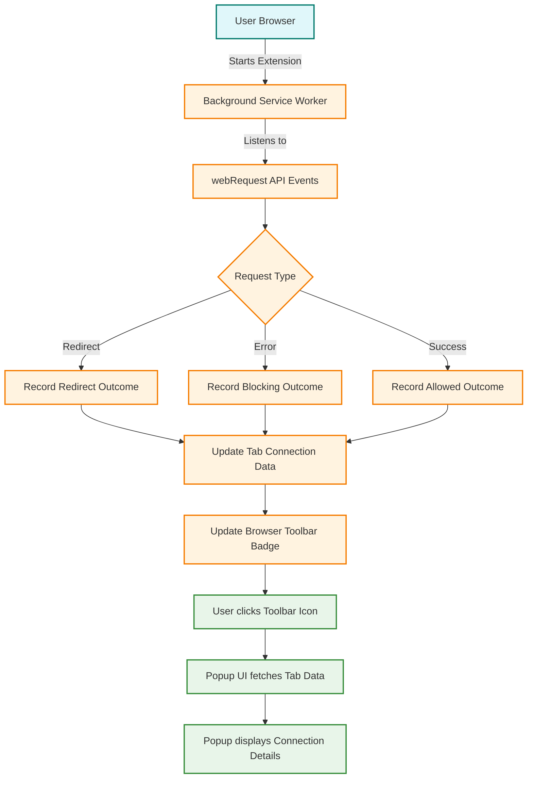

# Browser Integration & Compatibility

## Seamless Multi-Browser Support with uBO Scope

uBO Scope is meticulously designed to integrate smoothly with multiple modern browsers, including Chromium-based browsers (like Google Chrome and Microsoft Edge), Mozilla Firefox, and Apple Safari. Its primary function—to transparently report remote server connections from active browser tabs—relies on each browser's native `webRequest` API, enabling consistent and reliable data gathering across platforms.

By leveraging the standard browser extension APIs, uBO Scope delivers a familiar and consistent experience regardless of your browser choice, empowering privacy-conscious users and filter list maintainers to accurately visualize network activity in real-time.

---

## How uBO Scope Integrates with Browsers

### Using the WebRequest API to Capture Network Events

At the core of uBO Scope’s ability to report connections is the use of the `webRequest` API. This API allows the extension to listen to various network events in the browser as web pages attempt to connect to remote servers.

- **Monitored Events:**
  - **onBeforeRedirect:** Captures when a network request is redirected
  - **onErrorOccurred:** Detects when requests fail or are blocked
  - **onResponseStarted:** Detects successful responses to network requests

These listeners collect granular data about each request, including the URL, request type, and outcome (such as allowed, blocked, or stealth-blocked).

This monitoring operates transparently and independently of any content blockers in use, allowing uBO Scope to present a clear and undistorted picture of network activity.

### Permissions and Host Access

To function effectively, uBO Scope requires permissions to access all HTTP and WebSocket URLs (`http://*/*`, `https://*/*`, `ws://*/*`, `wss://*/*`). This comprehensive host permission enables it to capture connections made by any webpage in the browser.

### Background Service Worker

A background service worker script runs persistently (or gets activated temporarily) to process network events and maintain live session details per tab. This centralized backend handles:

- Logging request outcomes
- Aggregating domain-level connection statistics
- Updating the toolbar badge count in real-time

It ensures that user interface elements like the popup and badge always reflect accurate and current data.

### Popup and Toolbar Integration

When a user clicks the uBO Scope toolbar icon, a popup UI is shown (`popup.html`), displaying categorized domain connection details for the active tab. The extension action defines:

- A default icon in multiple sizes for crisp toolbar display
- A default tooltip title ('uBO Scope') for clarity
- The popup page that renders detailed connection information

This interface reacts immediately to background updates, presenting concise, actionable insights to users.

---

## Browser-Specific Manifest Details

uBO Scope maintains tailored manifest files to support browser-specific requirements without compromising functionality:

| Browser Platform | Notable Manifest Characteristics |
|------------------|----------------------------------|
| **Chromium**     | Uses a service worker (`background.type: module`) and grants full host permissions including websockets (wss/ws). Requires Chrome v122+. |
| **Firefox**      | Uses a module-type background script and similar host permissions for wide URL monitoring. Defines Gecko-specific settings including extension ID and minimum version. |
| **Safari**       | Uses background scripts (including a module type), but Safari requires a stricter minimum version (18.5). Host permissions slightly limited to HTTP/HTTPS URLs only, excluding WebSocket permissions due to platform restrictions. |

These tailored manifests ensure compatibility and meet each browser’s security model and extension architecture.

---

## Real-World User Workflow

1. **Install uBO Scope** on your preferred browser from the official extension store.
2. **Browse websites normally**. uBO Scope passively monitors all network requests in the current active tab.
3. **See real-time badge count** on the toolbar icon indicating the number of distinct third-party domains your browser connects with.
4. **Click the toolbar icon** to open the popup listing domains classified as “not blocked,” “stealth-blocked,” or “blocked,” complete with connection counts.
5. **Use this insight** to evaluate privacy, content blocking effectiveness, or troubleshoot connections.

This seamless integration across browsers empowers users to confidently monitor and analyze real network connections.

---

## Compatibility Notes and Best Practices

- **Minimum Browser Versions:** uBO Scope requires relatively recent browser versions (Chromium 122+, Firefox 128+, Safari 18.5+) to support the Manifest V3 extension standard and modern APIs.
- **Host Permissions Caution:** Granting wide-ranging host permissions is necessary for accurate data capture but consider reviewing permissions for security awareness.
- **WebRequest API Limitations:** Some browsers may limit or evolve their network monitoring APIs in future, possibly affecting uBO Scope’s data completeness.
- **Session Data Persistence:** uBO Scope persists data in session storage to maintain state per tab but clears it on tab closure to ensure accurate and fresh reporting.

---

## Troubleshooting Common Compatibility Issues

<AccordionGroup title="Troubleshooting Browser Integration">
  <Accordion title="The Badge Count Does Not Update">
    If the toolbar badge count remains empty or incorrect:

    - Confirm that host permissions are granted and the extension is enabled.
    - Verify browser version meets the minimum requirement.
    - Ensure no conflicting extensions interfere with webRequest listeners.
    - Reload the browser tab or restart the browser.
  </Accordion>

  <Accordion title="Popup Shows No Data">
    When the popup displays “NO DATA,” try:

    - Reloading the active browser tab to generate fresh network requests.
    - Checking if the current tab is active and fully loaded.
    - Confirm extension is not blocked by browser policies.
  </Accordion>

  <Accordion title="Extension Fails to Install or Activate on Safari">
    Safari strict version requirements must be met. Update Safari to at least version 18.5 to enable the extension.
  </Accordion>
</AccordionGroup>

---

## Summary Diagram: uBO Scope Browser Integration Flow

---

## Next Steps

- Review [System Requirements & Supported Browsers]( /getting-started/installation-basics/system-requirements ) before installation.
- Proceed to [Installing uBO Scope]( /getting-started/installation-basics/extension-installation ) for platform-specific instructions.
- Explore [How uBO Scope Works (with Diagram)]( /overview/concepts-architecture/system-architecture ) to understand internal data flows.

---

For detailed product introduction and core value explanations, see the [Product Introduction]( /overview/intro-product-value/product-introduction ) documentation page.

---

## References

- [GitHub Repository](https://github.com/gorhill/uBO-Scope)
- [Browser WebRequest API Docs](https://developer.mozilla.org/en-US/docs/Mozilla/Add-ons/WebExtensions/API/webRequest)

---

© Raymond Hill