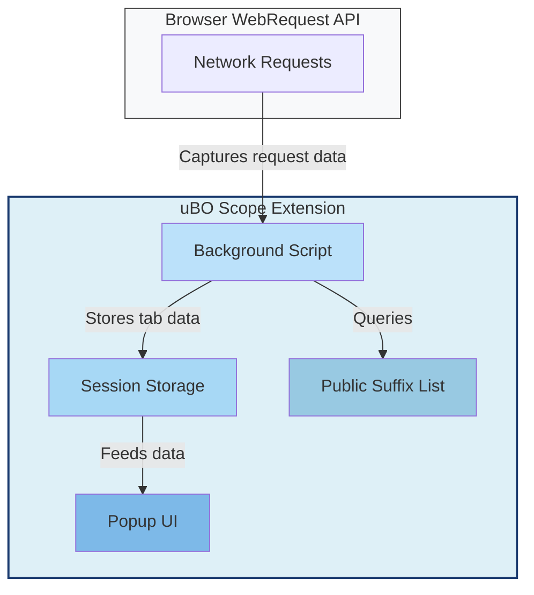

# Integration and Interoperability

Discover how uBO Scope seamlessly integrates within modern browser environments to provide transparent, reliable reporting of remote server connections. This page explains how uBO Scope leverages native browser webRequest APIs, operates independently alongside other content blockers or DNS-based solutions, and is distributed across major platforms including Chromium, Firefox, and Safari.

---

## Why Integration Matters

Web privacy tools often compete for access to network request data, but uBO Scope takes a collaborative approach. By integrating closely with standardized browser webRequest APIs, uBO Scope enables you to observe all remote connection attempts made by web pages, regardless of other blocking extensions or DNS-level filters.

This clear separation empowers you to understand the true network activity of your browser in real time.

## How uBO Scope Works with Browser APIs

At its core, uBO Scope listens to the browser's webRequest API, a native interface provided by Chromium, Firefox, and Safari. This allows the extension to capture every relevant network request's outcome—whether the request was allowed, blocked, redirected, or encountered an error.

Use case example:

- You load a web page.
- uBO Scope intercepts requests as the page loads, including those blocked by your content blocker or DNS filter.
- The extension records detailed outcomes for each third-party domain, aggregating this data to update your toolbar badge and popup display.

By working at this level, uBO Scope remains content-agnostic, focusing purely on connection attempts rather than filtering or blocking itself.

### Browser Support: Chromium, Firefox, and Safari

uBO Scope is designed to work consistently across the three main browser platforms:

- **Chromium-based browsers:**  Supports browsers like Google Chrome and Microsoft Edge with service workers managing background tasks.
- **Mozilla Firefox:**  Uses a background module script and respects Firefox’s specific manifest and permissions settings.
- **Safari:**  Packs into a Safari Web Extension format with module-based background scripts and strict version requirements.

This broad compatibility ensures you get uniform connection visibility across browsers.

> _Note:_ You may reference the respective [Chromium Manifest](#), [Firefox Manifest](#), and [Safari Manifest](#) files for the exact permissions and configuration details adapted for each platform.

## Coexisting with Other Extensions and Blockers

uBO Scope operates independently of any content blockers you may have, including uBlock Origin or DNS-based filtering services:

- **No Interference:** Since it only observes network requests through privileged APIs, it neither blocks nor alters traffic.
- **Accurate Measuring:** The counts and connection data reflect aggregated network activity across all blocking layers, providing a transparent "ground truth".
- **Compatibility:** It avoids injecting scripts or modifying page content, minimizing conflicts.

Example scenario:

Even if you use a DNS filter or multiple ad blockers, uBO Scope will detect connection attempts and their outcomes from the browser’s network stack, revealing attempts that might otherwise be invisible.

## Data Persistence and Session Management

To maintain usage continuity, uBO Scope stores session data and the public suffix list efficiently using browser session storage:

- **Session Storage:** Connection metadata is cached and associated with tab IDs, preserving state across page reloads.
- **Public Suffix List:** The extension utilizes the Mozilla Foundation’s Public Suffix List, encapsulated in an optimized JavaScript implementation, to accurately group hostnames into domains.

This architecture maximizes responsiveness and accuracy while minimizing resource use.

## Visualizing Integration Architecture

The background script acts as the central nervous system, ingesting events from the browser, using the public suffix list for domain parsing, storing session states, and updating the user interface in real time.

## Practical Tips and Best Practices

- **Ensure Permissions:** uBO Scope requires relevant webRequest permissions configured in your browser. These are pre-set in the extension manifest for each platform.
- **Minimal Impact:** Since it only observes requests, running uBO Scope alongside other security or privacy extensions is safe and effective.
- **Browser Compatibility:** Verify you use a supported browser version (Chromium >= 122, Firefox >= 128, Safari >= 18.5) for reliable operation.

## Troubleshooting Integration Issues

If you experience incomplete or missing remote server data:

- Check that webRequest permissions are granted.
- Confirm that browser updates have not changed extension API behaviors.
- Ensure no conflicting extensions explicitly disable or interfere with webRequest listeners.

Refer to the [Troubleshooting Setup Issues](../getting-started/quickstart-verification/troubleshooting-setup) guide for detailed assistance.

---

## Summary

The Integration and Interoperability page clarifies that uBO Scope leverages native browser webRequest APIs to monitor all remote connection attempts irrespective of other blockers. Its multi-platform manifest and permission setup enable seamless operation within Chromium, Firefox, and Safari browsers. By coexisting harmoniously alongside different filtering layers, it delivers a transparent and independent view of your browser’s network activity.

---

## Next Steps

- Explore [What is uBO Scope?](/overview/product-intro-value/what-is-ubo-scope) to understand core concepts.
- Visit [Core Value and Use Cases](/overview/product-intro-value/value-prop-use-cases) to see practical benefits.
- Consult the [Troubleshooting Setup Issues](/getting-started/quickstart-verification/troubleshooting-setup) page if you encounter difficulties.

---

## References

- [Chromium Manifest](platform/chromium/manifest.json) — Browser permissions and configuration for Chromium browsers.
- [Firefox Manifest](platform/firefox/manifest.json) — Firefox-specific manifest configuration.
- [Safari Manifest](platform/safari/manifest.json) — Safari Web Extension manifest details.
- [Public Suffix List Implementation](js/lib/publicsuffixlist.js) — Core library used for domain handling.

---