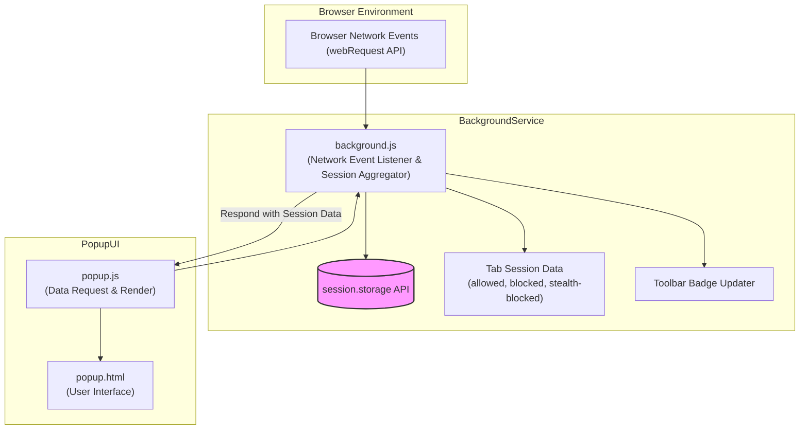

# System Architecture & Data Flow

## Visualizing How uBO Scope Operates Under the Hood

Understanding how uBO Scope monitors your browser's network activity demystifies the data you see in the popup and the badge counts on the toolbar icon. This page offers a clear walkthrough of the extension's internal workflow, following a network request's journey from its interception to the rendering of aggregated connection data.

### Why This Matters

Seeing the flow of data helps users trust uBO Scope's reports, understand its limitations, and troubleshoot or interpret connection results with confidence.

---

## 1. High-Level Overview

uBO Scope is a browser extension designed to observe and report every network connection attempt your browser makes to remote servers. It captures network events through the browser's webRequest API, aggregates related data into sessions per active tab, and then presents the summarized connection statistics in an intuitive popup interface.

At the core, the components involved are:

- **Background script (`background.js`)**: Captures network events and maintains session aggregation.
- **Session storage**: Stores current session data safely and persistently (within the browser's storage.session API).
- **Popup interface (`popup.html` and `popup.js`)**: Renders the aggregated data in a user-friendly format when you open the extension popup.

## 2. Data Flow Walkthrough

### Step 1: Capturing Network Events

- The extension registers listeners for key network events via the `webRequest` API:
  - `onBeforeRedirect` (for redirects)
  - `onErrorOccurred` (for failed requests)
  - `onResponseStarted` (for successful responses)

- Each network event delivers detailed information including the request URL, request type (main_frame, sub_frame, script, etc.), tab ID, frame ID, and status.

- Events are queued individually to avoid high-frequency processing, then processed in batches once per second to efficiently update session data.

### Step 2: Session Aggregation in Background Script

- For each tab, the code creates and maintains a **tabDetails** object that tracks connection outcomes categorized as:
  - **Allowed** (requests allowed by content blockers or network)
  - **Blocked** (requests surfaced as errors)
  - **Stealth-blocked** (requests that redirect to filtered addresses)

- Hostnames and domains from each URL involved in requests are parsed and counted.

- Upon main document load (`main_frame` request), the tab's previous session details reset to start fresh.

- Aggregation maintains separate mappings for domains and hostnames to accurately count distinct third parties.

### Step 3: Updating User Interface

- The popup interface asks for current tab session data whenever it opens.

- The background script responds by providing the serialized session data relevant to the active tab.

- The popup's JavaScript deserializes, then:
  - Converts domain names to Unicode for readability using `punycode`.
  - Displays counts of allowed, blocked, and stealth-blocked domains.
  - Shows a summary tally of connected domains.

- The toolbar badge text updates periodically to reflect the count of allowed third-party domains.

## 3. Core Components and Their Roles

| Component          | Role                                          |
|--------------------|-----------------------------------------------|
| `background.js`    | Captures and processes network events; manages session aggregation and storage |
| `storage.session`  | Persists session data during the browser session for reliability and continuity |
| `popup.js`         | Requests session data and renders connection info in the UI popup                 |
| `dom.js`           | Handles DOM operations and event management within the popup                      |
| Manifest files     | Define extension permissions, background scripts, and browser compatibility      |

## 4. Practical Example: Tracking a Single Page Load

Imagine you navigate to `https://example.com`:

1. **Main frame request** triggers, resetting the tab session tracking.
2. Background script records `example.com` as the primary hostname and domain.
3. Subresource requests (scripts, images, iframes) load from various third-party domains.
4. Each one fires webRequest events that queue for processing.
5. Background script categorizes each connection as allowed, blocked, or stealth-blocked.
6. Summary counts update and badge text reflects the number of allowed third-party domains.
7. Opening the popup shows detailed domain counts grouped by outcome.

## 5. System Architecture Diagram

## 6. Tips & Best Practices

- **Open the popup frequently when trying to understand a new site** to see detailed connection data per tab session.
- **Interpret badge counts carefully**: fewer allowed third-party domains generally indicates a leaner, more privacy-conscious connection profile.
- **Keep in mind browser limitations**: uBO Scope relies on the browser's webRequest API, so some background connections not routed through this API (like non-browser processes or some encrypted DNS traffic) are not reported.

## 7. Common Pitfalls & Troubleshooting

- **No data appears in popup on first load:** The background session data may still be initializing. Wait a moment or reload the tab.
- **Badge count does not change:** The page might not have network requests, or connections are outside monitored URLs.
- **Confusion about stealth-blocking:** Stealth-blocked connections indicate redirects or filters silently applied by content blockers; these are not outright blocked but are hidden from normal page scripts.

## 8. Next Steps

- Proceed to [Core Concepts & Terminology](/overview/concepts-architecture/core-concepts-and-terminology) to understand key terms used by uBO Scope.
- Explore the [Quick Feature Tour](/overview/features-at-a-glance/quick-feature-tour) to see how this architecture supports the extension’s user-facing capabilities.

---

For source code, see [background.js](https://github.com/gorhill/uBO-Scope/blob/main/js/background.js) and [popup.js](https://github.com/gorhill/uBO-Scope/blob/main/js/popup.js).

---

**Understanding how uBO Scope operates empowers you to use the extension confidently and interpret what its powerful insights reveal about your browsing experience.**
