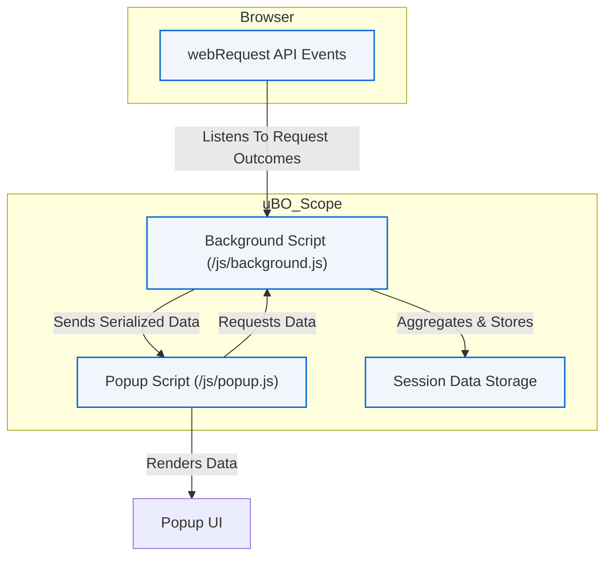

# System Architecture Overview

## Understanding How uBO Scope Works Within Your Browser

uBO Scope empowers you with a transparent window into your browser's web traffic, showing you exactly which remote servers your browser connects to and how those connections are handled. This page guides you through the core architecture of uBO Scope, illustrating how it integrates with browsers, listens to network events, processes connection outcomes, and presents clear summaries through the popup interface.

---

### How uBO Scope Fits Into Your Browsing Experience

From a user’s perspective, uBO Scope monitors network requests made by each open tab, classifies those connections based on their outcomes under your content blocker and browser environment, and surfaces this information instantly in a concise, easy-to-understand manner.

This is achieved without disrupting your browsing, working silently behind the scenes, collecting meaningful data, and then summarizing it upon demand.

---

## Core Components and Data Flow

uBO Scope functions as a browser extension, composed of several key parts that work together seamlessly to track and report network connection outcomes.

### The Key Components:

- **Browser WebRequest API**: Acts as the watchtower, reporting all network requests and their results (redirects, errors, or successful responses) for URLs accessible by the extension.
- **Background Script (`/js/background.js`)**: The central controller; it listens to webRequest events, records outcomes, aggregates data per browser tab, and manages session state.
- **Popup Script (`/js/popup.js`)**: The user interface renderer; it requests the collected data from the background script and displays summaries, including counts and domain lists.

---

### User Interaction Flow

1. **Browsing Activity**: When you navigate websites, your browser issues various network requests for resources like scripts, images, or API calls.
2. **Request Monitoring**: uBO Scope’s background script uses the webRequest API listeners to detect every outgoing request and captures its outcome.
3. **Outcome Classification**: Each request outcome is classified into one of three types:
   - **Allowed (Not Blocked)**: Requests that succeeded without interference.
   - **Stealth-Blocked**: Requests that were silently canceled or altered to prevent detection but still blocked.
   - **Blocked**: Requests that failed with explicit errors or were actively blocked.
4. **Data Aggregation**: For each browser tab, uBO Scope aggregates counts of domains contacted in each category, maintaining a detailed record of distinct hostnames and their associated primary domains.
5. **Badge Update**: The browser toolbar icon dynamically updates to display the number of distinct third-party domains contacted not blocked.
6. **Popup Display**: When you click the toolbar icon, the popup script fetches the current tab’s data and presents it in a categorized summary with counts and domain names.

---

## Architecture Mermaid Diagram

## Practical Example: How Connections are Recorded

Imagine you visit `https://example.com`.

- The page loads, triggering multiple requests, some to first-party domains and others to third-party CDNs.
- uBO Scope’s background script listens to all these requests, classifying each:
  - The main page request to `example.com` is considered allowed.
  - A request to `cdn.examplecdn.org` is also allowed if not blocked by your content blocker.
  - Another request to `tracker.badtracker.net` is stealth-blocked or blocked outright.

These outcomes update the tab's data structure in real-time, which is then shown as counts and domain lists in your popup.

---

## Best Practices and Tips

- **Understanding Badge Counts**: The badge reflects distinct *third-party* domains contacted without blocking — a smaller number signals less third-party exposure.
- **Browser Compatibility**: uBO Scope works with browsers supporting the webRequest API, including Chromium-based browsers, Firefox, and Safari with some permissions limitations.
- **Session Persistence**: Data persists per session but resets when tabs close; you can trust that the popup reflects up-to-date information.
- **Performance Awareness**: Because it listens to all network requests, disabling or uninstalling uBO Scope will stop data collection but does not impact normal browsing.

---

## Troubleshooting Common Issues

<AccordionGroup title="Common Troubleshooting Steps">
<Accordion title="Popup Shows No Data">
- Ensure you have active tabs with network activity.
- Reload the page to trigger fresh network requests.
- Check if the extension has required permissions.
- Confirm no browser restriction blocks webRequest API.
</Accordion>
<Accordion title="Badge Count Does Not Update">
- Wait a few seconds; updates batch to avoid performance overhead.
- Reload the page or switch tabs.
- Verify the extension is enabled and running.
</Accordion>
</AccordionGroup>

---

## Getting Started Preview

To begin using uBO Scope:

1. **Install the extension** compatible with your browser.
2. **Navigate to websites as usual**; uBO Scope silently records network outcomes.
3. **Click the toolbar icon** to open the popup and review connection summaries.
4. For detailed install and setup steps, see [Installation Guide](/getting-started/essentials/installation).

---

Explore more to master uBO Scope's capabilities by visiting:
- [What Is uBO Scope?](/overview/intro-value/what-is-ubo-scope)
- [Who Should Use uBO Scope?](/overview/intro-value/who-should-use)
- [Core Concepts & Terminology](/overview/concepts-architecture/core-concepts-terminology)

---