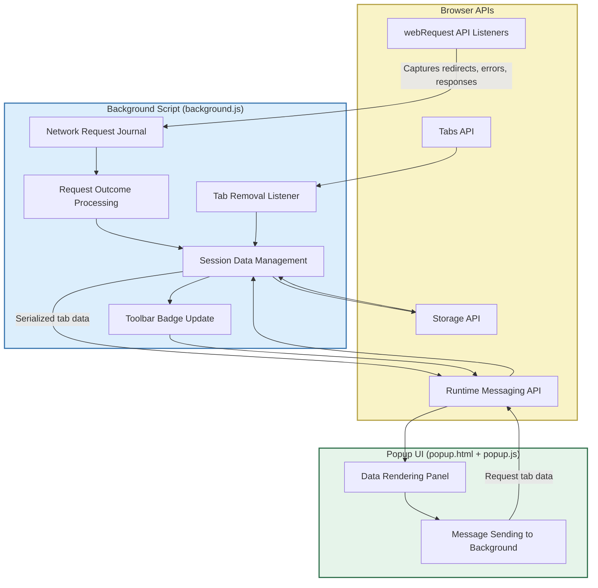

# System Architecture Overview

## Visualizing How uBO Scope Works Behind the Scenes

Understanding uBO Scope’s architecture unlocks the reasoning behind its precision and reliability. This page provides a clear visual and narrative walkthrough of how uBO Scope’s main components collaborate to capture, analyze, and present comprehensive data about remote server connections made by your browser.

Whether you're a privacy-conscious user curious about the extension's inner workings or a developer aiming to understand data flows, this overview brings clarity by focusing on the user-relevant architecture and integration points, without delving into internal implementation details.

---

## What You’ll See on This Page
- A clear Mermaid.js diagram detailing the interaction between the UI (popup), background scripts, and browser APIs.
- Explanation of each component’s role and how they work together.
- How data flows from network events to user-facing summaries.
- Why this modular design guarantees timely, accurate, and meaningful connection metrics.

---

## High-Level Architecture of uBO Scope

At its core, uBO Scope consists of three primary components:

1. **User Interface (UI)**
2. **Background Scripts**
3. **Browser APIs**

Each piece plays a specific role in capturing and displaying detailed connection data.

---

## Component Roles Explained

### 1. Browser APIs

These built-in browser facilities provide necessary hooks and storage mechanisms:

- **webRequest API:** Monitors all network requests associated with the browser, providing events for redirects, errors, and successful responses. This is the primary source of raw connection data.
- **Tabs API:** Allows listening to tab lifecycle events, such as when tabs are removed, to keep data relevant and up-to-date.
- **Storage API:** Enables persistent session storage of connection data between browser sessions.
- **Runtime Messaging API:** Facilitates communication between the popup UI and background scripts to request and deliver tab-specific data.

### 2. Background Script

The invisible powerhouse managing data collection and processing:

- **Network Request Journal:** Buffers network events detected by webRequest listeners into a queue for batch processing.
- **Request Outcome Processing:** Transforms raw network events into categorized outcomes — distinguishing allowed, stealth-blocked, or explicitly blocked connections.
- **Session Data Management:** Maintains tab-specific connection details, updating counts and resetting data upon navigation.
- **Toolbar Badge Update:** Reflects how many distinct third-party domains connections succeeded with, providing at-a-glance feedback on the extent of third-party exposure.
- **Tab Removal Listener:** Clears obsolete data when tabs close to keep memory usage lean and session data clean.

### 3. User Interface (Popup)

Delivers a concise, user-friendly summary of connection data:

- **Data Rendering Panel:** Shows categorized connection outcomes for the active tab directly in the popup, listing domains and counts for allowed, stealth-blocked, and blocked connections.
- **Message Sending:** Communicates with the background script to fetch the latest tab-specific data exactly when the popup opens, ensuring up-to-date reporting.

---

## How Data Flows Through uBO Scope

1. **Network events triggered:** The browser triggers `webRequest` listeners as network requests proceed, redirect, error out, or complete.
2. **Event buffering:** The background script queues these network events in the Network Request Journal.
3. **Batch processing:** After a short delay, these events are processed to derive connection outcomes (allowed, stealth, blocked) and update tab-specific session data.
4. **Session persistence:** Updated session data is serialized and saved in session storage to be available throughout the browser session.
5. **Badge update:** Based on the current tab's data, the toolbar badge is updated to reflect the number of distinct third-party domains that succeeded.
6. **Popup request:** When the user opens the popup UI, it requests tab data via messaging through the runtime API.
7. **Data display:** The popup deserializes and renders the categorized data, allowing the user to quickly understand all remote connections associated with the active tab.

---

## Why This Architecture Matters to You

- **Accuracy and Timeliness:** By queuing and batch processing network events, uBO Scope ensures data integrity and responsiveness without overwhelming the browser environment.
- **Clear Categorization:** Connection outcomes are clearly separated into allowed, blocked, and stealth-blocked, giving you detailed insight into third-party remote server interactions.
- **Persistent Session Awareness:** Data is preserved within browser sessions, so sudden tab closures or browser crashes don't erase valuable connection history.
- **In-Browser Efficiency:** The background script handles heavy lifting quietly, letting the UI focus exclusively on presenting interpreted data.
- **Real-Time User Feedback:** Toolbar badges provide an immediate indication of third-party connection counts, helping you gauge web activity at a glance.

---

## Practical Tips & Common Pitfalls

- **Badge Counts Reflect Distinct Domains:** Don’t confuse badge numbers with total requests; the badge summarizes third-party domain counts where connections succeeded.
- **Understanding Stealth-Blocked:** These are network redirects caught stealthily by browser mechanisms or content blockers and can sometimes be overlooked in other tools.
- **Session Data May Reset on Browser Restart:** Session storage persists only until the browser closes. Expect fresh counters at the start of a new session.
- **Popup Visibility Limitations:** The UI updates only when popped open; to see live changes, refresh the popup by reopening it after navigating or reloading tabs.

---

## Getting the Most From This Page

- Use this overview to relate what you see in the popup UI and toolbar badges to the underlying mechanism capturing the data.
- Refer to the [Core Concepts & Terminology](../core-concepts-terminology) page for definitions of key terms like allowed, blocked, stealth-blocked domains.
- For practical use and installation guidance, consult the [Getting Started](/getting-started/installation-basics/prerequisites) section.

---

## Want to Explore Further?

- Dive into the [Key Features at a Glance](../feature-glance) page to see what makes uBO Scope unique.
- Learn about integration with other tools on the [Integration and Interoperability](../integration-overview) page.

---

This visualization brings your privacy monitoring tool’s design into focus, empowering you with transparency and confidence in every remote connection your browser attempts.

---

{/* End of System Architecture Overview */}