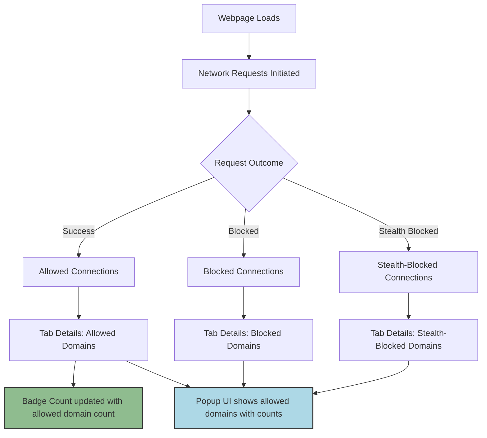

# Interpreting Badge Counts and the Popup UI

Understanding the badge count displayed on the uBO Scope toolbar icon and the detailed breakdown in the popup UI is essential for making informed decisions about your web privacy and network activity. This guide demystifies what these numbers and domains represent, empowering you to diagnose privacy concerns and better understand third-party requests each web page attempts or successfully establishes.

---

## What Does the Badge Count Represent?

The badge count visible on the toolbar icon shows the **number of distinct third-party remote domains** that your current browser tab has connected to successfully.

- It counts **unique domains** from which network connections were allowed.
- A **lower count is better**, indicating fewer third-party connections and reduced tracking exposure.
- The count reflects third-party connections **beyond what content blockers alone may report**, since uBO Scope tracks actual network events via the browser’s `webRequest` API.

### Why Focus on Third-Party Domains?

Third-party domains represent external servers distinct from the main website’s domain. Tracking and advertising entities usually operate through these third parties, so tracking their presence paints a clear picture of network exposure.

---

## Breakdown of Domain Categories in the Popup UI

When you click on the uBO Scope icon, the popup UI displays a categorized list of domains involved in network requests for the active tab. These domains are grouped by outcome:

### 1. Not Blocked (Allowed)

- These domains had network requests that were successfully allowed by the browser.
- This includes both first-party domains (the main site) and third-party domains.
- Domains here represent actual network exposure.

### 2. Stealth-Blocked

- These connections triggered stealth blocking—requests the content blocker intercepted silently without obvious network errors or user-visible failures.
- This category reflects advanced blocking techniques designed not to break webpages.
- Stealth-blocked domains underscore connections that did not proceed, even if they tried.

### 3. Blocked

- These domains correspond to network requests explicitly blocked by the browser or content blockers, resulting in errors or failed network loads.
- This category includes connections that were stopped with visible failure signals.

---

## How Domains Are Determined and Grouped

uBO Scope uses the [Public Suffix List](https://publicsuffix.org/) to interpret domain names properly. This means:

- Domains are resolved to their registered base domain, avoiding accidental inflation from subdomains.
- Hostnames extracted from URLs are normalized and grouped so the popup UI shows meaningful domain-level summaries.

This careful parsing enables precise understanding of connections from third parties versus the main site.

---

## Using the Popup UI Effectively

The popup UI provides counts next to each domain, indicating how many requests involved that domain.

- This count helps identify dominant third-party services or trackers contacted by the page.
- You can distinguish between persistent, allowed connections and those that were blocked or stealth-blocked.
- The summary at the top shows the total unique domains connected to (allowed), reflecting your immediate network exposure.

### Practical Example
Imagine you visit a news website:
- The badge count reads `5`, indicating 5 third-party remote domains established connections.
- The popup UI lists domains like `cdn.example.com` under allowed — this might be a trusted content delivery network.
- You also see domains under stealth-blocked, which shows trackers that attempted connections but were silently blocked.
- Domains under blocked signify outright blocked trackers with failed requests.

This layered insight lets you understand not only what was blocked but what actually loaded and connected.

---

## Common Questions and Tips

<AccordionGroup title="Frequently Asked Questions">  <Accordion title="Why is the badge count sometimes zero even if the site loads many resources?">The badge count reflects distinct third-party domains allowed connections. If a content blocker prevents all third-party connections, or if none are made, the count will be zero despite visible site content loaded from the main domain.</Accordion>  <Accordion title="What does stealth-blocked mean and why is it important?">Stealth blocking is a subtle mechanism where content blockers prevent connections quietly to avoid breaking sites. Seeing stealth-blocked domains alerts you to attempted but blocked tracking activity that wouldn't be obvious otherwise.</Accordion>  <Accordion title="Can the popup UI domains and counts be trusted?">Yes. uBO Scope directly observes your browser's network requests via the `webRequest` API, offering a truthful report of connection outcomes without influence from page-level scripts or deceptive trackers.</Accordion></AccordionGroup>

<Note>
If you notice unexpected or unknown domains under allowed connections, it may indicate trackers or services you did not anticipate for the webpage. Investigating these can help tighten your privacy.
</Note>

---

## Troubleshooting Common Issues

- **Popup shows 'NO DATA' or no domains:**
  - The extension may not have yet captured network activity for the tab — try refreshing the page.
  - Some network requests might not be reported if they fall outside browser `webRequest` API visibility.

- **Badge count doesn’t update immediately:**
  - Network connection events are processed with a slight delay (typically within a second).
  - Closing and reopening the popup or switching tabs refreshes the count.

- **Confusion about domain grouping:**
  - Remember domains are shown based on the Public Suffix List parsing; subdomain variations consolidate under base domains to avoid clutter.

---

## Summary

Interpreting uBO Scope's badge counts and popup UI provides a direct window into your current tab's network exposure:

- The badge captures unique third-party domains successfully connected.
- The popup UI categorizes domains as allowed, stealth-blocked, or blocked.
- This transparency helps diagnose privacy leaks, verify content blocker effectiveness, and understand real network behaviors beyond surface-level metrics.

By mastering this view, you gain confidence in assessing the true web connections your browser makes.

---

## Next Steps

- To deepen your understanding, visit the [Key Terminology and Concepts](./key-terminology) page to clarify important definitions.
- Explore how uBO Scope tracks connection states in [Data Flow: How Connection Tracking Works](./data-flow-connection-tracking).
- Learn about integrating with your browser and content blockers in [Integration with Browsers and Content Blockers](./integration-with-other-systems).

For practical guidance, see the [Understanding the Popup Panel](../../guides/getting-started/reading-the-popup) tutorial.

---

## References

- [Public Suffix List](https://publicsuffix.org/)
- [uBO Scope GitHub Repository](https://github.com/gorhill/uBO-Scope)

---

## Visual Overview: How Badge and Popup Reflect Connection Outcomes

This flow shows how individual network request outcomes feed into the tab-level domain statistics presented both in the badge count and detailed popup UI.

---

_This guide equips you to confidently interpret uBO Scope’s key interface elements, making your web privacy assessments precise and actionable._