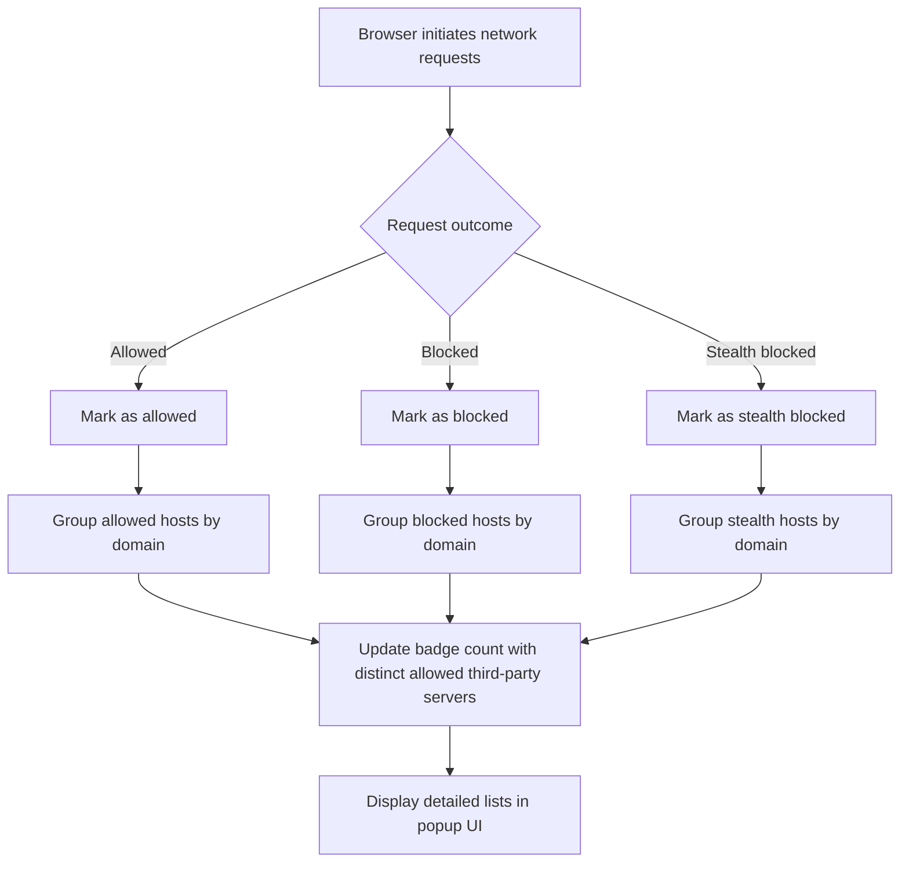

# Core Concepts and Terminology

Understanding uBO Scope's output and behavior begins with a clear grasp of several fundamental concepts that shape how the extension interprets and reports network activity. These core terms enable users to make sense of the data shown in the popup UI and toolbar badge, helping you accurately analyze web connections and the impact of content blockers.

---

## Network Request Outcome

Every network connection attempt your browser makes while loading a webpage results in one of three possible outcomes tracked by uBO Scope:

- **Allowed:** The network request was successful and not prevented from completing.
- **Blocked:** The request was explicitly blocked by some mechanism, such as a content blocker.
- **Stealth:** The request was prevented in a way that is completely invisible to the webpage itself (stealth blocking).

These outcomes are fundamental to understanding what happens behind the scenes during page loads. uBO Scope reports on all three to give a full picture of third-party network activity.

<Note>
Stealth blocking is a technique used in content blocking to prevent requests without making their blocking detectable by the web page, reducing breakage and increasing privacy.
</Note>

---

## Distinct Remote Server

When uBO Scope analyzes network requests, it groups connections by unique remote servers, also known as distinct third-party hosts contacted by the browser. A remote server is identified by its **domain**, resolved using the [Public Suffix List (PSL)](https://publicsuffix.org) to determine the registrable domain.

By focusing on distinct remote servers rather than each individual request, uBO Scope highlights the diversity of third parties contacted, which is more meaningful to privacy and performance analysis.

<Info>
For example, multiple resources may be fetched from different subdomains (*cdn.example.com*, *ads.example.com*), but uBO Scope will consolidate these under the primary registrable domain (*example.com*).
</Info>

---

## Badge Count

On the browser toolbar icon, uBO Scope displays a **badge count** — a number indicating the count of distinct third-party remote servers contacted during the current page load.

- This count reflects the number of unique domains that successfully received or attempted connections.
- A **lower badge count** is desirable, indicating fewer third parties are involved.

This count is an unbiased metric to assess the exposure surface presented by a webpage and to evaluate content blocking effectiveness from a user-centric perspective.

<Warning>
Do not confuse this badge count with the number of blocked requests. The badge reflects how many distinct third-party servers your browser connected to, regardless of content blockers.
</Warning>

---

## Stealth Blocking

Stealth blocking is a sophisticated form of request blocking:

- The network request is blocked **silently** — the webpage has no way to detect that the request was prevented.
- This avoids webpage breakage or antisocial behavior that some detection scripts employ against content blockers.
- uBO Scope recognizes and reports stealth blocking separately from straightforward blocking.

Understanding stealth blocking helps you interpret why some requests disappear in network debugging tools but evidently never completed.

---

## How These Concepts Fit Together

Below is a simplified flow to illustrate how uBO Scope categorizes network requests for a given webpage:

Each request maps to a domain-based bucket under allowed, blocked, or stealth outcomes. The toolbar badge dynamically reflects how many unique allowed third-party domains are active.

---

## Practical Impact for Users

- **When you see the badge count increase**, it means the page is contacting more distinct third-party servers.
- **Blocked connections will not increase the badge count**, but are still tracked and shown in the popup.
- **Stealth blocked requests are listed separately**, alerting you to invisible blocking occurring.

This clarity empowers you to distinguish between mere block counts and true third-party exposure — the metric that matters most for privacy and performance.

<Check>
For accurate interpretation, always consider all three categories in the popup alongside the badge count.
</Check>

---

## Summary of Key Terms

| Term                   | Meaning                                                                                  |
|------------------------|------------------------------------------------------------------------------------------|
| Network Request Outcome | Status of each connection attempt: allowed, blocked, or stealth                          |
| Distinct Remote Server  | Unique third-party domain contacted, resolved via Public Suffix List                     |
| Badge Count            | Number on toolbar icon showing the count of distinct allowed third-party servers        |
| Stealth Blocking        | Requests blocked invisibly, undetectable by the webpage                                 |

---

For a broader understanding of how these concepts integrate into uBO Scope’s architecture and user experience, see the [System Architecture and Data Flow](../core-architecture-and-concepts/system-architecture) page, and for insights about practical usage, consult the [Understanding the Badge and Popup Data](../../guides/interpreting-results/badge-meanings) guide.

For questions about troubleshooting or interpreting behaviors, the [Troubleshooting Installation & First-Run Issues](../../getting-started/troubleshooting/common-installation-issues) page provides targeted guidance.

---

By mastering these fundamental concepts and terminology, you unlock the full value of uBO Scope, gaining precise insights into the remote server connections your browser makes and the effectiveness of your content blockers.

---

End of Core Concepts and Terminology

