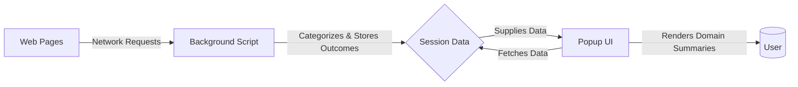

# System Architecture and Data Flow

uBO Scope is designed with simplicity and efficiency, focusing on providing real-time, accurate insights into the network connections your browser makes without interfering with your browsing experience. This page explains how uBO Scope is architected and how data flows between its core components to achieve this.

---

## Architectural Overview

At its core, uBO Scope is composed of two key elements:

- **Background Monitoring Service:** A persistent background script actively monitors all network requests across every browser tab.
- **Popup User Interface (UI):** A user-facing popup that retrieves aggregated data from the background monitoring and presents it in an understandable, concise format.

### High-Level Data Flow

This flow illustrates how network activities originating from web pages are captured by the background script, which processes and stores the outcomes. The popup then accesses this data on demand to display meaningful summaries to the user.

---

## Background Monitoring Service

The background script is the backbone of uBO Scope's architecture. It has these key responsibilities:

### Continuous Network Request Observation

- Listens to network events for all browser tabs using browser-provided `webRequest` APIs.
- Tracks every remote server connection attempt, regardless of blocking by any content blocker or DNS filter.
- Supports protocols such as HTTP, HTTPS, WebSocket, and secure WebSocket.

### Categorization and Session State Management

- Each network request is categorized based on its outcome:
  - **Allowed:** Successfully completed network requests.
  - **Stealth:** Redirected requests that bypass direct detection.
  - **Blocked:** Requests that failed or were blocked.

- Uses a session-based data structure to keep track of these categorized requests per tab, mapping hostnames and their associated domains.
- Manages counts of distinct domains and hostnames per outcome, updating this state to reflect real-time browsing activity.

### Data Persistence and Badge Updates

- Saves session data to the browser's session storage asynchronously to maintain continuity across browsing sessions.
- Updates the browser extension icon’s badge to show the number of distinct allowed third-party domains for the active tab, providing instant visual insight.

---

## Popup User Interface (UI)

The popup UI complements the background service by providing users with clear analytics about network connections:

### Data Retrieval and Presentation

- When opened, the popup queries the background service for session data related to the active tab.
- Deserializes and processes this data to display three categorized domain lists:
  - **Not Blocked:** Domains from which resources were successfully fetched.
  - **Stealth-Blocked:** Domains involved in stealthy redirects or blocked requests not direct by content blockers.
  - **Blocked:** Domains where requests failed or were actively blocked.

- Presents counts of each domain and overall summary, making the complex network traffic easily digestible.

### User Experience Considerations

- The UI adapts its layout automatically for different viewport sizes, ensuring usability across devices.
- Uses punycode to Unicode domain conversions, so all domain names appear in their readable, native format.

---

## Key Internal Concepts

### Domain and Hostname Handling

- uBO Scope considers both hostnames (full domain names) and their registrable domains (e.g., example.com) to accurately count and categorize third-party connections.
- It employs a Public Suffix List (PSL) to correctly identify domain boundaries, avoiding counting internal subdomains as separate entities.

### Event Processing Optimization

- Network events are batched and processed asynchronously with a debouncing timer to ensure performance and reduce overhead.
- This design ensures the extension remains responsive without impacting browser speed.

---

## Practical Tips

- **Understanding the Badge Count:** The badge reflects the count of distinct allowed domains for the current tab. This serves as a real-time indicator of third-party connections the browser established.
- **Why Session Data Matters:** The detailed session state allows for persistent tracking of network behaviors on a per-tab basis, making analysis more meaningful.
- **Stealth Blocking Insight:** Recognizing stealth-blocked domains helps users and filter list maintainers identify indirect or subtle blocking behaviors that traditional tools might miss.

---

## Troubleshooting and Common Pitfalls

- If the badge count does not update, ensure the background script is running and that your browser permissions allow `webRequest` monitoring.
- Domains reported as stealth or blocked might be influenced by DNS-level blockers or other extensions, but uBO Scope still captures these events as long as they are reported by the browser.
- Since uBO Scope relies on browser-provided APIs, network requests made outside their reach (e.g., via native apps or certain protocol handlers) won’t appear.

---

## Summary

By separating the continuous monitoring logic (background) from the user interaction interface (popup), uBO Scope achieves a robust, efficient architecture. This structure guarantees that users receive timely, accurate visibility into all third-party connections their browser attempts or blocks, ultimately fostering a better understanding of real-world web interactions.

For deeper insights into uBO Scope usage, consult the [Overview & Value Proposition](./what-is-ubo-scope.md) and the [User Guides](../../guides/getting-started/first-analysis.md).

---

## Source Code Reference

- [Background Script](https://github.com/gorhill/uBO-Scope/blob/main/js/background.js) 
- [Popup UI Script](https://github.com/gorhill/uBO-Scope/blob/main/js/popup.js) 
- [Public Suffix List Handling](https://github.com/gorhill/uBO-Scope/blob/main/js/lib/publicsuffixlist.js)

---