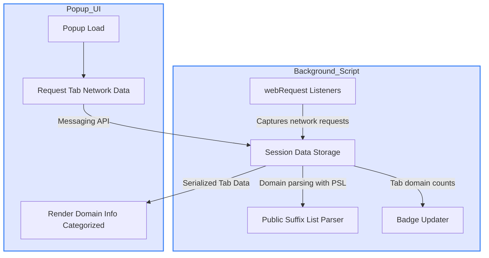

# System Architecture of uBO Scope

## A Transparent View into Network Activity

uBO Scope empowers users to understand what happens behind the scenes when browsing the web by revealing the flows of network connections at a per-tab granularity. This page presents an architectural narrative paired with a Mermaid diagram to clearly illustrate how the extension’s main components interact and deliver insights on remote server connections.

---

## Core Components and their Roles

At its heart, uBO Scope consists of two main components:

1. **Background Script**
2. **Popup UI**

Each plays a critical role in monitoring, tracking, and presenting data about your browser's network activity.

### Background Script: The Watchful Monitor

This is the extension's backbone. Running continuously (or as a service worker depending on the browser) it listens to every network request your browser attempts, including redirects and errors, using the browser's `webRequest` API.

Key activities include:

- **Request Capture:** Tracking network requests, their outcomes (allowed, blocked, stealth-blocked), and associated domains.
- **Session Management:** Maintaining a session-level map tying each browser tab to detailed network data.
- **Public Suffix List Loading:** Leveraging an accurate domain and subdomain parsing system based on the [Public Suffix List](https://publicsuffix.org/list/), allowing it to correctly identify domains from hostnames.
- **Badge Updates:** Updating the extension’s toolbar badge count dynamically per tab to reflect the number of distinct third-party domains involved.
- **Data Persistence:** Saving and restoring session data efficiently to ensure continuity across browser processes.

### Popup UI: The Window Into Your Current Tab

When you click the uBO Scope toolbar icon, the popup UI loads and presents the data collected by the background script for the active browser tab.

Its responsibilities include:

- **Data Request:** Asking the background script for detailed data associated with the current tab.
- **Decoding & Rendering:** Parsing this data and displaying it in an organized manner showing domains categorized by connection outcome (allowed, stealth-blocked, and blocked).
- **User-Friendly Presentation:** Converting domain names from Punycode to Unicode for readability and ensuring a clear summary of how many third-party domains were contacted.

---

## Data Flow and Interaction

The components communicate via browser runtime messaging APIs. The background script aggregates live network data, and the popup queries it on demand.

### Explanation:

- The **background script** listens for network events, identifies the domains involved by parsing URLs and hostnames, categorizes these per tab, and updates the extension badge.
- Upon popup load, the **popup UI** requests the current tab’s network data from the background script.
- The background script replies with serialized data, which the popup then deserializes and renders.

---

## Why This Architecture Matters to You

- The separation of concerns ensures that the constant monitoring does not block UI tasks, keeping browsing smooth.
- Using the Public Suffix List guarantees domain recognition accuracy, so you see meaningful domain groupings rather than raw hostnames.
- The messaging system ensures you always see updated, tab-specific data without unnecessary overhead.

By understanding this architecture, you gain confidence in the accuracy and responsiveness of uBO Scope.

---

## Practical Example

Imagine you're visiting a news website. The background script monitors all network calls:

- It detects connections to `cdn.example.com` (allowed, counted in green).
- A stealth-blocked (hidden) request to `tracker.adserver.com` is recorded as stealth-blocked (in red).
- A visibly blocked request to `ads.example.net` is also counted (in red).

When you open the popup for that tab, you see these domains clearly listed by their status, helping you verify what is actually being loaded and what is blocked, empowering your privacy decisions.

---

## Best Practices & Tips

- **Allow network activity for a moment on new tabs**: uBO Scope needs to observe requests to provide accurate data.
- **Click the toolbar icon for real-time tab insights**: The popup dynamically shows what’s happening on your active tab.
- **Use the badge count as a high-level indicator**: A low number indicates fewer distinct third-party domains are contacted.

## Common Pitfalls

- Badge not updating immediately after navigation: This can happen if the tab hasn’t finished loading network requests. Wait a few seconds for full data aggregation.
- Misinterpretation of stealth-blocked connections: These are silently blocked requests that might still impact page behavior—uBO Scope reveals these to give you a fuller picture.

---

## Additional Resources

For deeper understanding and practical usage, visit:

- [What is uBO Scope?](./what-is-uboscope.md)
- [Understanding the Toolbar Badge](../guides/essential-workflows/understanding-the-badge.md)
- [Exploring the Popup Panel](../guides/essential-workflows/exploring-the-popup.md)
- [uBO Scope on GitHub](https://github.com/gorhill/uBO-Scope)

---

Embrace transparency in your browsing with uBO Scope's clearly designed system architecture, giving you control and clarity in the complex modern web.
