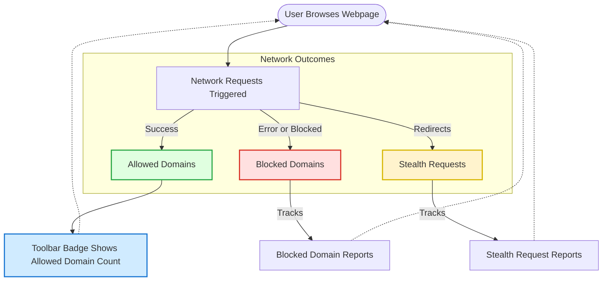

# Core Concepts & Terminology

Understanding the terminology uBO Scope uses is essential to fully leverage its powerful insights into your browser’s network activity. This page clarifies key terms such as *allowed domains*, *blocked domains*, *stealth requests*, and *toolbar badge counts*, so you can interpret your browsing exposure accurately.

---

## Allowed Domains

**Allowed domains** represent the third-party domains to which your browser successfully connects while you are browsing a webpage. These domains served content that was not blocked by any content blocking mechanism.

- These are the servers involved in successful network requests.
- uBO Scope tracks how many unique successful connections are made to these third-party domains.
- Understanding allowed domains helps you identify the actual external services your browser communicates with.

**Example:**
If you visit news.example.com and uBO Scope records allowed domains like `cdn.example-cdn.com` and `analytics.example-analytics.com`, these are the third-party services delivering resources or data.

---

## Blocked Domains

**Blocked domains** refer to third-party domains that attempted to connect but were prevented by a content blocker or network error.

- These represent servers your browser tried to reach but the connection was blocked or failed.
- A high number of blocked domains indicates aggressive blocking but does not necessarily mean fewer unique domains are contacted overall.
- It’s important to note that blocking some requests does not always reduce the total number of distinct third-party domains actually contacted.

**Example:**
If your browser attempts a request to `ads.badsite.com` and uBO Scope records it under blocked domains, this informs you that content from that source was blocked.

---

## Stealth Requests

**Stealth requests** are network requests that are redirected or handled in a way that aims to minimize detection by websites or other blockers.

- These often occur via redirects or obfuscated network paths.
- uBO Scope tracks these stealth outcomes separately to help users and researchers understand complex blocking behaviors that typical lists may hide.
- Stealth requests can indicate attempts to circumvent blocking or advanced content delivery techniques.

**Example:**
A request initially destined for `tracking.siteA.com` might redirect silently to `tracking-proxy.siteB.net`; uBO Scope tracks these under stealth to highlight this layered request behavior.

---

## Toolbar Badge Counts

The toolbar badge count is a central feature of uBO Scope that reflects your browser’s exposure to third-party domains:

- It shows the **number of distinct third-party domains with allowed (successful) connections** for the active tab.
- A lower badge count signals fewer unique third-party domains connected to, indicating reduced exposure.
- Crucially, the badge does *not* count blocked or stealth requests; it focuses only on successful connections.

<Tip>
The badge count is a clearer indicator of your actual network exposure than the number of blocked requests, which can be misleading. Focus on reducing the badge count to minimize third-party contact.
</Tip>

---

## Domain vs. Hostname

Terminology distinction:

- **Hostname:** The full web address, such as `images.subdomain.example.com`.
- **Domain:** The registered base domain under the public suffix list, such as `example.com`.

uBO Scope groups network outcomes primarily by domain but tracks hostnames for more granular insights.

---

## Public Suffix List (PSL) Usage

uBO Scope leverages the [Public Suffix List (PSL)](https://publicsuffix.org/) to accurately determine the *domain* part from hostnames.

- This improves grouping and counting of third-party domains, respecting organizational boundaries.
- The PSL includes standard domains and rules to handle complex domain structures (e.g., co.uk, ac.jp).

**Example:**
`tracking.site.co.uk` has the domain `site.co.uk` according to PSL rules.

---

## Outcomes of Network Requests

Network requests can have multiple outcomes that uBO Scope categorizes:

| Outcome   | Description                                                  | Categorized As     |
|-----------|--------------------------------------------------------------|--------------------|
| Success   | Request completed normally and connected to remote server.  | Allowed             |
| Error     | Request failed or was blocked by content blocker or network. | Blocked             |
| Redirect  | Request response caused navigation or transfer to another URL. | Stealth (tracked)  |

Tracking these outcomes provides a clear picture of what actually happens behind the scenes.

---

## How uBO Scope Processes Concepts Together

When you load a webpage:

1. Network requests start and uBO Scope records each request's status.
2. Requests successfully connecting to distinct third-party domains increment the **allowed domains** count.
3. Requests blocked or failed are counted as **blocked domains**.
4. Redirect chains with stealth behaviors are captured under **stealth requests**.
5. The **toolbar badge** updates to show the count of unique allowed domains, summarizing your browsing exposure.

This process ensures you receive a precise, distilled view of your real network footprint.

---

## Practical Tips

- **Understand the badge count as your primary privacy metric.** It reflects how many unique external domains your browser actually talks to.
- **Comparing block counts alone is misleading.** Focus on unique allowed domains.
- **Stealth requests are relevant for advanced users and filter list maintainers** seeking subtle blocking bypasses.
- For detailed inspection, use the popup UI to explore allowed, blocked, and stealth domains per tab.

---

## Troubleshooting Common Confusions

<AccordionGroup title="Common User Questions and Clarifications">
<Accordion title="Why does my badge count remain high despite using a blocker?">
Blocked requests don't reduce the count if your browser still establishes connections to many distinct third-party domains. Reducing unique allowed domains is key.
</Accordion>
<Accordion title="What if I see domains in stealth but no badge count increase?">
Stealth requests involve redirects or masked connections and don't affect the badge count. They highlight attempts at stealthy tracking or redirection instead.
</Accordion>
<Accordion title="Are all third-party domains bad?">
Not necessarily. Many third-party domains serve legitimate content like CDNs or analytics. uBO Scope surfaces all to provide transparency, letting you decide what to allow or block.
</Accordion>
<Accordion title="How does uBO Scope preserve accuracy despite redirects?">
It tracks each redirect event to categorize stealth activity separately, ensuring the badge count reflects only truly allowed distinct domains.
</Accordion>
</AccordionGroup>

---

## Visual Data Flow of Terms

---

This terminology foundation equips you with clear understanding to confidently interpret uBO Scope data, maximizing your privacy and insight.

For deeper context and usage, explore these related documentation pages:

- [What is uBO Scope?](../product-introduction/what-is-ubo-scope)
- [Value Proposition and Why It Matters](../product-introduction/value-proposition-and-why-it-matters)
- [Monitoring Third-party Connections Guide](../../guides/practical-use-cases/monitoring-3rd-party-connections)

---